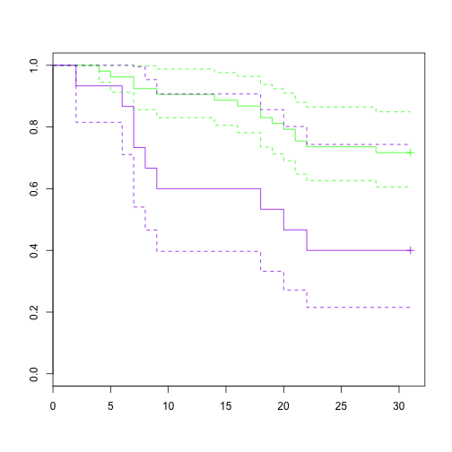

## Survival Package to look at the CHF subset in the Procalcitonin Database )(d01)

========================================================
#Here we read the chfnoesrd file into the current knitr document create a survival object and and plot a curve on it using the CHF patient in the d01 Procalcitonin dataset that do not have the ESRD.CKD5 code


```r
chfnoesrd <- read.csv("~/Desktop/Procalcitonin Day 01 Priject/chfnoesrd")
data=chfnoesrd
library(survival)
```

```
## Loading required package: splines
## 
## Attaching package: 'survival'
## 
## The following object is masked from 'package:caret':
## 
##     cluster
```

```r
chf.surv <- with(data, Surv(time=Survival,event=event))
fit <- survfit(chf.surv ~ 1, data=data)
plot(fit)
```

 

We generate survival curves on CHF patients based on their Procalcitonin levels ( >2 or not.)


```r
library(dplyr)
chfnoesrd2 <- mutate(chfnoesrd, ProcalGreater2 = PROCALCITONIN.d01 >=2)
data=chfnoesrd2
attach(data)
predict <- cbind(PROCALCITONIN.d01,CR.d01,VentCPT,RRTCPT,ALB.d01,WBC.d01,gender)
## create a surv object
chf.surv <- with(data, Surv(time=as.numeric(Survival),event=event))
## fit a surv object based on d01 ProcalGreater than 2
fit <- survfit(chf.surv ~ ProcalGreater2, data=data, conf.int=TRUE)
## plot KM curve with intervals
plot(fit, col=c("green","purple") ,conf.int=TRUE)
```

 

```r
## Test for differences in survival objects using survdiff ()
diff <- with(data, survdiff(Surv(time=Survival,event=event)~ProcalGreater2),rho=1)
diff
```

```
## Call:
## survdiff(formula = Surv(time = Survival, event = event) ~ ProcalGreater2)
## 
##                        N Observed Expected (O-E)^2/E (O-E)^2/V
## ProcalGreater2=FALSE 150       32     33.9     0.107     0.411
## ProcalGreater2=TRUE   57       14     12.1     0.300     0.411
## 
##  Chisq= 0.4  on 1 degrees of freedom, p= 0.521
```


```r
library(dplyr)
chfnoesrd2 <- mutate(chfnoesrd, ProcalGreater2 = PROCALCITONIN.d01 >=2)
data=chfnoesrd2
attach(data)
predict <- cbind(PROCALCITONIN.d01,CR.d01,VentCPT,RRTCPT,ALB.d01,WBC.d01,gender)
## create a surv object
chf.surv <- with(data, Surv(time=as.numeric(Survival),event=two_week))
## fit a surv object based on d01 ProcalGreater than 2
fit <- survfit(chf.surv ~ ProcalGreater2, data=data, conf.int=TRUE)
## plot KM curve with intervals
plot(fit, col=c("green","purple") ,conf.int=TRUE)
```

 

```r
## Test for differences in survival objects using survdiff ()
## Test for differences in 2 week survival objects using survdiff ()
diff <- with(data, survdiff(Surv(time=Survival,event=twp_week)~ProcalGreater2),rho=1)
```

```
## Error: object 'twp_week' not found
```

```r
diff
```

```
## Call:
## survdiff(formula = Surv(time = Survival, event = event) ~ ProcalGreater2)
## 
##                        N Observed Expected (O-E)^2/E (O-E)^2/V
## ProcalGreater2=FALSE 150       32     33.9     0.107     0.411
## ProcalGreater2=TRUE   57       14     12.1     0.300     0.411
## 
##  Chisq= 0.4  on 1 degrees of freedom, p= 0.521
```

```r
## Cox PH regression on 2 week survival using
predict <- cbind(PROCALCITONIN.d01,CR.d01,VentCPT,RRTCPT,ALB.d01,WBC.d01,gender)
predict <- cbind(PROCALCITONIN.d01)

coxph <- coxph(Surv(time=Survival,event=two_week)~predict, method="breslow")
coxph
```

```
## Call:
## coxph(formula = Surv(time = Survival, event = two_week) ~ predict, 
##     method = "breslow")
## 
## 
##           coef exp(coef) se(coef)    z     p
## predict 0.0109      1.01  0.00597 1.83 0.068
## 
## Likelihood ratio test=2.33  on 1 df, p=0.127  n= 207, number of events= 27
```

```r
## use the parametric models

wiebull <- survreg(Surv(time=Survival,event=two_week)~predict, dist="weibull")
wiebull
```

```
## Call:
## survreg(formula = Surv(time = Survival, event = two_week) ~ predict, 
##     dist = "weibull")
## 
## Coefficients:
## (Intercept)     predict 
##     5.92074    -0.01329 
## 
## Scale= 1.236 
## 
## Loglik(model)= -169.4   Loglik(intercept only)= -170.6
## 	Chisq= 2.29 on 1 degrees of freedom, p= 0.13 
## n= 207
```

```r
exponential <- survreg(Surv(time=Survival,event=two_week)~predict, dist="exponential")
exponential
```

```
## Call:
## survreg(formula = Surv(time = Survival, event = two_week) ~ predict, 
##     dist = "exponential")
## 
## Coefficients:
## (Intercept)     predict 
##     5.42982    -0.01078 
## 
## Scale fixed at 1 
## 
## Loglik(model)= -170.1   Loglik(intercept only)= -171.3
## 	Chisq= 2.32 on 1 degrees of freedom, p= 0.13 
## n= 207
```

```r
loglogistic<- survreg(Surv(time=Survival,event=two_week)~predict, dist="loglogistic")
loglogistic
```

```
## Call:
## survreg(formula = Surv(time = Survival, event = two_week) ~ predict, 
##     dist = "loglogistic")
## 
## Coefficients:
## (Intercept)     predict 
##     5.69700    -0.01686 
## 
## Scale= 1.166 
## 
## Loglik(model)= -168.7   Loglik(intercept only)= -170.1
## 	Chisq= 2.73 on 1 degrees of freedom, p= 0.098 
## n= 207
```

## Looking at the influence of a Procalcitonin of > 2 on survival in the ESLD patients


```r
## Looking at survival in the ESLD patients

anonmaster4 <- read.csv("~/Desktop/Procalcitonin Day 01 Priject/anonmaster4.csv")
anonmaster5<- mutate(anonmaster4, ProcalGreater2 = PROCALCITONIN.d01 >=2)
data=anonmaster5
attach(anonmaster5)
predict <- cbind(PROCALCITONIN.d01,CR.d01,VentCPT,RRTCPT,ALB.d01,WBC.d01,gender)
## create a surv object
chf.surv <- with(data, Surv(time=as.numeric(Survival),event=event))
## fit a surv object based on d01 ProcalGreater than 2
fit <- survfit(chf.surv ~ ProcalGreater2, data=data,subset=(ESLD=="ESLD"), conf.int=TRUE)
## plot KM curve with intervals
plot(fit, col=c("green","purple") ,conf.int=TRUE)
```

 

```r
## Test for differences in survival objects using survdiff ()
diff <- with(data, survdiff(Surv(time=Survival,event=event)~ProcalGreater2),rho=1)
diff
```

```
## Call:
## survdiff(formula = Surv(time = Survival, event = event) ~ ProcalGreater2)
## 
##                        N Observed Expected (O-E)^2/E (O-E)^2/V
## ProcalGreater2=FALSE 441       84     87.3     0.127     0.418
## ProcalGreater2=TRUE  205       42     38.7     0.287     0.418
## 
##  Chisq= 0.4  on 1 degrees of freedom, p= 0.518
```

```r
## Cox PH regression on 4 week survival in ESLD patients  using
predict <- cbind(PROCALCITONIN.d01,CR.d01,VentCPT,RRTCPT,ALB.d01,WBC.d01,gender)

coxph <- coxph(Surv(time=Survival,event=event)~predict,subset=(ESLD=="ESLD") ,method="breslow")
coxph
```

```
## Call:
## coxph(formula = Surv(time = Survival, event = event) ~ predict, 
##     subset = (ESLD == "ESLD"), method = "breslow")
## 
## 
##                             coef exp(coef) se(coef)      z     p
## predictPROCALCITONIN.d01  0.0252     1.026   0.0119  2.123 0.034
## predictCR.d01             0.1261     1.134   0.1642  0.768 0.440
## predictVentCPT            0.8653     2.376   0.4509  1.919 0.055
## predictRRTCPT             0.1940     1.214   0.5774  0.336 0.740
## predictALB.d01            0.1163     1.123   0.3359  0.346 0.730
## predictWBC.d01            0.0142     1.014   0.0237  0.599 0.550
## predictgender            -0.2058     0.814   0.4357 -0.472 0.640
## 
## Likelihood ratio test=11.3  on 7 df, p=0.127  n= 66, number of events= 24 
##    (2 observations deleted due to missingness)
```

```r
## Cox PH regression on 2 week survival in ESLD patients  using
predict <- cbind(PROCALCITONIN.d01,CR.d01,VentCPT,RRTCPT,ALB.d01,WBC.d01,gender,LACTATE.d01)

coxph <- coxph(Surv(time=Survival,event=two_week)~predict,subset=(ESLD=="ESLD") ,method="breslow")
coxph
```

```
## Call:
## coxph(formula = Surv(time = Survival, event = two_week) ~ predict, 
##     subset = (ESLD == "ESLD"), method = "breslow")
## 
## 
##                              coef exp(coef) se(coef)      z     p
## predictPROCALCITONIN.d01 -0.00567     0.994   0.0164 -0.346 0.730
## predictCR.d01             0.26267     1.300   0.2386  1.101 0.270
## predictVentCPT            0.57738     1.781   0.7055  0.818 0.410
## predictRRTCPT            -1.00745     0.365   0.9887 -1.019 0.310
## predictALB.d01           -0.75899     0.468   0.5217 -1.455 0.150
## predictWBC.d01           -0.04336     0.958   0.0646 -0.671 0.500
## predictgender             0.09838     1.103   0.6709  0.147 0.880
## predictLACTATE.d01        0.30355     1.355   0.1313  2.313 0.021
## 
## Likelihood ratio test=12.4  on 8 df, p=0.136  n= 54, number of events= 12 
##    (14 observations deleted due to missingness)
```

```r
## use the parametric models

wiebull <- survreg(Surv(time=Survival,event=two_week)~predict, dist="weibull")
wiebull
```

```
## Call:
## survreg(formula = Surv(time = Survival, event = two_week) ~ predict, 
##     dist = "weibull")
## 
## Coefficients:
##              (Intercept) predictPROCALCITONIN.d01            predictCR.d01 
##                 5.545816                 0.005438                -0.013486 
##           predictVentCPT            predictRRTCPT           predictALB.d01 
##                -0.750801                -0.634406                 0.533438 
##           predictWBC.d01            predictgender       predictLACTATE.d01 
##                 0.051181                 0.382187                -0.249051 
## 
## Scale= 1.373 
## 
## Loglik(model)= -313.5   Loglik(intercept only)= -329.1
## 	Chisq= 31.16 on 8 degrees of freedom, p= 0.00013 
## n=389 (257 observations deleted due to missingness)
```

```r
exponential <- survreg(Surv(time=Survival,event=two_week)~predict, dist="exponential")
exponential
```

```
## Call:
## survreg(formula = Surv(time = Survival, event = two_week) ~ predict, 
##     dist = "exponential")
## 
## Coefficients:
##              (Intercept) predictPROCALCITONIN.d01            predictCR.d01 
##                 4.955100                 0.003610                -0.003789 
##           predictVentCPT            predictRRTCPT           predictALB.d01 
##                -0.565879                -0.518129                 0.405395 
##           predictWBC.d01            predictgender       predictLACTATE.d01 
##                 0.039437                 0.288136                -0.190414 
## 
## Scale fixed at 1 
## 
## Loglik(model)= -316.8   Loglik(intercept only)= -333.7
## 	Chisq= 33.66 on 8 degrees of freedom, p= 4.7e-05 
## n=389 (257 observations deleted due to missingness)
```

```r
loglogistic<- survreg(Surv(time=Survival,event=two_week)~predict, dist="loglogistic")
loglogistic
```

```
## Call:
## survreg(formula = Surv(time = Survival, event = two_week) ~ predict, 
##     dist = "loglogistic")
## 
## Coefficients:
##              (Intercept) predictPROCALCITONIN.d01            predictCR.d01 
##                 5.112164                 0.006973                -0.038401 
##           predictVentCPT            predictRRTCPT           predictALB.d01 
##                -0.741864                -0.514689                 0.547855 
##           predictWBC.d01            predictgender       predictLACTATE.d01 
##                 0.046917                 0.385242                -0.260446 
## 
## Scale= 1.259 
## 
## Loglik(model)= -312.7   Loglik(intercept only)= -328.2
## 	Chisq= 31.11 on 8 degrees of freedom, p= 0.00013 
## n=389 (257 observations deleted due to missingness)
```


