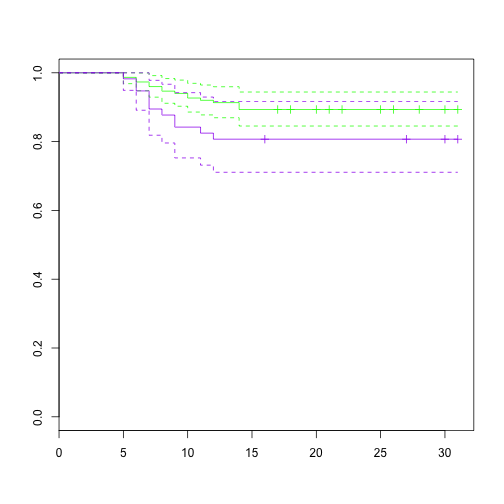

## Survival Package.

========================================================
#Here we read the chfnoesrd file into the current knitr document create a survival object and and plot a curve on it using the CHF patient in the d01 Procalcitonin dataset that do not have the ESRD.CKD5 code


```r
chfnoesrd <- read.csv("~/Desktop/Procalcitonin Day 01 Priject/chfnoesrd")
data=chfnoesrd
library(survival)
```

```
## Loading required package: splines
## 
## Attaching package: 'survival'
## 
## The following object is masked from 'package:caret':
## 
##     cluster
```

```r
chf.surv <- with(data, Surv(time=Survival,event=event))
fit <- survfit(chf.surv ~ 1, data=data)
plot(fit)
```

 

We generate survival curves on CHF patients based on their Procalcitonin levels ( >2 or not.)


```r
library(dplyr)
chfnoesrd2 <- mutate(chfnoesrd, ProcalGreater2 = PROCALCITONIN.d01 >=2)
data=chfnoesrd2
attach(data)
predict <- cbind(PROCALCITONIN.d01,CR.d01,VentCPT,RRTCPT,ALB.d01,WBC.d01,gender)
## create a surv object
chf.surv <- with(data, Surv(time=as.numeric(Survival),event=event))
## fit a surv object based on d01 ProcalGreater than 2
fit <- survfit(chf.surv ~ ProcalGreater2, data=data, conf.int=TRUE)
## plot KM curve with intervals
plot(fit, col=c("green","purple") ,conf.int=TRUE)
```

 

```r
## Test for differences in survival objects using survdiff ()
diff <- with(data, survdiff(Surv(time=Survival,event=event)~ProcalGreater2),rho=1)
diff
```

```
## Call:
## survdiff(formula = Surv(time = Survival, event = event) ~ ProcalGreater2)
## 
##                        N Observed Expected (O-E)^2/E (O-E)^2/V
## ProcalGreater2=FALSE 150       32     33.9     0.107     0.411
## ProcalGreater2=TRUE   57       14     12.1     0.300     0.411
## 
##  Chisq= 0.4  on 1 degrees of freedom, p= 0.521
```


```r
library(dplyr)
chfnoesrd2 <- mutate(chfnoesrd, ProcalGreater2 = PROCALCITONIN.d01 >=2)
data=chfnoesrd2
attach(data)
predict <- cbind(PROCALCITONIN.d01,CR.d01,VentCPT,RRTCPT,ALB.d01,WBC.d01,gender)
## create a surv object
chf.surv <- with(data, Surv(time=as.numeric(Survival),event=two_week))
## fit a surv object based on d01 ProcalGreater than 2
fit <- survfit(chf.surv ~ ProcalGreater2, data=data, conf.int=TRUE)
## plot KM curve with intervals
plot(fit, col=c("green","purple") ,conf.int=TRUE)
```

 

```r
## Test for differences in survival objects using survdiff ()
## Test for differences in survival objects using survdiff ()
diff <- with(data, survdiff(Surv(time=Survival,event=two_week)~ProcalGreater2),rho=1)
diff
```

```
## Call:
## survdiff(formula = Surv(time = Survival, event = two_week) ~ 
##     ProcalGreater2)
## 
##                        N Observed Expected (O-E)^2/E (O-E)^2/V
## ProcalGreater2=FALSE 150       16    19.88     0.756       2.9
## ProcalGreater2=TRUE   57       11     7.12     2.110       2.9
## 
##  Chisq= 2.9  on 1 degrees of freedom, p= 0.0885
```

```r
## Cox PH regression using
predict <- cbind(PROCALCITONIN.d01,CR.d01,VentCPT,RRTCPT,ALB.d01,WBC.d01,gender)
predict <- cbind(PROCALCITONIN.d01)

coxph <- coxph(Surv(time=Survival,event=two_week)~predict, method="breslow")
coxph
```

```
## Call:
## coxph(formula = Surv(time = Survival, event = two_week) ~ predict, 
##     method = "breslow")
## 
## 
##           coef exp(coef) se(coef)    z     p
## predict 0.0109      1.01  0.00597 1.83 0.068
## 
## Likelihood ratio test=2.33  on 1 df, p=0.127  n= 207, number of events= 27
```

```r
## use the parametric models

wiebull <- survreg(Surv(time=Survival,event=two_week)~predict, dist="weibull")
wiebull
```

```
## Call:
## survreg(formula = Surv(time = Survival, event = two_week) ~ predict, 
##     dist = "weibull")
## 
## Coefficients:
## (Intercept)     predict 
##     5.92074    -0.01329 
## 
## Scale= 1.236 
## 
## Loglik(model)= -169.4   Loglik(intercept only)= -170.6
## 	Chisq= 2.29 on 1 degrees of freedom, p= 0.13 
## n= 207
```

```r
exponential <- survreg(Surv(time=Survival,event=two_week)~predict, dist="exponential")
exponential
```

```
## Call:
## survreg(formula = Surv(time = Survival, event = two_week) ~ predict, 
##     dist = "exponential")
## 
## Coefficients:
## (Intercept)     predict 
##     5.42982    -0.01078 
## 
## Scale fixed at 1 
## 
## Loglik(model)= -170.1   Loglik(intercept only)= -171.3
## 	Chisq= 2.32 on 1 degrees of freedom, p= 0.13 
## n= 207
```

```r
loglogistic<- survreg(Surv(time=Survival,event=two_week)~predict, dist="loglogistic")
loglogistic
```

```
## Call:
## survreg(formula = Surv(time = Survival, event = two_week) ~ predict, 
##     dist = "loglogistic")
## 
## Coefficients:
## (Intercept)     predict 
##     5.69700    -0.01686 
## 
## Scale= 1.166 
## 
## Loglik(model)= -168.7   Loglik(intercept only)= -170.1
## 	Chisq= 2.73 on 1 degrees of freedom, p= 0.098 
## n= 207
```

