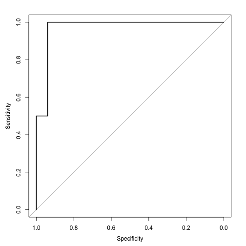
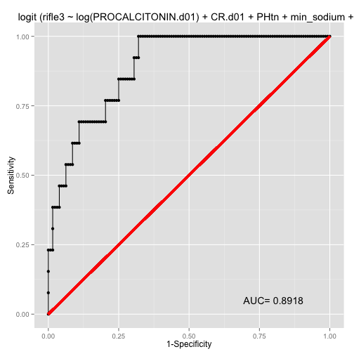

CHF AKI AUC with Partioning
========================================================
## Model for Rifle 3 AKI in CHF.


```r
chf <- read.csv("~/Desktop/Procalcitonin Day 01 Priject/chf.csv")
set.seed(2014)
data<- chf
library(caret)
```

```
## Loading required package: lattice
## Loading required package: ggplot2
```

```r
trainingRows <- createDataPartition(data$rifle3,p=0.8, list=FALSE)
training <- data[trainingRows,]
testing <- data[-trainingRows,]
train.fit<- glm(rifle3 ~  log(PROCALCITONIN.d01)+CR.d01+PHtn+min_sodium+CHFTYPE+ESLD,data=training, na.action=na.exclude, family=binomial(link=logit))


library(Deducer)
```

```
## Loading required package: JGR
## Loading required package: rJava
## Loading required package: JavaGD
## Loading required package: iplots
## Note: On Mac OS X we strongly recommend using iplots from within JGR.
## Proceed at your own risk as iplots cannot resolve potential ev.loop deadlocks.
## 'Yes' is assumed for all dialogs as they cannot be shown without a deadlock,
## also ievent.wait() is disabled.
## More recent OS X version do not allow signle-threaded GUIs and will fail.
## 
## 
## Please type JGR() to launch console. Platform specific launchers (.exe and .app) can also be obtained at http://www.rforge.net/JGR/files/.
## 
## 
## Loading required package: car
## Loading required package: MASS
## 
## 
## Note Non-JGR console detected:
## 	Deducer is best used from within JGR (http://jgr.markushelbig.org/).
## 	To Bring up GUI dialogs, type deducer().
## 
## 
## Attaching package: 'Deducer'
## 
## The following object is masked from 'package:stats':
## 
##     summary.lm
```

```r
rocplot(train.fit)
```

 

```r
prediction <- predict(train.fit, backtransform=TRUE,newdata=testing)

library(pROC)
```

```
## Type 'citation("pROC")' for a citation.
## 
## Attaching package: 'pROC'
## 
## The following objects are masked from 'package:stats':
## 
##     cov, smooth, var
```

```r
testing.roc <- roc(testing$rifle3, prediction)
plot(testing.roc)
```

 

```
## 
## Call:
## roc.default(response = testing$rifle3, predictor = prediction)
## 
## Data: prediction in 33 controls (testing$rifle3 FALSE) < 2 cases (testing$rifle3 TRUE).
## Area under the curve: 0.97
```

```r
ci(testing.roc)
```

```
## 95% CI: 0.897-1 (DeLong)
```
These are the AUC values I got from doing a rerun of sampling and testing from seeds of 2014 to 2025
mean(0.96,0.72,0.68,0.98,0.85,0.68,0.88,0.89,0.838,0.97,0.967,1,0.7262,0.750.79,0.94,0.94,0.88,0.87,0.840.767), 


this gives us a mean AUC of 85,3, CI 0.80 to 0.89 range.

## CHF RIFLE 2 AKI

```r
chf <- read.csv("~/Desktop/Procalcitonin Day 01 Priject/chf.csv")
set.seed(48)

data<- chf3
```

```
## Error: object 'chf3' not found
```

```r
library(caret)
trainingRows <- createDataPartition(data$akiR2,p=0.8, list=FALSE)
```

```
## Error: y must have at least 2 data points
```

```r
training <- data[trainingRows,]
testing <- data[-trainingRows,]
train.fit<- glm(akiR2 ~ log(PROCALCITONIN.d01)+ PHtn+min_sodium+CR.d01+AGE+ESLD+IHD+AFIB,data=training, na.action=na.exclude, family=binomial(link=logit))
```

```
## Error: object 'akiR2' not found
```

```r
library(Deducer)
rocplot(train.fit)
```

 

```r
prediction <- predict(train.fit, backtransform=TRUE,newdata=testing)

library(pROC)
testing.roc <- roc(testing$akiR2, prediction)
```

```
## Error: No valid data provided.
```

```r
plot(testing.roc)
```

 

```
## 
## Call:
## roc.default(response = testing$rifle3, predictor = prediction)
## 
## Data: prediction in 33 controls (testing$rifle3 FALSE) < 2 cases (testing$rifle3 TRUE).
## Area under the curve: 0.97
```

```r
ci(testing.roc)
```

```
## 95% CI: 0.897-1 (DeLong)
```
auc <- 0.6
