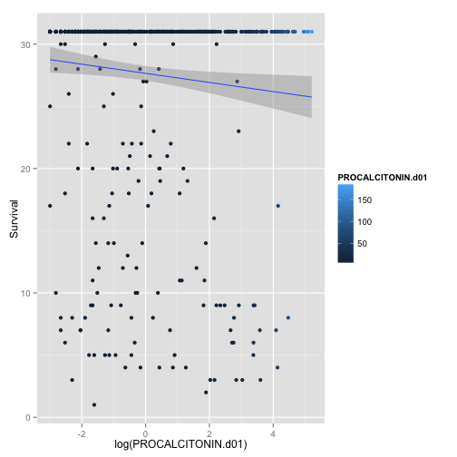
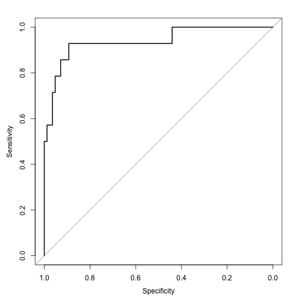
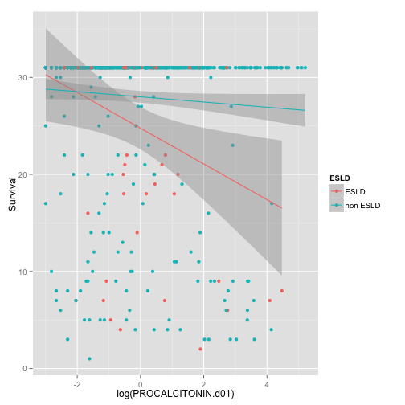
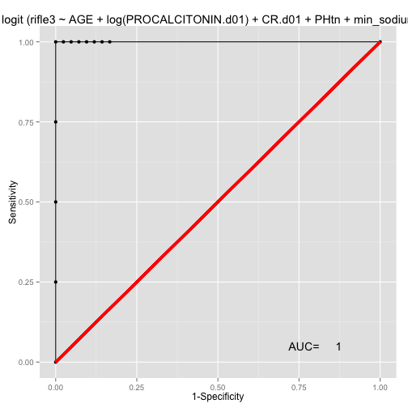
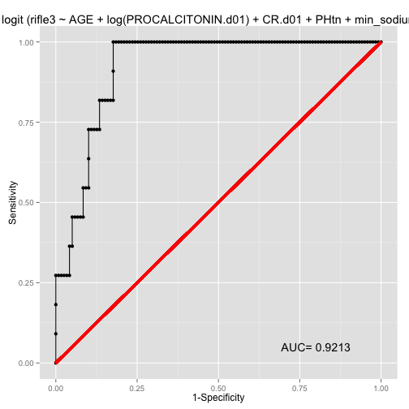
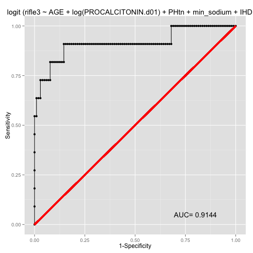
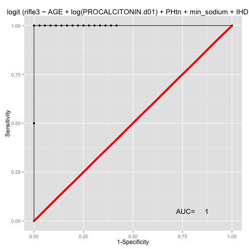

Model selection and evaluation for models that predict Acute Kidney Failure (RIFLE3) and their ROC curves.
========================================================

In this document we are selecting glm models for predicting the development of Acute Kidney Injury (specifically RIFLE 3 class) in patients with Congestive Heart Failure who are admitted to the hospital. We will be using the glmulti, pROC and other packages. We will start off by inputing a large model with many variables in our dataset.

We will generate a glm object called chfrifle3. 


```r
chf <- read.csv("~/Desktop/Procalcitonin Day 01 Priject/chf.csv")
library(glmulti)
chfrifle3 <- glm(rifle3~log(PROCALCITONIN.d01)+LACTATE.d01+ WBC.d01+DM2+CR.d01+gender+ALB.d01+PHtn+Htn+AGE+min_sodium+min_hb+BUN.Cr+HCO3,data=chf, family=binomial(link=logit))
```

## Selecting the best glm model 

that takes a bit to run. I have run it before and basically it runs through greater than 16000 models and selects the best model based on a criterion called AICc. Change eval=TRUE to run again.


Look at the top 10 models, ranked by AICc

Tada.....Best model: rifle3~1+PHtn+log(PROCALCITONIN.d01)+CR.d01+min_sodium

Here is the weightable for the top 10 models. To look at the top 10 models, ranked by AICc, turn eval=TRUE


```r
weightable(multi.chf)
```

## Prepare for the ROC analysis on the models

Subset out the relevant variables into a smaller dataset called chf2. And create a model object called "fit", which represents model. I treid the top model, however the AUC was in the 80s for Rifle3 and I found that by adding other variables the AUC could be improved on significantly.

# AUC for RIFLE 3 

```r
fit<- glm(rifle3 ~AGE+ log(PROCALCITONIN.d01)+CR.d01+PHtn+min_sodium+IHD+AFIB+CHFTYPE,data=chf, na.action=na.exclude, family=binomial(link=logit))
summary(fit)
```

```
## 
## Call:
## glm(formula = rifle3 ~ AGE + log(PROCALCITONIN.d01) + CR.d01 + 
##     PHtn + min_sodium + IHD + AFIB + CHFTYPE, family = binomial(link = logit), 
##     data = chf, na.action = na.exclude)
## 
## Deviance Residuals: 
##     Min       1Q   Median       3Q      Max  
## -1.7443  -0.3212  -0.1604  -0.0635   2.3692  
## 
## Coefficients:
##                         Estimate Std. Error z value Pr(>|z|)   
## (Intercept)               3.7527  1792.8559    0.00   0.9983   
## AGE                      -0.0349     0.0232   -1.50   0.1326   
## log(PROCALCITONIN.d01)    0.6160     0.2034    3.03   0.0025 **
## CR.d01                    1.1870     0.3765    3.15   0.0016 **
## PHtnPHtn                  1.3794     0.8603    1.60   0.1089   
## min_sodium               -0.1508     0.0748   -2.02   0.0437 * 
## IHDno IHD                -0.1107     0.7184   -0.15   0.8775   
## AFIBno AFIB               0.2350     0.7223    0.33   0.7449   
## CHFTYPEdiastolic CHF     14.9432  1792.8300    0.01   0.9933   
## CHFTYPEsystolic CHF      12.2364  1792.8301    0.01   0.9946   
## CHFTYPEUnspecified       12.7584  1792.8300    0.01   0.9943   
## ---
## Signif. codes:  0 '***' 0.001 '**' 0.01 '*' 0.05 '.' 0.1 ' ' 1
## 
## (Dispersion parameter for binomial family taken to be 1)
## 
##     Null deviance: 102.557  on 175  degrees of freedom
## Residual deviance:  62.898  on 165  degrees of freedom
##   (31 observations deleted due to missingness)
## AIC: 84.9
## 
## Number of Fisher Scoring iterations: 16
```

```r
## I added the terms LACTATE.d01 ,CHFTYPE,AFIB,AGE,IHD to get the best model based on the AUC curve.

## Load the pROC library 

library(pROC)
```

```
## Type 'citation("pROC")' for a citation.
## 
## Attaching package: 'pROC'
## 
## The following objects are masked from 'package:stats':
## 
##     cov, smooth, var
```

```r
## Make your reciever-operater curve for RIFLE3 Injury

m.roc <- roc(chf$rifle3, predict(fit, backtransform = TRUE))
plot(m.roc)
```

 

```
## 
## Call:
## roc.default(response = chf$rifle3, predictor = predict(fit, backtransform = TRUE))
## 
## Data: predict(fit, backtransform = TRUE) in 161 controls (chf$rifle3 FALSE) < 15 cases (chf$rifle3 TRUE).
## Area under the curve: 0.922
```


# AUC for >RIFLE2 


```r
fit<- glm(devakirifle2 ~AGE+ log(PROCALCITONIN.d01)+CR.d01+PHtn+min_sodium+IHD+AFIB+CHFTYPE+LACTATE.d01,data=chf, na.action=na.exclude, family=binomial(link=logit))
summary(fit)
```

```
## 
## Call:
## glm(formula = devakirifle2 ~ AGE + log(PROCALCITONIN.d01) + CR.d01 + 
##     PHtn + min_sodium + IHD + AFIB + CHFTYPE + LACTATE.d01, family = binomial(link = logit), 
##     data = chf, na.action = na.exclude)
## 
## Deviance Residuals: 
##     Min       1Q   Median       3Q      Max  
## -2.0381  -0.2100  -0.0464  -0.0067   2.2227  
## 
## Coefficients:
##                         Estimate Std. Error z value Pr(>|z|)   
## (Intercept)              14.5142  2399.6168    0.01   0.9952   
## AGE                      -0.0512     0.0372   -1.37   0.1692   
## log(PROCALCITONIN.d01)    1.7689     0.6327    2.80   0.0052 **
## CR.d01                   -1.9669     1.0389   -1.89   0.0583 . 
## PHtnPHtn                  3.0987     2.0566    1.51   0.1319   
## min_sodium               -0.2212     0.1400   -1.58   0.1140   
## IHDno IHD                 1.3083     1.3738    0.95   0.3409   
## AFIBno AFIB               3.1739     1.6781    1.89   0.0586 . 
## CHFTYPEdiastolic CHF     16.2135  2399.5452    0.01   0.9946   
## CHFTYPEsystolic CHF      13.3493  2399.5453    0.01   0.9956   
## CHFTYPEUnspecified       11.6927  2399.5455    0.00   0.9961   
## LACTATE.d01              -0.3644     0.3020   -1.21   0.2277   
## ---
## Signif. codes:  0 '***' 0.001 '**' 0.01 '*' 0.05 '.' 0.1 ' ' 1
## 
## (Dispersion parameter for binomial family taken to be 1)
## 
##     Null deviance: 56.881  on 106  degrees of freedom
## Residual deviance: 29.306  on  95  degrees of freedom
##   (100 observations deleted due to missingness)
## AIC: 53.31
## 
## Number of Fisher Scoring iterations: 15
```

```r
summary(fit)
```

```
## 
## Call:
## glm(formula = devakirifle2 ~ AGE + log(PROCALCITONIN.d01) + CR.d01 + 
##     PHtn + min_sodium + IHD + AFIB + CHFTYPE + LACTATE.d01, family = binomial(link = logit), 
##     data = chf, na.action = na.exclude)
## 
## Deviance Residuals: 
##     Min       1Q   Median       3Q      Max  
## -2.0381  -0.2100  -0.0464  -0.0067   2.2227  
## 
## Coefficients:
##                         Estimate Std. Error z value Pr(>|z|)   
## (Intercept)              14.5142  2399.6168    0.01   0.9952   
## AGE                      -0.0512     0.0372   -1.37   0.1692   
## log(PROCALCITONIN.d01)    1.7689     0.6327    2.80   0.0052 **
## CR.d01                   -1.9669     1.0389   -1.89   0.0583 . 
## PHtnPHtn                  3.0987     2.0566    1.51   0.1319   
## min_sodium               -0.2212     0.1400   -1.58   0.1140   
## IHDno IHD                 1.3083     1.3738    0.95   0.3409   
## AFIBno AFIB               3.1739     1.6781    1.89   0.0586 . 
## CHFTYPEdiastolic CHF     16.2135  2399.5452    0.01   0.9946   
## CHFTYPEsystolic CHF      13.3493  2399.5453    0.01   0.9956   
## CHFTYPEUnspecified       11.6927  2399.5455    0.00   0.9961   
## LACTATE.d01              -0.3644     0.3020   -1.21   0.2277   
## ---
## Signif. codes:  0 '***' 0.001 '**' 0.01 '*' 0.05 '.' 0.1 ' ' 1
## 
## (Dispersion parameter for binomial family taken to be 1)
## 
##     Null deviance: 56.881  on 106  degrees of freedom
## Residual deviance: 29.306  on  95  degrees of freedom
##   (100 observations deleted due to missingness)
## AIC: 53.31
## 
## Number of Fisher Scoring iterations: 15
```

```r
## NONE OF THE ESLD PATIENTS DEVELOPED AKI2 SEE BELOW REMOVED
with(chf,table(ESLD,devakirifle2))
```

```
##           devakirifle2
## ESLD       FALSE TRUE
##   ESLD        12    0
##   non ESLD   184   10
```

```r
## I added the terms LACTATE.d01 ,CHFTYPE,AFIB,AGE,IHD to get the best model based on the AUC curve.
## Severe Imbalance in the devakirifle2 in COPD removed term.(although not sure it should be removed)
with(chf,table(COPD,devakirifle2))
```

```
##           devakirifle2
## COPD       FALSE TRUE
##   COPD        76    1
##   non COPD   120    9
```

```r
m.roc <- roc(chf$devakirifle2, predict(fit, backtransform = TRUE))
plot(m.roc)
```

 

```
## 
## Call:
## roc.default(response = chf$devakirifle2, predictor = predict(fit,     backtransform = TRUE))
## 
## Data: predict(fit, backtransform = TRUE) in 99 controls (chf$devakirifle2 FALSE) < 8 cases (chf$devakirifle2 TRUE).
## Area under the curve: 0.952
```

# AKI for >RIFLE1


```r
fit<- glm(devaki~ AGE+log(PROCALCITONIN.d01)+ CR.d01+PHtn+min_sodium+CHFTYPE+AFIB+ESLD+IHD+COPD+LACTATE.d01,data=chf, na.action=na.exclude, family=binomial(link=logit))
summary(fit)
```

```
## 
## Call:
## glm(formula = devaki ~ AGE + log(PROCALCITONIN.d01) + CR.d01 + 
##     PHtn + min_sodium + CHFTYPE + AFIB + ESLD + IHD + COPD + 
##     LACTATE.d01, family = binomial(link = logit), data = chf, 
##     na.action = na.exclude)
## 
## Deviance Residuals: 
##     Min       1Q   Median       3Q      Max  
## -1.2383  -0.4776  -0.2824  -0.0777   2.9740  
## 
## Coefficients:
##                         Estimate Std. Error z value Pr(>|z|)  
## (Intercept)            -1.90e+01   6.98e+03    0.00    0.998  
## AGE                    -3.56e-03   2.79e-02   -0.13    0.898  
## log(PROCALCITONIN.d01)  5.72e-01   2.49e-01    2.29    0.022 *
## CR.d01                 -7.10e-01   5.56e-01   -1.28    0.202  
## PHtnPHtn                1.24e+00   1.19e+00    1.04    0.299  
## min_sodium             -1.23e-01   9.20e-02   -1.34    0.180  
## CHFTYPEdiastolic CHF    1.64e+01   6.52e+03    0.00    0.998  
## CHFTYPEsystolic CHF     1.57e+01   6.52e+03    0.00    0.998  
## CHFTYPEUnspecified      1.51e+01   6.52e+03    0.00    0.998  
## AFIBno AFIB             1.57e+00   9.94e-01    1.58    0.114  
## ESLDnon ESLD            1.68e+01   2.47e+03    0.01    0.995  
## IHDno IHD              -1.55e-01   8.59e-01   -0.18    0.857  
## COPDnon COPD            1.66e+00   9.97e-01    1.66    0.096 .
## LACTATE.d01            -1.83e-01   1.85e-01   -0.99    0.321  
## ---
## Signif. codes:  0 '***' 0.001 '**' 0.01 '*' 0.05 '.' 0.1 ' ' 1
## 
## (Dispersion parameter for binomial family taken to be 1)
## 
##     Null deviance: 75.111  on 106  degrees of freedom
## Residual deviance: 57.270  on  93  degrees of freedom
##   (100 observations deleted due to missingness)
## AIC: 85.27
## 
## Number of Fisher Scoring iterations: 17
```

```r
m.roc <- roc(chf$devaki, predict(fit, backtransform = TRUE))
plot(m.roc)
```

 

```
## 
## Call:
## roc.default(response = chf$devaki, predictor = predict(fit, backtransform = TRUE))
## 
## Data: predict(fit, backtransform = TRUE) in 95 controls (chf$devaki FALSE) < 12 cases (chf$devaki TRUE).
## Area under the curve: 0.821
```


## ROC curves for RIFLE 3 outcome.

RIFLE 3 AKI with day Creatinine in the model

```r
set.seed(2)
library(caret)
```

```
## Loading required package: lattice
## Loading required package: ggplot2
```

```r
trainingRows <- createDataPartition(chf$rifle3,p=0.75, list=FALSE)
training <- chf[trainingRows,]
testing <- chf[-trainingRows,]
train.fit<- glm(rifle3 ~AGE+ log(PROCALCITONIN.d01)+CR.d01+PHtn+min_sodium+IHD+AFIB+CHFTYPE,data=training, na.action=na.exclude, family=binomial(link=logit))
test.fit <- glm(rifle3 ~AGE+ log(PROCALCITONIN.d01)+CR.d01+PHtn+min_sodium+IHD+AFIB+CHFTYPE,data=testing, na.action=na.exclude, family=binomial(link=logit))
```

```
## Warning: glm.fit: algorithm did not converge
## Warning: glm.fit: fitted probabilities numerically 0 or 1 occurred
```

```r
library(Deducer)
```

```
## Loading required package: JGR
## Loading required package: rJava
## Loading required package: JavaGD
## Loading required package: iplots
## Note: On Mac OS X we strongly recommend using iplots from within JGR.
## Proceed at your own risk as iplots cannot resolve potential ev.loop deadlocks.
## 'Yes' is assumed for all dialogs as they cannot be shown without a deadlock,
## also ievent.wait() is disabled.
## More recent OS X version do not allow signle-threaded GUIs and will fail.
## 
## 
## Please type JGR() to launch console. Platform specific launchers (.exe and .app) can also be obtained at http://www.rforge.net/JGR/files/.
## 
## 
## Loading required package: car
## Loading required package: MASS
## 
## 
## Note Non-JGR console detected:
## 	Deducer is best used from within JGR (http://jgr.markushelbig.org/).
## 	To Bring up GUI dialogs, type deducer().
## 
## 
## Attaching package: 'Deducer'
## 
## The following object is masked from 'package:stats':
## 
##     summary.lm
```

```r
rocplot(test.fit)
```

 

```r
rocplot(train.fit)
```

 


## No creatinine model; Model for prediciting RIFLE 3 ARF without usingday01 Creatinine

##Lets see if we can take day one Creatinine out of the equation and predict RIFLE 3 AKF


```r
set.seed(606)
library(caret)
trainingRows <- createDataPartition(chf$rifle3,p=0.75, list=FALSE)

training <- chf[trainingRows,]
testing <- chf[-trainingRows,]

training.fit2 <- glm(rifle3 ~AGE+ log(PROCALCITONIN.d01)+PHtn+min_sodium+IHD+AFIB+CHFTYPE+COPD+Transplant.y+ALB.d01+min_hb+HCO3+ESLD:PLATELETS.d01,data=training, na.action=na.exclude, family=binomial(link=logit))
rocplot(training.fit2)
```

 

```r
testing.fit2 <- glm(rifle3 ~AGE+ log(PROCALCITONIN.d01)+PHtn+min_sodium+IHD+AFIB+CHFTYPE+COPD+Transplant.y+ALB.d01+min_hb+HCO3+ESLD:PLATELETS.d01+ESLD:PLATELETS.d01,data=testing, na.action=na.exclude, family=binomial(link=logit))
```

```
## Warning: glm.fit: algorithm did not converge
## Warning: glm.fit: fitted probabilities numerically 0 or 1 occurred
```

```r
rocplot(testing.fit2)
```

 

#RIFLE 2 renal injury model AUCs
___________________________________________
Lets start by partioning our data.


## Using the train function, generate models


 But we should be able to preprocess with dummy vars


summary(fit)
## I added the terms LACTATE.d01 ,CHFTYPE,AFIB,AGE,IHD to get the best model based on the AUC curve.
## Load the pROC library
library(pROC)
## Make your reciever-operater curve for RIFLE3 Injury
training.roc <- roc(training$rifle3, predict(fit, backtransform = TRUE))
plot(training.roc)
test.roc <- roc(testing$rifle3,predict(fit,newdata=testing, backtransform=TRUE))
plot(test.roc)


```


