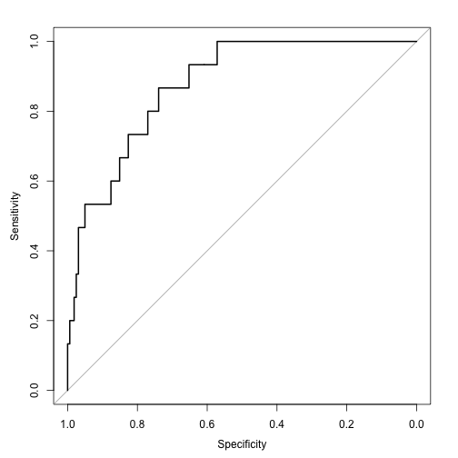

Model selection and evaluation for models that predict Acute Kidney Failure (RIFLE3) and their ROC curves.
========================================================

In this document we are selecting glm models for predicting the development of Acute Kidney Injury (specifically RIFLE 3 class) in patients with Congestive Heart Failure who are admitted to the hospital. We will be using the glmulti, pROC and other packages. We will start off by inputing a large model with many variables in our dataset.

We will generate a glm object called chfrifle3. 


```r
chf <- read.csv("~/Desktop/Procalcitonin Day 01 Priject/chf.csv")
library(glmulti)
```

```
## Loading required package: rJava
```

```r
chfrifle3 <- glm(rifle3~log(PROCALCITONIN.d01)+LACTATE.d01+ WBC.d01+DM2+CR.d01+gender+ALB.d01+PHtn+Htn+AGE+min_sodium+min_hb+BUN.Cr+HCO3,data=chf, family=binomial(link=logit))
```

## Selecting the best glm model 

that takes a bit to run. I have run it before and basically it runs through greater than 16000 models and selects the best model based on a criterion called AICc. Change eval=TRUE to run again.


```r
multi.chf <- glmulti(chfrifle3, # use the model with built as a starting point
                      level = 1,  #  just look at main effects
                      crit="aicc") # use AICc because it works better than AIC for small sample sizes)

summary(multi.chf)
```
Look at the top 10 models, ranked by AICc

Tada.....Best model: rifle3~1+PHtn+log(PROCALCITONIN.d01)+CR.d01+min_sodium

Here is the weightable for the top 10 models. To look at the top 10 models, ranked by AICc, turn eval=TRUE


```r
weightable(multi.chf)
```

## Prepare for the ROC analysis on the top model

Subset out the relevant variables into a smaller dataset called chf2. And create a model object called "fit", which represents the top model.


```r
library(dplyr)
```

```
## 
## Attaching package: 'dplyr'
## 
## The following objects are masked from 'package:stats':
## 
##     filter, lag
## 
## The following objects are masked from 'package:base':
## 
##     intersect, setdiff, setequal, union
```

```r
chf2 <- select(chf, CR.d01,min_sodium,PHtn,PROCALCITONIN.d01,rifle3)


fit<- glm(rifle3 ~ log(PROCALCITONIN.d01) + CR.d01+PHtn+min_sodium,data=chf2, na.action=na.exclude, family=binomial(link=logit))
summary(fit)
```

```
## 
## Call:
## glm(formula = rifle3 ~ log(PROCALCITONIN.d01) + CR.d01 + PHtn + 
##     min_sodium, family = binomial(link = logit), data = chf2, 
##     na.action = na.exclude)
## 
## Deviance Residuals: 
##    Min      1Q  Median      3Q     Max  
## -1.587  -0.376  -0.198  -0.115   2.641  
## 
## Coefficients:
##                        Estimate Std. Error z value Pr(>|z|)   
## (Intercept)             13.9566     9.1828    1.52   0.1285   
## log(PROCALCITONIN.d01)   0.5047     0.1757    2.87   0.0041 **
## CR.d01                   0.8910     0.3070    2.90   0.0037 **
## PHtnPHtn                 1.5949     0.7594    2.10   0.0357 * 
## min_sodium              -0.1392     0.0694   -2.01   0.0448 * 
## ---
## Signif. codes:  0 '***' 0.001 '**' 0.01 '*' 0.05 '.' 0.1 ' ' 1
## 
## (Dispersion parameter for binomial family taken to be 1)
## 
##     Null deviance: 102.557  on 175  degrees of freedom
## Residual deviance:  71.838  on 171  degrees of freedom
##   (31 observations deleted due to missingness)
## AIC: 81.84
## 
## Number of Fisher Scoring iterations: 7
```

Not done on current analysis:average the models together, eval=FALSE for now


```r
f.ave <- model.avg(f, f2, f3, f4, f5,na.action=na.exclude)
summary(f.ave)
```


Load the pROC library

```r
library(pROC)
```

```
## Type 'citation("pROC")' for a citation.
## 
## Attaching package: 'pROC'
## 
## The following objects are masked from 'package:stats':
## 
##     cov, smooth, var
```

Make your reciever-operater curve

```r
m.roc <- roc(chf2$rifle3, predict(fit, backtransform = TRUE))
plot(m.roc)
```

 

```
## 
## Call:
## roc.default(response = chf2$rifle3, predictor = predict(fit,     backtransform = TRUE))
## 
## Data: predict(fit, backtransform = TRUE) in 161 controls (chf2$rifle3 FALSE) < 15 cases (chf2$rifle3 TRUE).
## Area under the curve: 0.875
```


reasonable good ROC of this model 0.879, but this is a derivation data set. I would like to do some cool crossvalisdation using the CARET package next.
Before that lets see how the model of Creatinine alone performs


```r
fit<- glm(rifle3 ~ + CR.d01,data=chf2, na.action=na.exclude, family=binomial(link=logit))
m.roc <- roc(chf2$rifle3, predict(fit, backtransform = TRUE))
plot(m.roc)
```

 

```
## 
## Call:
## roc.default(response = chf2$rifle3, predictor = predict(fit,     backtransform = TRUE))
## 
## Data: predict(fit, backtransform = TRUE) in 188 controls (chf2$rifle3 FALSE) < 18 cases (chf2$rifle3 TRUE).
## Area under the curve: 0.766
```
This model only has a 0.75 AUC, so we observe that our best model does really improve the AUC. But this is not crossvalidated data. Lets see if we can work on cross-validation with caret.

Lets start by partioning our data.

```r
library(caret)
```

```
## Loading required package: lattice
## Loading required package: ggplot2
```

```r
trainingRows <- createDataPartition(chf$rifle3,p=0.75, list=FALSE)
training <- chf[trainingRows,]
testing <- chf[-trainingRows,]
dim
```

```
## function (x)  .Primitive("dim")
```
## Using the train function, generate models


```r
set.seed(1)
model.fit <- train(rifle3 ~ . , preProcess=c("knnImpute","center","scale"),data=training)
```

```
## Error: contrasts can be applied only to factors with 2 or more levels
```

```r
##
```

*THIS IS WERE THINGS START GETTING MESSY: *
Error in `contrasts<-`(`*tmp*`, value = contr.funs[1 + isOF[nn]]) : 
  contrasts can be applied only to factors with 2 or more levels
  
