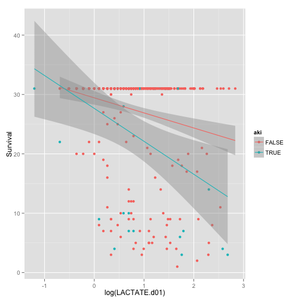
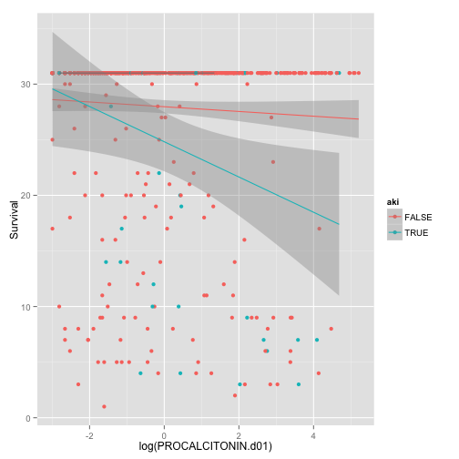
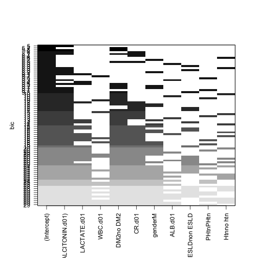

## Survival Analysis from d01 Procalcitonin Project

========================================================


```r
anonMASTER <- read.csv("~/Desktop/Procalcitonin Day 01 Priject/anonMASTER.csv")
View(anonMASTER)
library(ggplot2)
library(caret)
```

```
## Loading required package: lattice
```

```r
library(dplyr)
```

```
## 
## Attaching package: 'dplyr'
## 
## The following objects are masked from 'package:stats':
## 
##     filter, lag
## 
## The following objects are masked from 'package:base':
## 
##     intersect, setdiff, setequal, union
```


```r
data <- anonMASTER
data <- tbl_df(data)
qplot(LACTATE.d01,Survival,data=data, colour=Survival)
```

```
## Warning: Removed 221 rows containing missing values (geom_point).
```

 


```r
qplot(LACTATE.d01,Survival,data=data, colour=Survival, geom=c("point","smooth"), method=lm)
```

```
## Warning: Removed 221 rows containing missing values (stat_smooth).
## Warning: Removed 221 rows containing missing values (geom_point).
```

 


```r
qplot(LACTATE.d01,Survival,data=data, colour=Transplant.y, geom=c("point","smooth"), method=lm)
```

```
## Warning: Removed 202 rows containing missing values (stat_smooth).
## Warning: Removed 19 rows containing missing values (stat_smooth).
## Warning: Removed 221 rows containing missing values (geom_point).
```

 

```r
qplot(LACTATE.d01,Survival,data=data, colour=ESLD, geom=c("point","smooth"), method=lm)
```

```
## Warning: Removed 13 rows containing missing values (stat_smooth).
## Warning: Removed 208 rows containing missing values (stat_smooth).
## Warning: Removed 221 rows containing missing values (geom_point).
```

 


```r
qplot(log(PROCALCITONIN.d01),Survival,data=data,colour=PROCALCITONIN.d01, geom=c("point","smooth"), method=lm)
```

 


```r
qplot(log(PROCALCITONIN.d01),Survival,data=data,colour=Transplant.y, geom=c("point","smooth"), method=lm)
```

 


```r
qplot(log(PROCALCITONIN.d01),Survival,data=data,colour=ESLD, geom=c("point","smooth"), method=lm)
```

 


```r
qplot(log(LACTATE.d01),Survival,data=data,colour=aki, geom=c("point","smooth"), method=lm)
```

```
## Warning: Removed 203 rows containing missing values (stat_smooth).
## Warning: Removed 16 rows containing missing values (stat_smooth).
## Warning: Removed 2 rows containing missing values (stat_smooth).
## Warning: Removed 221 rows containing missing values (geom_point).
```

 

```r
qplot(log(PROCALCITONIN.d01),Survival,data=data,colour=aki, geom=c("point","smooth"), method=lm)
```

 

```r
qplot(log(PROCALCITONIN.d01),Survival,data=esldnonesrd,colour=aki, geom=c("point","smooth"), method=lm)
```

```
## Error: object 'esldnonesrd' not found
```


```r
qplot(log(LACTATE.d01),Survival,data=data,colour=ESLD, geom=c("point","smooth"), method=lm)
```

```
## Warning: Removed 13 rows containing missing values (stat_smooth).
## Warning: Removed 208 rows containing missing values (stat_smooth).
## Warning: Removed 221 rows containing missing values (geom_point).
```

 


```r
esld <- subset(data, ESLD=="ESLD")

esldnonesrd <- subset(esld, ESRD_CKD.5="non ESRD.CKD5")
g <- glm(rrtbin~WBC.d01 + log(PROCALCITONIN.d01) + CR.d01 +DM2 + Htn + PLATELETS.d01, data=esldnonesrd, family=binomial(link=logit))

summary(g)
```

```
## 
## Call:
## glm(formula = rrtbin ~ WBC.d01 + log(PROCALCITONIN.d01) + CR.d01 + 
##     DM2 + Htn + PLATELETS.d01, family = binomial(link = logit), 
##     data = esldnonesrd)
## 
## Deviance Residuals: 
##    Min      1Q  Median      3Q     Max  
## -1.718  -0.479  -0.197   0.264   2.352  
## 
## Coefficients:
##                        Estimate Std. Error z value Pr(>|z|)    
## (Intercept)            -5.54996    1.85852   -2.99  0.00282 ** 
## WBC.d01                 0.18368    0.06560    2.80  0.00511 ** 
## log(PROCALCITONIN.d01)  0.53847    0.25756    2.09  0.03656 *  
## CR.d01                  1.46222    0.41349    3.54  0.00041 ***
## DM2no DM2              -0.46167    0.87908   -0.53  0.59946    
## Htnno htn              -0.10604    0.94002   -0.11  0.91019    
## PLATELETS.d01          -0.00491    0.00366   -1.34  0.17956    
## ---
## Signif. codes:  0 '***' 0.001 '**' 0.01 '*' 0.05 '.' 0.1 ' ' 1
## 
## (Dispersion parameter for binomial family taken to be 1)
## 
##     Null deviance: 85.612  on 67  degrees of freedom
## Residual deviance: 44.814  on 61  degrees of freedom
## AIC: 58.81
## 
## Number of Fisher Scoring iterations: 6
```


```r
chf <- subset(data, CHF=="CHF")
chfnoesrd<- subset(chf, ESRD_CKD5=="non ESRD.CKD5" )


glm.chf.rrt <- glm(rrtbin~log(PROCALCITONIN.d01)+ WBC.d01 +CR.d01 + PHtn + ALB.d01+DM2 +min_sodium + min_hb+Htn,data=chfnoesrd, family=binomial)
summary(glm.chf.rrt)
```

```
## 
## Call:
## glm(formula = rrtbin ~ log(PROCALCITONIN.d01) + WBC.d01 + CR.d01 + 
##     PHtn + ALB.d01 + DM2 + min_sodium + min_hb + Htn, family = binomial, 
##     data = chfnoesrd)
## 
## Deviance Residuals: 
##    Min      1Q  Median      3Q     Max  
## -1.163  -0.343  -0.203  -0.125   2.595  
## 
## Coefficients:
##                        Estimate Std. Error z value Pr(>|z|)  
## (Intercept)              7.9346    11.4446    0.69    0.488  
## log(PROCALCITONIN.d01)   0.4965     0.2279    2.18    0.029 *
## WBC.d01                 -0.0277     0.0522   -0.53    0.595  
## CR.d01                   0.4566     0.2222    2.05    0.040 *
## PHtnPHtn                 1.7160     0.8899    1.93    0.054 .
## ALB.d01                 -0.1718     0.7060   -0.24    0.808  
## DM2no DM2               -0.0934     0.7676   -0.12    0.903  
## min_sodium              -0.0940     0.0868   -1.08    0.279  
## min_hb                   0.1192     0.1703    0.70    0.484  
## Htnno htn               -0.0159     0.8000   -0.02    0.984  
## ---
## Signif. codes:  0 '***' 0.001 '**' 0.01 '*' 0.05 '.' 0.1 ' ' 1
## 
## (Dispersion parameter for binomial family taken to be 1)
## 
##     Null deviance: 68.336  on 151  degrees of freedom
## Residual deviance: 52.984  on 142  degrees of freedom
##   (55 observations deleted due to missingness)
## AIC: 72.98
## 
## Number of Fisher Scoring iterations: 7
```

```r
glm.chf.rrt.lact <- glm(rrtbin~log(PROCALCITONIN.d01)+LACTATE.d01+ WBC.d01 +CR.d01 + PHtn + ALB.d01+DM2 +min_sodium + min_hb+Htn,data=chfnoesrd, family=binomial)
summary(glm.chf.rrt.lact)
```

```
## 
## Call:
## glm(formula = rrtbin ~ log(PROCALCITONIN.d01) + LACTATE.d01 + 
##     WBC.d01 + CR.d01 + PHtn + ALB.d01 + DM2 + min_sodium + min_hb + 
##     Htn, family = binomial, data = chfnoesrd)
## 
## Deviance Residuals: 
##    Min      1Q  Median      3Q     Max  
## -1.132  -0.396  -0.211  -0.116   2.420  
## 
## Coefficients:
##                        Estimate Std. Error z value Pr(>|z|)  
## (Intercept)              5.9622    14.1334    0.42     0.67  
## log(PROCALCITONIN.d01)   0.4462     0.2860    1.56     0.12  
## LACTATE.d01              0.1629     0.1360    1.20     0.23  
## WBC.d01                 -0.0385     0.0677   -0.57     0.57  
## CR.d01                   0.4426     0.2262    1.96     0.05 .
## PHtnPHtn                 1.5663     1.0678    1.47     0.14  
## ALB.d01                 -0.3980     0.7477   -0.53     0.59  
## DM2no DM2               -0.3081     0.9478   -0.33     0.75  
## min_sodium              -0.0866     0.1113   -0.78     0.44  
## min_hb                   0.2403     0.2103    1.14     0.25  
## Htnno htn                0.4355     0.9061    0.48     0.63  
## ---
## Signif. codes:  0 '***' 0.001 '**' 0.01 '*' 0.05 '.' 0.1 ' ' 1
## 
## (Dispersion parameter for binomial family taken to be 1)
## 
##     Null deviance: 55.417  on 97  degrees of freedom
## Residual deviance: 40.849  on 87  degrees of freedom
##   (109 observations deleted due to missingness)
## AIC: 62.85
## 
## Number of Fisher Scoring iterations: 7
```

```r
glm.chf.rrt.lact2 <- glm(rrtbin~+LACTATE.d01+ WBC.d01 +CR.d01 + PHtn + ALB.d01+DM2 +min_sodium + min_hb+Htn,data=chfnoesrd, family=binomial)
summary(glm.chf.rrt.lact2)
```

```
## 
## Call:
## glm(formula = rrtbin ~ +LACTATE.d01 + WBC.d01 + CR.d01 + PHtn + 
##     ALB.d01 + DM2 + min_sodium + min_hb + Htn, family = binomial, 
##     data = chfnoesrd)
## 
## Deviance Residuals: 
##    Min      1Q  Median      3Q     Max  
## -0.955  -0.375  -0.255  -0.180   2.558  
## 
## Coefficients:
##             Estimate Std. Error z value Pr(>|z|)  
## (Intercept)   1.0060    13.1246    0.08    0.939  
## LACTATE.d01   0.2262     0.1295    1.75    0.081 .
## WBC.d01      -0.0230     0.0620   -0.37    0.711  
## CR.d01        0.4800     0.2518    1.91    0.057 .
## PHtnPHtn      0.7901     0.8685    0.91    0.363  
## ALB.d01      -0.6161     0.7584   -0.81    0.417  
## DM2no DM2    -0.3610     0.9260   -0.39    0.697  
## min_sodium   -0.0443     0.0990   -0.45    0.655  
## min_hb        0.2485     0.2105    1.18    0.238  
## Htnno htn     0.5920     0.8791    0.67    0.501  
## ---
## Signif. codes:  0 '***' 0.001 '**' 0.01 '*' 0.05 '.' 0.1 ' ' 1
## 
## (Dispersion parameter for binomial family taken to be 1)
## 
##     Null deviance: 55.417  on 97  degrees of freedom
## Residual deviance: 43.691  on 88  degrees of freedom
##   (109 observations deleted due to missingness)
## AIC: 63.69
## 
## Number of Fisher Scoring iterations: 6
```

```r
qplot( log(PROCALCITONIN.d01),CR.d01-d2max_cr,data=chfnoesrd, colour=rrtbin)
```

```
## Warning: Removed 1 rows containing missing values (geom_point).
```

 

```r
glm.chf.aki <- glm(devaki~log(PROCALCITONIN.d01)+WBC.d01+DM2+CR.d01+gender+ALB.d01+ESLD+PHtn+Htn,data=chfnoesrd, family=binomial(link=logit))
summary(glm.chf.aki)
```

```
## 
## Call:
## glm(formula = devaki ~ log(PROCALCITONIN.d01) + WBC.d01 + DM2 + 
##     CR.d01 + gender + ALB.d01 + ESLD + PHtn + Htn, family = binomial(link = logit), 
##     data = chfnoesrd)
## 
## Deviance Residuals: 
##    Min      1Q  Median      3Q     Max  
## -0.973  -0.416  -0.324  -0.222   2.628  
## 
## Coefficients:
##                        Estimate Std. Error z value Pr(>|z|)  
## (Intercept)             -2.8696     2.3735   -1.21    0.227  
## log(PROCALCITONIN.d01)   0.3525     0.1566    2.25    0.024 *
## WBC.d01                 -0.0588     0.0473   -1.24    0.214  
## DM2no DM2               -0.4732     0.6253   -0.76    0.449  
## CR.d01                  -0.3810     0.4716   -0.81    0.419  
## genderM                 -0.2416     0.6751   -0.36    0.720  
## ALB.d01                  0.6485     0.5113    1.27    0.205  
## ESLDnon ESLD            -0.1257     1.1322   -0.11    0.912  
## PHtnPHtn                -0.0123     0.7962   -0.02    0.988  
## Htnno htn               -0.1574     0.6281   -0.25    0.802  
## ---
## Signif. codes:  0 '***' 0.001 '**' 0.01 '*' 0.05 '.' 0.1 ' ' 1
## 
## (Dispersion parameter for binomial family taken to be 1)
## 
##     Null deviance: 91.822  on 169  degrees of freedom
## Residual deviance: 82.634  on 160  degrees of freedom
##   (37 observations deleted due to missingness)
## AIC: 102.6
## 
## Number of Fisher Scoring iterations: 6
```

```r
glm.chf.aki.lact <- glm(devaki~log(PROCALCITONIN.d01)+LACTATE.d01+WBC.d01+DM2+CR.d01+gender+ALB.d01+ESLD+PHtn,data=chfnoesrd, family=binomial(link=logit))

summary(glm.chf.aki.lact)
```

```
## 
## Call:
## glm(formula = devaki ~ log(PROCALCITONIN.d01) + LACTATE.d01 + 
##     WBC.d01 + DM2 + CR.d01 + gender + ALB.d01 + ESLD + PHtn, 
##     family = binomial(link = logit), data = chfnoesrd)
## 
## Deviance Residuals: 
##    Min      1Q  Median      3Q     Max  
## -1.307  -0.378  -0.227  -0.124   2.559  
## 
## Coefficients:
##                        Estimate Std. Error z value Pr(>|z|)   
## (Intercept)             -0.3789     3.0774   -0.12   0.9020   
## log(PROCALCITONIN.d01)   0.6948     0.2607    2.67   0.0077 **
## LACTATE.d01             -0.0467     0.1624   -0.29   0.7739   
## WBC.d01                 -0.0777     0.0619   -1.26   0.2093   
## DM2no DM2               -1.2340     0.9300   -1.33   0.1845   
## CR.d01                  -0.8734     0.6732   -1.30   0.1945   
## genderM                 -0.1131     0.9794   -0.12   0.9081   
## ALB.d01                  0.2834     0.6262    0.45   0.6508   
## ESLDnon ESLD            -0.8211     1.2793   -0.64   0.5210   
## PHtnPHtn                 0.7652     1.2724    0.60   0.5476   
## ---
## Signif. codes:  0 '***' 0.001 '**' 0.01 '*' 0.05 '.' 0.1 ' ' 1
## 
## (Dispersion parameter for binomial family taken to be 1)
## 
##     Null deviance: 62.301  on 109  degrees of freedom
## Residual deviance: 48.070  on 100  degrees of freedom
##   (97 observations deleted due to missingness)
## AIC: 68.07
## 
## Number of Fisher Scoring iterations: 7
```


```r
glm.chf.vent <- glm(VentCPT~log(PROCALCITONIN.d01)+WBC.d01+DM2+CR.d01+gender+ALB.d01+ESLD+PHtn+ESLD+Transplant.y,data=chfnoesrd, family=binomial(link=logit))
summary(glm.chf.vent)
```

```
## 
## Call:
## glm(formula = VentCPT ~ log(PROCALCITONIN.d01) + WBC.d01 + DM2 + 
##     CR.d01 + gender + ALB.d01 + ESLD + PHtn + ESLD + Transplant.y, 
##     family = binomial(link = logit), data = chfnoesrd)
## 
## Deviance Residuals: 
##    Min      1Q  Median      3Q     Max  
## -2.171  -0.847  -0.493   0.979   2.076  
## 
## Coefficients:
##                        Estimate Std. Error z value Pr(>|z|)   
## (Intercept)              0.7355     1.2693    0.58   0.5622   
## log(PROCALCITONIN.d01)   0.3318     0.1056    3.14   0.0017 **
## WBC.d01                  0.0584     0.0248    2.35   0.0185 * 
## DM2no DM2               -0.6378     0.3665   -1.74   0.0818 . 
## CR.d01                  -0.1685     0.1651   -1.02   0.3075   
## genderM                  1.3075     0.4176    3.13   0.0017 **
## ALB.d01                 -0.6681     0.2937   -2.27   0.0229 * 
## ESLDnon ESLD            -0.0985     0.7012   -0.14   0.8883   
## PHtnPHtn                 1.3613     0.4613    2.95   0.0032 **
## Transplant.yT           -1.0528     0.7864   -1.34   0.1807   
## ---
## Signif. codes:  0 '***' 0.001 '**' 0.01 '*' 0.05 '.' 0.1 ' ' 1
## 
## (Dispersion parameter for binomial family taken to be 1)
## 
##     Null deviance: 230.35  on 169  degrees of freedom
## Residual deviance: 186.51  on 160  degrees of freedom
##   (37 observations deleted due to missingness)
## AIC: 206.5
## 
## Number of Fisher Scoring iterations: 4
```


```r
glm.chf.vent.lact <- glm(VentCPT~log(PROCALCITONIN.d01)+LACTATE.d01+WBC.d01+DM2+CR.d01+gender+ALB.d01+ESLD+PHtn,data=chfnoesrd, family=binomial(link=logit))
summary(glm.chf.vent.lact)
```

```
## 
## Call:
## glm(formula = VentCPT ~ log(PROCALCITONIN.d01) + LACTATE.d01 + 
##     WBC.d01 + DM2 + CR.d01 + gender + ALB.d01 + ESLD + PHtn, 
##     family = binomial(link = logit), data = chfnoesrd)
## 
## Deviance Residuals: 
##    Min      1Q  Median      3Q     Max  
## -2.073  -0.933   0.258   0.905   1.884  
## 
## Coefficients:
##                        Estimate Std. Error z value Pr(>|z|)  
## (Intercept)              0.2959     1.6011    0.18    0.853  
## log(PROCALCITONIN.d01)   0.0896     0.1265    0.71    0.479  
## LACTATE.d01              0.2800     0.1331    2.10    0.035 *
## WBC.d01                  0.0764     0.0322    2.37    0.018 *
## DM2no DM2               -0.5747     0.4595   -1.25    0.211  
## CR.d01                  -0.1262     0.1821   -0.69    0.489  
## genderM                  0.8781     0.5202    1.69    0.091 .
## ALB.d01                 -0.5150     0.3603   -1.43    0.153  
## ESLDnon ESLD            -0.6793     0.8423   -0.81    0.420  
## PHtnPHtn                 0.7182     0.6199    1.16    0.247  
## ---
## Signif. codes:  0 '***' 0.001 '**' 0.01 '*' 0.05 '.' 0.1 ' ' 1
## 
## (Dispersion parameter for binomial family taken to be 1)
## 
##     Null deviance: 152.16  on 109  degrees of freedom
## Residual deviance: 124.03  on 100  degrees of freedom
##   (97 observations deleted due to missingness)
## AIC: 144
## 
## Number of Fisher Scoring iterations: 5
```


```r
library(MASS)
library(leaps)
attach(chfnoesrd)
leaps <- regsubsets(devaki~log(PROCALCITONIN.d01)+LACTATE.d01+WBC.d01+DM2+CR.d01+gender+ALB.d01+ESLD+PHtn+Htn,data=chfnoesrd, nbest=10)
summary(leaps)
```

```
## Subset selection object
## Call: regsubsets.formula(devaki ~ log(PROCALCITONIN.d01) + LACTATE.d01 + 
##     WBC.d01 + DM2 + CR.d01 + gender + ALB.d01 + ESLD + PHtn + 
##     Htn, data = chfnoesrd, nbest = 10)
## 10 Variables  (and intercept)
##                        Forced in Forced out
## log(PROCALCITONIN.d01)     FALSE      FALSE
## LACTATE.d01                FALSE      FALSE
## WBC.d01                    FALSE      FALSE
## DM2no DM2                  FALSE      FALSE
## CR.d01                     FALSE      FALSE
## genderM                    FALSE      FALSE
## ALB.d01                    FALSE      FALSE
## ESLDnon ESLD               FALSE      FALSE
## PHtnPHtn                   FALSE      FALSE
## Htnno htn                  FALSE      FALSE
## 10 subsets of each size up to 8
## Selection Algorithm: exhaustive
##           log(PROCALCITONIN.d01) LACTATE.d01 WBC.d01 DM2no DM2 CR.d01
## 1  ( 1 )  "*"                    " "         " "     " "       " "   
## 1  ( 2 )  " "                    " "         " "     "*"       " "   
## 1  ( 3 )  " "                    " "         " "     " "       " "   
## 1  ( 4 )  " "                    " "         " "     " "       "*"   
## 1  ( 5 )  " "                    " "         "*"     " "       " "   
## 1  ( 6 )  " "                    " "         " "     " "       " "   
## 1  ( 7 )  " "                    "*"         " "     " "       " "   
## 1  ( 8 )  " "                    " "         " "     " "       " "   
## 1  ( 9 )  " "                    " "         " "     " "       " "   
## 1  ( 10 ) " "                    " "         " "     " "       " "   
## 2  ( 1 )  "*"                    " "         " "     "*"       " "   
## 2  ( 2 )  "*"                    " "         " "     " "       " "   
## 2  ( 3 )  "*"                    " "         "*"     " "       " "   
## 2  ( 4 )  "*"                    " "         " "     " "       "*"   
## 2  ( 5 )  "*"                    " "         " "     " "       " "   
## 2  ( 6 )  "*"                    " "         " "     " "       " "   
## 2  ( 7 )  "*"                    "*"         " "     " "       " "   
## 2  ( 8 )  "*"                    " "         " "     " "       " "   
## 2  ( 9 )  "*"                    " "         " "     " "       " "   
## 2  ( 10 ) " "                    " "         " "     "*"       " "   
## 3  ( 1 )  "*"                    " "         "*"     "*"       " "   
## 3  ( 2 )  "*"                    " "         " "     "*"       "*"   
## 3  ( 3 )  "*"                    " "         " "     "*"       " "   
## 3  ( 4 )  "*"                    " "         "*"     " "       "*"   
## 3  ( 5 )  "*"                    " "         "*"     " "       " "   
## 3  ( 6 )  "*"                    " "         " "     " "       "*"   
## 3  ( 7 )  "*"                    "*"         " "     "*"       " "   
## 3  ( 8 )  "*"                    " "         " "     "*"       " "   
## 3  ( 9 )  "*"                    " "         " "     "*"       " "   
## 3  ( 10 ) "*"                    " "         " "     "*"       " "   
## 4  ( 1 )  "*"                    " "         "*"     "*"       "*"   
## 4  ( 2 )  "*"                    " "         "*"     "*"       " "   
## 4  ( 3 )  "*"                    " "         " "     "*"       "*"   
## 4  ( 4 )  "*"                    " "         "*"     "*"       " "   
## 4  ( 5 )  "*"                    " "         "*"     "*"       " "   
## 4  ( 6 )  "*"                    " "         "*"     " "       "*"   
## 4  ( 7 )  "*"                    "*"         "*"     "*"       " "   
## 4  ( 8 )  "*"                    " "         "*"     "*"       " "   
## 4  ( 9 )  "*"                    " "         "*"     "*"       " "   
## 4  ( 10 ) "*"                    "*"         " "     "*"       "*"   
## 5  ( 1 )  "*"                    " "         "*"     "*"       "*"   
## 5  ( 2 )  "*"                    " "         "*"     "*"       "*"   
## 5  ( 3 )  "*"                    "*"         "*"     "*"       "*"   
## 5  ( 4 )  "*"                    " "         "*"     "*"       "*"   
## 5  ( 5 )  "*"                    " "         "*"     "*"       "*"   
## 5  ( 6 )  "*"                    " "         "*"     "*"       "*"   
## 5  ( 7 )  "*"                    "*"         "*"     "*"       " "   
## 5  ( 8 )  "*"                    " "         "*"     "*"       " "   
## 5  ( 9 )  "*"                    "*"         " "     "*"       "*"   
## 5  ( 10 ) "*"                    " "         "*"     "*"       " "   
## 6  ( 1 )  "*"                    "*"         "*"     "*"       "*"   
## 6  ( 2 )  "*"                    " "         "*"     "*"       "*"   
## 6  ( 3 )  "*"                    " "         "*"     "*"       "*"   
## 6  ( 4 )  "*"                    " "         "*"     "*"       "*"   
## 6  ( 5 )  "*"                    " "         "*"     "*"       "*"   
## 6  ( 6 )  "*"                    "*"         "*"     "*"       "*"   
## 6  ( 7 )  "*"                    " "         "*"     "*"       "*"   
## 6  ( 8 )  "*"                    " "         "*"     "*"       "*"   
## 6  ( 9 )  "*"                    " "         "*"     "*"       "*"   
## 6  ( 10 ) "*"                    "*"         "*"     "*"       "*"   
## 7  ( 1 )  "*"                    "*"         "*"     "*"       "*"   
## 7  ( 2 )  "*"                    "*"         "*"     "*"       "*"   
## 7  ( 3 )  "*"                    "*"         "*"     "*"       "*"   
## 7  ( 4 )  "*"                    "*"         "*"     "*"       "*"   
## 7  ( 5 )  "*"                    " "         "*"     "*"       "*"   
## 7  ( 6 )  "*"                    " "         "*"     "*"       "*"   
## 7  ( 7 )  "*"                    " "         "*"     "*"       "*"   
## 7  ( 8 )  "*"                    " "         "*"     "*"       "*"   
## 7  ( 9 )  "*"                    " "         "*"     "*"       "*"   
## 7  ( 10 ) "*"                    " "         "*"     "*"       "*"   
## 8  ( 1 )  "*"                    "*"         "*"     "*"       "*"   
## 8  ( 2 )  "*"                    "*"         "*"     "*"       "*"   
## 8  ( 3 )  "*"                    "*"         "*"     "*"       "*"   
## 8  ( 4 )  "*"                    "*"         "*"     "*"       "*"   
## 8  ( 5 )  "*"                    "*"         "*"     "*"       "*"   
## 8  ( 6 )  "*"                    "*"         "*"     "*"       "*"   
## 8  ( 7 )  "*"                    " "         "*"     "*"       "*"   
## 8  ( 8 )  "*"                    " "         "*"     "*"       "*"   
## 8  ( 9 )  "*"                    " "         "*"     "*"       "*"   
## 8  ( 10 ) "*"                    " "         "*"     "*"       "*"   
##           genderM ALB.d01 ESLDnon ESLD PHtnPHtn Htnno htn
## 1  ( 1 )  " "     " "     " "          " "      " "      
## 1  ( 2 )  " "     " "     " "          " "      " "      
## 1  ( 3 )  " "     "*"     " "          " "      " "      
## 1  ( 4 )  " "     " "     " "          " "      " "      
## 1  ( 5 )  " "     " "     " "          " "      " "      
## 1  ( 6 )  " "     " "     "*"          " "      " "      
## 1  ( 7 )  " "     " "     " "          " "      " "      
## 1  ( 8 )  " "     " "     " "          " "      "*"      
## 1  ( 9 )  "*"     " "     " "          " "      " "      
## 1  ( 10 ) " "     " "     " "          "*"      " "      
## 2  ( 1 )  " "     " "     " "          " "      " "      
## 2  ( 2 )  " "     "*"     " "          " "      " "      
## 2  ( 3 )  " "     " "     " "          " "      " "      
## 2  ( 4 )  " "     " "     " "          " "      " "      
## 2  ( 5 )  " "     " "     " "          "*"      " "      
## 2  ( 6 )  " "     " "     " "          " "      "*"      
## 2  ( 7 )  " "     " "     " "          " "      " "      
## 2  ( 8 )  " "     " "     "*"          " "      " "      
## 2  ( 9 )  "*"     " "     " "          " "      " "      
## 2  ( 10 ) " "     "*"     " "          " "      " "      
## 3  ( 1 )  " "     " "     " "          " "      " "      
## 3  ( 2 )  " "     " "     " "          " "      " "      
## 3  ( 3 )  " "     "*"     " "          " "      " "      
## 3  ( 4 )  " "     " "     " "          " "      " "      
## 3  ( 5 )  " "     "*"     " "          " "      " "      
## 3  ( 6 )  " "     "*"     " "          " "      " "      
## 3  ( 7 )  " "     " "     " "          " "      " "      
## 3  ( 8 )  " "     " "     " "          "*"      " "      
## 3  ( 9 )  " "     " "     "*"          " "      " "      
## 3  ( 10 ) " "     " "     " "          " "      "*"      
## 4  ( 1 )  " "     " "     " "          " "      " "      
## 4  ( 2 )  " "     "*"     " "          " "      " "      
## 4  ( 3 )  " "     "*"     " "          " "      " "      
## 4  ( 4 )  " "     " "     " "          " "      "*"      
## 4  ( 5 )  " "     " "     " "          "*"      " "      
## 4  ( 6 )  " "     "*"     " "          " "      " "      
## 4  ( 7 )  " "     " "     " "          " "      " "      
## 4  ( 8 )  "*"     " "     " "          " "      " "      
## 4  ( 9 )  " "     " "     "*"          " "      " "      
## 4  ( 10 ) " "     " "     " "          " "      " "      
## 5  ( 1 )  " "     "*"     " "          " "      " "      
## 5  ( 2 )  " "     " "     " "          "*"      " "      
## 5  ( 3 )  " "     " "     " "          " "      " "      
## 5  ( 4 )  " "     " "     " "          " "      "*"      
## 5  ( 5 )  "*"     " "     " "          " "      " "      
## 5  ( 6 )  " "     " "     "*"          " "      " "      
## 5  ( 7 )  " "     "*"     " "          " "      " "      
## 5  ( 8 )  " "     "*"     " "          " "      "*"      
## 5  ( 9 )  " "     "*"     " "          " "      " "      
## 5  ( 10 ) " "     "*"     " "          "*"      " "      
## 6  ( 1 )  " "     "*"     " "          " "      " "      
## 6  ( 2 )  " "     "*"     " "          "*"      " "      
## 6  ( 3 )  "*"     "*"     " "          " "      " "      
## 6  ( 4 )  " "     "*"     "*"          " "      " "      
## 6  ( 5 )  " "     "*"     " "          " "      "*"      
## 6  ( 6 )  " "     " "     " "          "*"      " "      
## 6  ( 7 )  " "     " "     " "          "*"      "*"      
## 6  ( 8 )  " "     " "     "*"          "*"      " "      
## 6  ( 9 )  "*"     " "     " "          "*"      " "      
## 6  ( 10 ) " "     " "     " "          " "      "*"      
## 7  ( 1 )  " "     "*"     " "          "*"      " "      
## 7  ( 2 )  " "     "*"     "*"          " "      " "      
## 7  ( 3 )  "*"     "*"     " "          " "      " "      
## 7  ( 4 )  " "     "*"     " "          " "      "*"      
## 7  ( 5 )  " "     "*"     " "          "*"      "*"      
## 7  ( 6 )  " "     "*"     "*"          "*"      " "      
## 7  ( 7 )  "*"     "*"     " "          "*"      " "      
## 7  ( 8 )  " "     "*"     "*"          " "      "*"      
## 7  ( 9 )  "*"     "*"     "*"          " "      " "      
## 7  ( 10 ) "*"     "*"     " "          " "      "*"      
## 8  ( 1 )  " "     "*"     "*"          "*"      " "      
## 8  ( 2 )  " "     "*"     " "          "*"      "*"      
## 8  ( 3 )  "*"     "*"     " "          "*"      " "      
## 8  ( 4 )  "*"     "*"     "*"          " "      " "      
## 8  ( 5 )  " "     "*"     "*"          " "      "*"      
## 8  ( 6 )  "*"     "*"     " "          " "      "*"      
## 8  ( 7 )  " "     "*"     "*"          "*"      "*"      
## 8  ( 8 )  "*"     "*"     " "          "*"      "*"      
## 8  ( 9 )  "*"     "*"     "*"          "*"      " "      
## 8  ( 10 ) "*"     "*"     "*"          " "      "*"
```

```r
plot(leaps)
```

 


