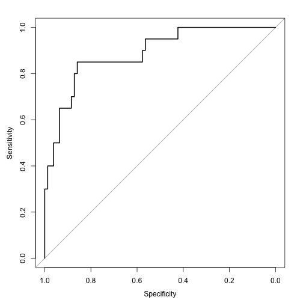

## Survival Analysis from d01 Procalcitonin Project

========================================================


```r
anonMASTER <- read.csv("~/Desktop/Procalcitonin Day 01 Priject/anonMASTER.csv")
View(anonMASTER)
library(ggplot2)
library(caret)
```

```
## Loading required package: lattice
```

```r
library(dplyr)
```

```
## 
## Attaching package: 'dplyr'
## 
## The following objects are masked from 'package:stats':
## 
##     filter, lag
## 
## The following objects are masked from 'package:base':
## 
##     intersect, setdiff, setequal, union
```


```r
data <- anonMASTER
data <- tbl_df(data)
qplot(LACTATE.d01,Survival,data=data, colour=Survival)
```

```
## Warning: Removed 221 rows containing missing values (geom_point).
```

 


```r
qplot(LACTATE.d01,Survival,data=data, colour=Survival, geom=c("point","smooth"), method=lm)
```

```
## Warning: Removed 221 rows containing missing values (stat_smooth).
## Warning: Removed 221 rows containing missing values (geom_point).
```

 


```r
qplot(LACTATE.d01,Survival,data=data, colour=Transplant.y, geom=c("point","smooth"), method=lm)
```

```
## Warning: Removed 202 rows containing missing values (stat_smooth).
## Warning: Removed 19 rows containing missing values (stat_smooth).
## Warning: Removed 221 rows containing missing values (geom_point).
```

 

```r
qplot(LACTATE.d01,Survival,data=data, colour=ESLD, geom=c("point","smooth"), method=lm)
```

```
## Warning: Removed 13 rows containing missing values (stat_smooth).
## Warning: Removed 208 rows containing missing values (stat_smooth).
## Warning: Removed 221 rows containing missing values (geom_point).
```

 


```r
qplot(log(PROCALCITONIN.d01),Survival,data=data,colour=PROCALCITONIN.d01, geom=c("point","smooth"), method=lm)
```

 


```r
qplot(log(PROCALCITONIN.d01),Survival,data=data,colour=Transplant.y, geom=c("point","smooth"), method=lm)
```

 


```r
qplot(log(PROCALCITONIN.d01),Survival,data=data,colour=ESLD, geom=c("point","smooth"), method=lm)
```

 


```r
qplot(log(LACTATE.d01),Survival,data=data,colour=aki, geom=c("point","smooth"), method=lm)
```

```
## Warning: Removed 203 rows containing missing values (stat_smooth).
## Warning: Removed 16 rows containing missing values (stat_smooth).
## Warning: Removed 2 rows containing missing values (stat_smooth).
## Warning: Removed 221 rows containing missing values (geom_point).
```

 


```r
qplot(log(LACTATE.d01),Survival,data=data,colour=ESLD, geom=c("point","smooth"), method=lm)
```

```
## Warning: Removed 13 rows containing missing values (stat_smooth).
## Warning: Removed 208 rows containing missing values (stat_smooth).
## Warning: Removed 221 rows containing missing values (geom_point).
```

 


```
