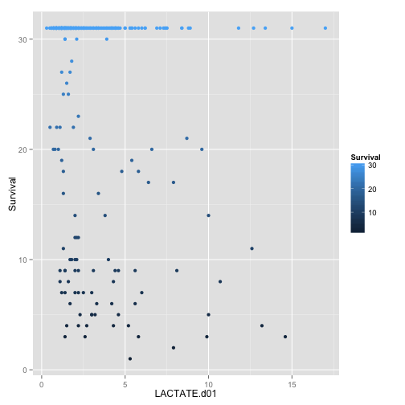

## Survival Analysis from d01 Procalcitonin Project

========================================================


```r
anonMASTER <- read.csv("~/Desktop/Procalcitonin Day 01 Priject/anonMASTER.csv")
View(anonMASTER)
library(ggplot2)
library(caret)
```

```
## Loading required package: lattice
```

```r
library(dplyr)
```

```
## 
## Attaching package: 'dplyr'
## 
## The following objects are masked from 'package:stats':
## 
##     filter, lag
## 
## The following objects are masked from 'package:base':
## 
##     intersect, setdiff, setequal, union
```


```r
data <- anonMASTER
data <- tbl_df(data)
qplot(LACTATE.d01,Survival,data=data, colour=Survival)
```

```
## Warning: Removed 221 rows containing missing values (geom_point).
```

 


```r
qplot(LACTATE.d01,Survival,data=data, colour=Survival, geom=c("point","smooth"), method=lm)
```

```
## Warning: Removed 221 rows containing missing values (stat_smooth).
## Warning: Removed 221 rows containing missing values (geom_point).
```

 


```r
qplot(LACTATE.d01,Survival,data=data, colour=Transplant.y, geom=c("point","smooth"), method=lm)
```

```
## Warning: Removed 202 rows containing missing values (stat_smooth).
## Warning: Removed 19 rows containing missing values (stat_smooth).
## Warning: Removed 221 rows containing missing values (geom_point).
```

 

```r
qplot(LACTATE.d01,Survival,data=data, colour=ESLD, geom=c("point","smooth"), method=lm)
```

```
## Warning: Removed 13 rows containing missing values (stat_smooth).
## Warning: Removed 208 rows containing missing values (stat_smooth).
## Warning: Removed 221 rows containing missing values (geom_point).
```

 


```r
qplot(log(PROCALCITONIN.d01),Survival,data=data,colour=PROCALCITONIN.d01, geom=c("point","smooth"), method=lm)
```

 


```r
qplot(log(PROCALCITONIN.d01),Survival,data=data,colour=Transplant.y, geom=c("point","smooth"), method=lm)
```

 


```r
qplot(log(PROCALCITONIN.d01),Survival,data=data,colour=ESLD, geom=c("point","smooth"), method=lm)
```

 


```r
qplot(log(LACTATE.d01),Survival,data=data,colour=aki, geom=c("point","smooth"), method=lm)
```

```
## Warning: Removed 203 rows containing missing values (stat_smooth).
## Warning: Removed 16 rows containing missing values (stat_smooth).
## Warning: Removed 2 rows containing missing values (stat_smooth).
## Warning: Removed 221 rows containing missing values (geom_point).
```

 


```r
qplot(log(LACTATE.d01),Survival,data=data,colour=ESLD, geom=c("point","smooth"), method=lm)
```

```
## Warning: Removed 13 rows containing missing values (stat_smooth).
## Warning: Removed 208 rows containing missing values (stat_smooth).
## Warning: Removed 221 rows containing missing values (geom_point).
```

 


```r
esld <- subset(data, ESLD=="ESLD")

esldnonesrd <- subset(esld, ESRD_CKD.5="non ESRD.CKD5")
g <- glm(rrtbin~WBC.d01 + log(PROCALCITONIN.d01) + CR.d01 +DM2 + Htn + PLATELETS.d01, data=esldnonesrd, family=binomial(link=logit))

summary(g)
```

```
## 
## Call:
## glm(formula = rrtbin ~ WBC.d01 + log(PROCALCITONIN.d01) + CR.d01 + 
##     DM2 + Htn + PLATELETS.d01, family = binomial(link = logit), 
##     data = esldnonesrd)
## 
## Deviance Residuals: 
##    Min      1Q  Median      3Q     Max  
## -1.718  -0.479  -0.197   0.264   2.352  
## 
## Coefficients:
##                        Estimate Std. Error z value Pr(>|z|)    
## (Intercept)            -5.54996    1.85852   -2.99  0.00282 ** 
## WBC.d01                 0.18368    0.06560    2.80  0.00511 ** 
## log(PROCALCITONIN.d01)  0.53847    0.25756    2.09  0.03656 *  
## CR.d01                  1.46222    0.41349    3.54  0.00041 ***
## DM2no DM2              -0.46167    0.87908   -0.53  0.59946    
## Htnno htn              -0.10604    0.94002   -0.11  0.91019    
## PLATELETS.d01          -0.00491    0.00366   -1.34  0.17956    
## ---
## Signif. codes:  0 '***' 0.001 '**' 0.01 '*' 0.05 '.' 0.1 ' ' 1
## 
## (Dispersion parameter for binomial family taken to be 1)
## 
##     Null deviance: 85.612  on 67  degrees of freedom
## Residual deviance: 44.814  on 61  degrees of freedom
## AIC: 58.81
## 
## Number of Fisher Scoring iterations: 6
```


```r
chf <- subset(data, CHF=="CHF")
chfnoesrd<- subset(chf, ESRD_CKD5=="non ESRD.CKD5" )
glm.chf.aki <- glm(aki~log(PROCALCITONIN.d01)+ WBC.d01 +CR.d01 + PHtn + ALB.d01+DM2 +min_sodium + min_hb,data=chfnoesrd, family=binomial)
glm.chf.rrt <- glm(rrtbin~log(PROCALCITONIN.d01)+ WBC.d01 +CR.d01 + PHtn + ALB.d01+DM2 +min_sodium + min_hb+Htn,data=chfnoesrd, family=binomial)
summary(glm.chf.rrt)
```

```
## 
## Call:
## glm(formula = rrtbin ~ log(PROCALCITONIN.d01) + WBC.d01 + CR.d01 + 
##     PHtn + ALB.d01 + DM2 + min_sodium + min_hb + Htn, family = binomial, 
##     data = chfnoesrd)
## 
## Deviance Residuals: 
##    Min      1Q  Median      3Q     Max  
## -1.163  -0.343  -0.203  -0.125   2.595  
## 
## Coefficients:
##                        Estimate Std. Error z value Pr(>|z|)  
## (Intercept)              7.9346    11.4446    0.69    0.488  
## log(PROCALCITONIN.d01)   0.4965     0.2279    2.18    0.029 *
## WBC.d01                 -0.0277     0.0522   -0.53    0.595  
## CR.d01                   0.4566     0.2222    2.05    0.040 *
## PHtnPHtn                 1.7160     0.8899    1.93    0.054 .
## ALB.d01                 -0.1718     0.7060   -0.24    0.808  
## DM2no DM2               -0.0934     0.7676   -0.12    0.903  
## min_sodium              -0.0940     0.0868   -1.08    0.279  
## min_hb                   0.1192     0.1703    0.70    0.484  
## Htnno htn               -0.0159     0.8000   -0.02    0.984  
## ---
## Signif. codes:  0 '***' 0.001 '**' 0.01 '*' 0.05 '.' 0.1 ' ' 1
## 
## (Dispersion parameter for binomial family taken to be 1)
## 
##     Null deviance: 68.336  on 151  degrees of freedom
## Residual deviance: 52.984  on 142  degrees of freedom
##   (55 observations deleted due to missingness)
## AIC: 72.98
## 
## Number of Fisher Scoring iterations: 7
```

```r
qplot( log(PROCALCITONIN.d01),CR.d01-d2max_cr,data=chfnoesrd, colour=rrtbin)
```

```
## Warning: Removed 1 rows containing missing values (geom_point).
```

 

```r
glm.chf.aki <- glm(devaki~log(PROCALCITONIN.d01)+WBC.d01+DM2+CR.d01+gender+ALB.d01+ESLD+PHtn+Htn,data=chfnoesrd, family=binomial(link=logit))
summary(glm.chf.aki)
```

```
## 
## Call:
## glm(formula = devaki ~ log(PROCALCITONIN.d01) + WBC.d01 + DM2 + 
##     CR.d01 + gender + ALB.d01 + ESLD + PHtn + Htn, family = binomial(link = logit), 
##     data = chfnoesrd)
## 
## Deviance Residuals: 
##    Min      1Q  Median      3Q     Max  
## -0.973  -0.416  -0.324  -0.222   2.628  
## 
## Coefficients:
##                        Estimate Std. Error z value Pr(>|z|)  
## (Intercept)             -2.8696     2.3735   -1.21    0.227  
## log(PROCALCITONIN.d01)   0.3525     0.1566    2.25    0.024 *
## WBC.d01                 -0.0588     0.0473   -1.24    0.214  
## DM2no DM2               -0.4732     0.6253   -0.76    0.449  
## CR.d01                  -0.3810     0.4716   -0.81    0.419  
## genderM                 -0.2416     0.6751   -0.36    0.720  
## ALB.d01                  0.6485     0.5113    1.27    0.205  
## ESLDnon ESLD            -0.1257     1.1322   -0.11    0.912  
## PHtnPHtn                -0.0123     0.7962   -0.02    0.988  
## Htnno htn               -0.1574     0.6281   -0.25    0.802  
## ---
## Signif. codes:  0 '***' 0.001 '**' 0.01 '*' 0.05 '.' 0.1 ' ' 1
## 
## (Dispersion parameter for binomial family taken to be 1)
## 
##     Null deviance: 91.822  on 169  degrees of freedom
## Residual deviance: 82.634  on 160  degrees of freedom
##   (37 observations deleted due to missingness)
## AIC: 102.6
## 
## Number of Fisher Scoring iterations: 6
```

```
