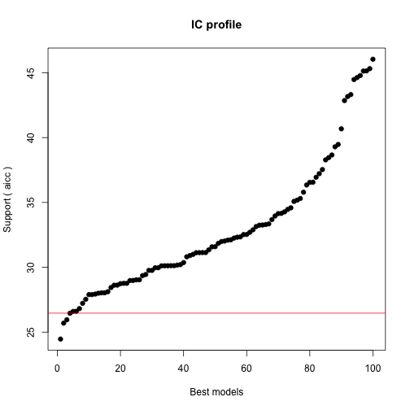
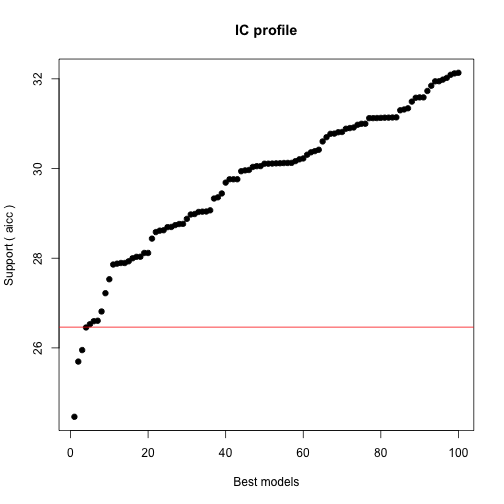

## Exploratory Survival Graphs from d01 Procalcitonin Project and the CHF,ESLD ,GLOBAL, renal failure project

========================================================

```r
opts_chunk$set(tidy=TRUE,echo=FALSE,cache=TRUE)
```


## Exploratory Graphs

 


## ** ESLD AKI  models **

Below we will create a data set esldnowesrd which contains the patients that have a cirrhosis code and do not have a esrd.ckd 5 code.


## Summary of the GLM for developing renal injury of >= RIFLE stage 1 in hospitalised ESLD patients who do not have prexisting stage 5 ESRD.


```
## 
## Call:
## glm(formula = devaki ~ WBC.d01 + log(PROCALCITONIN.d01) + CR.d01 + 
##     DM2 + Htn + PLATELETS.d01 + LACTATE.d01, family = binomial(link = logit), 
##     data = esldnonesrd)
## 
## Deviance Residuals: 
##    Min      1Q  Median      3Q     Max  
## -1.217  -0.461  -0.303  -0.175   3.157  
## 
## Coefficients:
##                        Estimate Std. Error z value Pr(>|z|)  
## (Intercept)            -0.01684    1.96581   -0.01    0.993  
## WBC.d01                -0.01034    0.07423   -0.14    0.889  
## log(PROCALCITONIN.d01)  0.62057    0.37404    1.66    0.097 .
## CR.d01                  0.03011    0.29135    0.10    0.918  
## DM2no DM2              -1.90340    1.32789   -1.43    0.152  
## Htnno htn              -1.83503    1.28125   -1.43    0.152  
## PLATELETS.d01          -0.00512    0.00682   -0.75    0.453  
## LACTATE.d01             0.15554    0.15074    1.03    0.302  
## ---
## Signif. codes:  0 '***' 0.001 '**' 0.01 '*' 0.05 '.' 0.1 ' ' 1
## 
## (Dispersion parameter for binomial family taken to be 1)
## 
##     Null deviance: 37.907  on 54  degrees of freedom
## Residual deviance: 30.211  on 47  degrees of freedom
##   (13 observations deleted due to missingness)
## AIC: 46.21
## 
## Number of Fisher Scoring iterations: 6
```


** Not enough data to look at patients in the rifle2 and rifle 3 categories in ESLD patients. Algorithms dont converge for rifle 2 and rifle 3 patients. The RRT data is shown below.**


```
## Warning: glm.fit: algorithm did not converge
## Warning: glm.fit: fitted probabilities numerically 0 or 1 occurred
## Warning: glm.fit: algorithm did not converge
## Warning: glm.fit: fitted probabilities numerically 0 or 1 occurred
```

```
## 
## Call:
## glm(formula = rrtbin ~ WBC.d01 + log(PROCALCITONIN.d01) + CR.d01 + 
##     DM2 + Htn + PLATELETS.d01 + LACTATE.d01, family = binomial(link = logit), 
##     data = esldnonesrd)
## 
## Deviance Residuals: 
##    Min      1Q  Median      3Q     Max  
## -1.694  -0.557  -0.244   0.483   2.386  
## 
## Coefficients:
##                        Estimate Std. Error z value Pr(>|z|)   
## (Intercept)            -5.56520    2.15312   -2.58   0.0097 **
## WBC.d01                 0.16787    0.07291    2.30   0.0213 * 
## log(PROCALCITONIN.d01)  0.46430    0.28357    1.64   0.1016   
## CR.d01                  1.42445    0.43306    3.29   0.0010 **
## DM2no DM2              -0.55779    0.93853   -0.59   0.5523   
## Htnno htn              -0.12755    0.97284   -0.13   0.8957   
## PLATELETS.d01          -0.00417    0.00383   -1.09   0.2763   
## LACTATE.d01             0.07702    0.14385    0.54   0.5923   
## ---
## Signif. codes:  0 '***' 0.001 '**' 0.01 '*' 0.05 '.' 0.1 ' ' 1
## 
## (Dispersion parameter for binomial family taken to be 1)
## 
##     Null deviance: 72.103  on 54  degrees of freedom
## Residual deviance: 40.918  on 47  degrees of freedom
##   (13 observations deleted due to missingness)
## AIC: 56.92
## 
## Number of Fisher Scoring iterations: 6
```


## CHF and RRT models


```
## 
## Call:
## glm(formula = rrtbin ~ log(PROCALCITONIN.d01) + WBC.d01 + CR.d01 + 
##     PHtn + ALB.d01 + DM2 + min_sodium + min_hb + Htn, family = binomial, 
##     data = chfnoesrd)
## 
## Deviance Residuals: 
##    Min      1Q  Median      3Q     Max  
## -1.163  -0.343  -0.203  -0.125   2.595  
## 
## Coefficients:
##                        Estimate Std. Error z value Pr(>|z|)  
## (Intercept)              7.9346    11.4446    0.69    0.488  
## log(PROCALCITONIN.d01)   0.4965     0.2279    2.18    0.029 *
## WBC.d01                 -0.0277     0.0522   -0.53    0.595  
## CR.d01                   0.4566     0.2222    2.05    0.040 *
## PHtnPHtn                 1.7160     0.8899    1.93    0.054 .
## ALB.d01                 -0.1718     0.7060   -0.24    0.808  
## DM2no DM2               -0.0934     0.7676   -0.12    0.903  
## min_sodium              -0.0940     0.0868   -1.08    0.279  
## min_hb                   0.1192     0.1703    0.70    0.484  
## Htnno htn               -0.0159     0.8000   -0.02    0.984  
## ---
## Signif. codes:  0 '***' 0.001 '**' 0.01 '*' 0.05 '.' 0.1 ' ' 1
## 
## (Dispersion parameter for binomial family taken to be 1)
## 
##     Null deviance: 68.336  on 151  degrees of freedom
## Residual deviance: 52.984  on 142  degrees of freedom
##   (55 observations deleted due to missingness)
## AIC: 72.98
## 
## Number of Fisher Scoring iterations: 7
```

```
## 
## Call:
## glm(formula = rrtbin ~ log(PROCALCITONIN.d01) + LACTATE.d01 + 
##     WBC.d01 + CR.d01 + PHtn + ALB.d01 + DM2 + min_sodium + min_hb + 
##     Htn, family = binomial, data = chfnoesrd)
## 
## Deviance Residuals: 
##    Min      1Q  Median      3Q     Max  
## -1.132  -0.396  -0.211  -0.116   2.420  
## 
## Coefficients:
##                        Estimate Std. Error z value Pr(>|z|)  
## (Intercept)              5.9622    14.1334    0.42     0.67  
## log(PROCALCITONIN.d01)   0.4462     0.2860    1.56     0.12  
## LACTATE.d01              0.1629     0.1360    1.20     0.23  
## WBC.d01                 -0.0385     0.0677   -0.57     0.57  
## CR.d01                   0.4426     0.2262    1.96     0.05 .
## PHtnPHtn                 1.5663     1.0678    1.47     0.14  
## ALB.d01                 -0.3980     0.7477   -0.53     0.59  
## DM2no DM2               -0.3081     0.9478   -0.33     0.75  
## min_sodium              -0.0866     0.1113   -0.78     0.44  
## min_hb                   0.2403     0.2103    1.14     0.25  
## Htnno htn                0.4355     0.9061    0.48     0.63  
## ---
## Signif. codes:  0 '***' 0.001 '**' 0.01 '*' 0.05 '.' 0.1 ' ' 1
## 
## (Dispersion parameter for binomial family taken to be 1)
## 
##     Null deviance: 55.417  on 97  degrees of freedom
## Residual deviance: 40.849  on 87  degrees of freedom
##   (109 observations deleted due to missingness)
## AIC: 62.85
## 
## Number of Fisher Scoring iterations: 7
```

```
## 
## Call:
## glm(formula = rrtbin ~ LACTATE.d01 + CR.d01, family = binomial, 
##     data = chfnoesrd)
## 
## Deviance Residuals: 
##    Min      1Q  Median      3Q     Max  
## -1.077  -0.389  -0.322  -0.272   2.626  
## 
## Coefficients:
##             Estimate Std. Error z value Pr(>|z|)    
## (Intercept)  -4.2523     0.8172   -5.20    2e-07 ***
## LACTATE.d01   0.1674     0.0982    1.70    0.088 .  
## CR.d01        0.6987     0.3240    2.16    0.031 *  
## ---
## Signif. codes:  0 '***' 0.001 '**' 0.01 '*' 0.05 '.' 0.1 ' ' 1
## 
## (Dispersion parameter for binomial family taken to be 1)
## 
##     Null deviance: 74.286  on 123  degrees of freedom
## Residual deviance: 62.028  on 121  degrees of freedom
##   (83 observations deleted due to missingness)
## AIC: 68.03
## 
## Number of Fisher Scoring iterations: 6
```

```
## 
## Call:
## glm(formula = rrtbin ~ log(PROCALCITONIN.d01) + CR.d01, family = binomial, 
##     data = chfnoesrd)
## 
## Deviance Residuals: 
##    Min      1Q  Median      3Q     Max  
## -0.913  -0.346  -0.234  -0.175   2.835  
## 
## Coefficients:
##                        Estimate Std. Error z value Pr(>|z|)    
## (Intercept)              -4.221      0.714   -5.91  3.4e-09 ***
## log(PROCALCITONIN.d01)    0.359      0.150    2.38    0.017 *  
## CR.d01                    0.685      0.299    2.29    0.022 *  
## ---
## Signif. codes:  0 '***' 0.001 '**' 0.01 '*' 0.05 '.' 0.1 ' ' 1
## 
## (Dispersion parameter for binomial family taken to be 1)
## 
##     Null deviance: 91.518  on 205  degrees of freedom
## Residual deviance: 74.787  on 203  degrees of freedom
##   (1 observation deleted due to missingness)
## AIC: 80.79
## 
## Number of Fisher Scoring iterations: 6
```

```
## Warning: Removed 1 rows containing missing values (geom_point).
```

 

## CHF AKI RIFLE Stage I models


```
## 
## Call:
## glm(formula = devaki ~ log(PROCALCITONIN.d01) + WBC.d01 + DM2 + 
##     CR.d01 + gender + ALB.d01 + ESLD + PHtn + Htn, family = binomial(link = logit), 
##     data = chfnoesrd)
## 
## Deviance Residuals: 
##    Min      1Q  Median      3Q     Max  
## -0.973  -0.416  -0.324  -0.222   2.628  
## 
## Coefficients:
##                        Estimate Std. Error z value Pr(>|z|)  
## (Intercept)             -2.8696     2.3735   -1.21    0.227  
## log(PROCALCITONIN.d01)   0.3525     0.1566    2.25    0.024 *
## WBC.d01                 -0.0588     0.0473   -1.24    0.214  
## DM2no DM2               -0.4732     0.6253   -0.76    0.449  
## CR.d01                  -0.3810     0.4716   -0.81    0.419  
## genderM                 -0.2416     0.6751   -0.36    0.720  
## ALB.d01                  0.6485     0.5113    1.27    0.205  
## ESLDnon ESLD            -0.1257     1.1322   -0.11    0.912  
## PHtnPHtn                -0.0123     0.7962   -0.02    0.988  
## Htnno htn               -0.1574     0.6281   -0.25    0.802  
## ---
## Signif. codes:  0 '***' 0.001 '**' 0.01 '*' 0.05 '.' 0.1 ' ' 1
## 
## (Dispersion parameter for binomial family taken to be 1)
## 
##     Null deviance: 91.822  on 169  degrees of freedom
## Residual deviance: 82.634  on 160  degrees of freedom
##   (37 observations deleted due to missingness)
## AIC: 102.6
## 
## Number of Fisher Scoring iterations: 6
```

```
## 
## Call:
## glm(formula = devaki ~ log(PROCALCITONIN.d01) + LACTATE.d01 + 
##     WBC.d01 + DM2 + PHtn + min_sodium + CR.d01 + gender + ALB.d01, 
##     family = binomial(link = logit), data = chfnoesrd)
## 
## Deviance Residuals: 
##    Min      1Q  Median      3Q     Max  
## -1.280  -0.399  -0.201  -0.117   2.779  
## 
## Coefficients:
##                        Estimate Std. Error z value Pr(>|z|)  
## (Intercept)              8.3201    13.3358    0.62    0.533  
## log(PROCALCITONIN.d01)   0.5900     0.2810    2.10    0.036 *
## LACTATE.d01             -0.0939     0.1854   -0.51    0.613  
## WBC.d01                 -0.0371     0.0643   -0.58    0.564  
## DM2no DM2               -1.0748     1.0157   -1.06    0.290  
## PHtnPHtn                 0.8141     1.3454    0.61    0.545  
## min_sodium              -0.0899     0.1038   -0.87    0.387  
## CR.d01                  -1.1553     0.8197   -1.41    0.159  
## genderM                  0.2784     1.0809    0.26    0.797  
## ALB.d01                  0.9259     0.8083    1.15    0.252  
## ---
## Signif. codes:  0 '***' 0.001 '**' 0.01 '*' 0.05 '.' 0.1 ' ' 1
## 
## (Dispersion parameter for binomial family taken to be 1)
## 
##     Null deviance: 55.417  on 97  degrees of freedom
## Residual deviance: 41.894  on 88  degrees of freedom
##   (109 observations deleted due to missingness)
## AIC: 61.89
## 
## Number of Fisher Scoring iterations: 7
```

## Stage 1 RIFLE AKI in CHF All Subset Regression

*We will generate all subset regression with the LEAPS package for looking at risk factors for developing AKI in patient with a history of CHF in the dataset. We are using the devaki variable as an outcome (1.5X rise in Cr, over admission day Creatinine)((d2max_cr/cr.d01 > 1.5)*


```
## The following objects are masked _by_ .GlobalEnv:
## 
##     rifle3, rrtbin
```

 

## Stage 1 RIFLE AKI in CHF Odds ratio table

*We will generate an odds ratio table for looking at risk factors for developing AKI in patient with a history of CHF in the dataset. We are using the devaki variable which essentially corresponds to a rifle stage 1 definition of renal failure (d2max_cr/cr.d01 > 1.5)*


```
## Waiting for profiling to be done...
```

```
## Warning: glm.fit: fitted probabilities numerically 0 or 1 occurred
## Warning: glm.fit: fitted probabilities numerically 0 or 1 occurred
```

```
##                          odds    2.5 %  97.5 %
## (Intercept)            0.6846 0.001213 264.647
## log(PROCALCITONIN.d01) 2.0033 1.268276   3.617
## LACTATE.d01            0.9544 0.638179   1.265
## WBC.d01                0.9252 0.807300   1.027
## DM2no DM2              0.2911 0.038014   1.643
## CR.d01                 0.4175 0.092484   1.153
## genderM                0.8931 0.129960   6.709
## ALB.d01                1.3277 0.405007   5.002
## ESLDnon ESLD           0.4399 0.044187  10.652
## PHtnPHtn               2.1494 0.157377  26.938
```


## CHF AKI RIFLE Stage 2 (d2maxcr/Cr.d01 >2)

*Here we subset the anonMASTER file and define the outcome of RIFLE 2 renal injury. We subset the data for CHF patients and generate and odds ratio table.*


```
## 
## Call:
## glm(formula = devakirifle2 ~ log(PROCALCITONIN.d01) + LACTATE.d01 + 
##     WBC.d01 + DM2 + CR.d01 + gender + ALB.d01 + ESLD + PHtn + 
##     Htn, family = binomial(link = logit), data = chfnoesrd)
## 
## Deviance Residuals: 
##     Min       1Q   Median       3Q      Max  
## -1.3291  -0.2503  -0.1036  -0.0309   2.4720  
## 
## Coefficients:
##                         Estimate Std. Error z value Pr(>|z|)  
## (Intercept)            -1.51e+01   3.17e+03    0.00    0.996  
## log(PROCALCITONIN.d01)  7.88e-01   3.57e-01    2.21    0.027 *
## LACTATE.d01            -3.75e-01   3.62e-01   -1.04    0.299  
## WBC.d01                -7.44e-03   6.86e-02   -0.11    0.914  
## DM2no DM2              -2.31e+00   1.36e+00   -1.70    0.090 .
## CR.d01                 -2.35e+00   1.40e+00   -1.68    0.092 .
## genderM                 1.48e+00   1.70e+00    0.87    0.382  
## ALB.d01                -7.14e-02   9.07e-01   -0.08    0.937  
## ESLDnon ESLD            1.58e+01   3.17e+03    0.00    0.996  
## PHtnPHtn                6.28e-01   1.77e+00    0.35    0.723  
## Htnno htn              -9.96e-01   1.15e+00   -0.87    0.386  
## ---
## Signif. codes:  0 '***' 0.001 '**' 0.01 '*' 0.05 '.' 0.1 ' ' 1
## 
## (Dispersion parameter for binomial family taken to be 1)
## 
##     Null deviance: 46.571  on 109  degrees of freedom
## Residual deviance: 30.074  on  99  degrees of freedom
##   (97 observations deleted due to missingness)
## AIC: 52.07
## 
## Number of Fisher Scoring iterations: 18
```

```
## Waiting for profiling to be done...
```

```
##                             odds      2.5 %     97.5 %
## (Intercept)            2.703e-07         NA 4.829e+129
## log(PROCALCITONIN.d01) 2.198e+00  1.195e+00  5.109e+00
## LACTATE.d01            6.871e-01  2.782e-01  1.180e+00
## WBC.d01                9.926e-01  8.472e-01  1.120e+00
## DM2no DM2              9.937e-02  3.463e-03  1.073e+00
## CR.d01                 9.545e-02  3.071e-03  7.734e-01
## genderM                4.408e+00  2.292e-01  2.557e+02
## ALB.d01                9.311e-01  1.318e-01  5.588e+00
## ESLDnon ESLD           7.286e+06 4.079e-130         NA
## PHtnPHtn               1.875e+00  4.221e-02  6.776e+01
## Htnno htn              3.694e-01  2.912e-02  3.203e+00
```

*All subsets regression fo RIFLE2 renal failure in CHF*


```
## The following objects are masked _by_ .GlobalEnv:
## 
##     aki, rrtbin
## The following objects are masked from chfnoesrd (position 3):
## 
##     aki, ALB.d01, CatheterCPT, CHEMORAD, CHF, CR.d01, CRP.d01,
##     d2max_cr, devaki, devakirifle2, DM2, ESLD, ESRD_CKD5, event,
##     fractioncrchange, gender, HIV, Htn, IMMUNE, LACTATE.d01,
##     LOS.y, LVAD, max_cr, maxcr, mean_cr, min_cr, min_hb,
##     min_sodium, newage, PHtn, PLATELETS.d01, PLevel,
##     PROCALCITONIN.d01, ratiocr, rationcr, rrtbin, RRTCPT,
##     Survival, Transplant.x, Transplant.y, two_week, VentCPT,
##     WBC.d01, X, X.1, X30d
```

 

## CHF and RIFLE 3 AKI Models

*We are generating glm models on the outcome of RIFLE 3 Renal failure which includes a Creatinine rise of >3X and or RRT.*


```
## 
## Call:
## glm(formula = rifle3 ~ log(PROCALCITONIN.d01) + LACTATE.d01 + 
##     WBC.d01 + DM2 + CR.d01 + gender + ALB.d01 + ESLD + PHtn + 
##     Htn, family = binomial(link = logit), data = chfnoesrd)
## 
## Deviance Residuals: 
##    Min      1Q  Median      3Q     Max  
## -1.447  -0.451  -0.243  -0.138   2.952  
## 
## Coefficients:
##                        Estimate Std. Error z value Pr(>|z|)   
## (Intercept)             -3.9223     3.1197   -1.26   0.2087   
## log(PROCALCITONIN.d01)   0.4474     0.2252    1.99   0.0470 * 
## LACTATE.d01              0.0905     0.1286    0.70   0.4819   
## WBC.d01                 -0.0259     0.0484   -0.54   0.5926   
## DM2no DM2                0.2572     0.7726    0.33   0.7392   
## CR.d01                   1.1253     0.3989    2.82   0.0048 **
## genderM                  0.7827     0.9671    0.81   0.4183   
## ALB.d01                  0.3885     0.7030    0.55   0.5805   
## ESLDnon ESLD            -2.8262     1.0758   -2.63   0.0086 **
## PHtnPHtn                 1.0986     1.0367    1.06   0.2893   
## Htnno htn               -0.5470     0.7700   -0.71   0.4775   
## ---
## Signif. codes:  0 '***' 0.001 '**' 0.01 '*' 0.05 '.' 0.1 ' ' 1
## 
## (Dispersion parameter for binomial family taken to be 1)
## 
##     Null deviance: 87.628  on 109  degrees of freedom
## Residual deviance: 56.602  on  99  degrees of freedom
##   (97 observations deleted due to missingness)
## AIC: 78.6
## 
## Number of Fisher Scoring iterations: 6
```

```
## Waiting for profiling to be done...
```

```
##                           odds     2.5 %  97.5 %
## (Intercept)            0.01980 3.022e-05  7.9078
## log(PROCALCITONIN.d01) 1.56423 1.024e+00  2.5166
## LACTATE.d01            1.09469 8.382e-01  1.4093
## WBC.d01                0.97445 8.757e-01  1.0603
## DM2no DM2              1.29327 2.820e-01  6.2176
## CR.d01                 3.08127 1.507e+00  7.3687
## genderM                2.18740 3.585e-01 17.2234
## ALB.d01                1.47482 3.758e-01  6.2315
## ESLDnon ESLD           0.05924 6.174e-03  0.4823
## PHtnPHtn               2.99992 3.710e-01 24.2556
## Htnno htn              0.57870 1.188e-01  2.5976
```


```
## Initialization...
## TASK: Exhaustive screening of candidate set.
## Fitting...
## 
## After 50 models:
## Best model: rifle3~1+log(PROCALCITONIN.d01)+CR.d01+min_sodium
## Crit= 24.4634293420555
## Mean crit= 57.2004072912646
```

 

```
## 
## After 100 models:
## Best model: rifle3~1+log(PROCALCITONIN.d01)+CR.d01+min_sodium
## Crit= 24.4634293420555
## Mean crit= 53.5872902402722
```

 

```
## 
## After 150 models:
## Best model: rifle3~1+log(PROCALCITONIN.d01)+CR.d01+min_sodium
## Crit= 24.4634293420555
## Mean crit= 46.134205980409
```

 

```
## 
## After 200 models:
## Best model: rifle3~1+log(PROCALCITONIN.d01)+CR.d01+min_sodium
## Crit= 24.4634293420555
## Mean crit= 42.0172347535561
```

 

```
## 
## After 250 models:
## Best model: rifle3~1+log(PROCALCITONIN.d01)+CR.d01+min_sodium
## Crit= 24.4634293420555
## Mean crit= 39.2342585485594
```

 

```
## 
## After 300 models:
## Best model: rifle3~1+log(PROCALCITONIN.d01)+CR.d01+min_sodium
## Crit= 24.4634293420555
## Mean crit= 37.3905319402869
```

 

```
## 
## After 350 models:
## Best model: rifle3~1+log(PROCALCITONIN.d01)+CR.d01+min_sodium
## Crit= 24.4634293420555
## Mean crit= 34.9650211645618
```

 

```
## 
## After 400 models:
## Best model: rifle3~1+log(PROCALCITONIN.d01)+CR.d01+min_sodium
## Crit= 24.4634293420555
## Mean crit= 33.1836442245638
```

 

```
## 
## After 450 models:
## Best model: rifle3~1+log(PROCALCITONIN.d01)+CR.d01+min_sodium
## Crit= 24.4634293420555
## Mean crit= 32.2523677097079
```

 

```
## 
## After 500 models:
## Best model: rifle3~1+log(PROCALCITONIN.d01)+CR.d01+min_sodium
## Crit= 24.4634293420555
## Mean crit= 31.6147726378283
```

 

```
## 
## After 550 models:
## Best model: rifle3~1+log(PROCALCITONIN.d01)+CR.d01+min_sodium
## Crit= 24.4634293420555
## Mean crit= 31.2882818319862
```

 

```
## 
## After 600 models:
## Best model: rifle3~1+log(PROCALCITONIN.d01)+CR.d01+min_sodium
## Crit= 24.4634293420555
## Mean crit= 30.7011539057239
```

 

```
## 
## After 650 models:
## Best model: rifle3~1+log(PROCALCITONIN.d01)+CR.d01+min_sodium
## Crit= 24.4634293420555
## Mean crit= 30.2378301251858
```

 

```
## 
## After 700 models:
## Best model: rifle3~1+log(PROCALCITONIN.d01)+CR.d01+min_sodium
## Crit= 24.4634293420555
## Mean crit= 30.1022559186875
```

 

```
## 
## After 750 models:
## Best model: rifle3~1+log(PROCALCITONIN.d01)+CR.d01+min_sodium
## Crit= 24.4634293420555
## Mean crit= 29.8237563521213
```

 

```
## 
## After 800 models:
## Best model: rifle3~1+log(PROCALCITONIN.d01)+CR.d01+min_sodium
## Crit= 24.4634293420555
## Mean crit= 29.7426604906768
```

 

```
## 
## After 850 models:
## Best model: rifle3~1+log(PROCALCITONIN.d01)+CR.d01+min_sodium
## Crit= 24.4634293420555
## Mean crit= 29.6154378921239
```

 

```
## 
## After 900 models:
## Best model: rifle3~1+log(PROCALCITONIN.d01)+CR.d01+min_sodium
## Crit= 24.4634293420555
## Mean crit= 29.5139631570923
```

 

```
## 
## After 950 models:
## Best model: rifle3~1+log(PROCALCITONIN.d01)+CR.d01+min_sodium
## Crit= 24.4634293420555
## Mean crit= 29.4638806630605
```

 

```
## 
## After 1000 models:
## Best model: rifle3~1+log(PROCALCITONIN.d01)+CR.d01+min_sodium
## Crit= 24.4634293420555
## Mean crit= 29.4171307257732
```

 

```
## 
## After 1050 models:
## Best model: rifle3~1+log(PROCALCITONIN.d01)+CR.d01+min_sodium
## Crit= 24.4634293420555
## Mean crit= 29.4122397545806
```

 

```
## Completed.
```

```
## $name
## [1] "glmulti.analysis"
## 
## $method
## [1] "h"
## 
## $fitting
## [1] "glm"
## 
## $crit
## [1] "aicc"
## 
## $level
## [1] 1
## 
## $marginality
## [1] FALSE
## 
## $confsetsize
## [1] 100
## 
## $bestic
## [1] 24.46
## 
## $icvalues
##   [1] 24.46 24.72 25.70 26.27 26.46 26.53 26.60 26.61 26.87 26.88 26.88
##  [12] 26.88 27.22 27.48 27.53 27.75 27.88 27.89 27.89 28.00 28.03 28.03
##  [23] 28.09 28.49 28.49 28.50 28.58 28.61 28.62 28.67 28.69 28.70 28.76
##  [34] 28.98 28.99 29.04 29.05 29.05 29.06 29.06 29.06 29.07 29.33 29.36
##  [45] 29.51 29.58 29.65 29.65 29.69 29.76 29.76 29.76 29.96 29.97 30.00
##  [56] 30.00 30.01 30.04 30.11 30.11 30.11 30.12 30.12 30.12 30.21 30.22
##  [67] 30.22 30.22 30.22 30.25 30.55 30.74 30.75 30.75 30.77 30.78 30.81
##  [78] 30.88 30.89 30.89 30.91 30.96 31.12 31.13 31.13 31.13 31.14 31.25
##  [89] 31.26 31.26 31.27 31.34 31.49 31.58 31.66 31.70 31.71 31.73 31.74
## [100] 31.74
## 
## $bestmodel
## [1] "rifle3 ~ 1 + log(PROCALCITONIN.d01) + CR.d01 + min_sodium"
## 
## $modelweights
##   [1] 0.079358 0.069650 0.042870 0.032156 0.029315 0.028263 0.027329
##   [8] 0.027194 0.023848 0.023749 0.023745 0.023688 0.019998 0.017569
##  [15] 0.017119 0.015365 0.014387 0.014282 0.014281 0.013548 0.013338
##  [22] 0.013319 0.012935 0.010603 0.010576 0.010549 0.010117 0.009958
##  [29] 0.009911 0.009692 0.009576 0.009557 0.009250 0.008315 0.008272
##  [36] 0.008041 0.008014 0.007998 0.007988 0.007958 0.007952 0.007937
##  [43] 0.006960 0.006867 0.006362 0.006150 0.005942 0.005938 0.005829
##  [50] 0.005616 0.005616 0.005613 0.005085 0.005063 0.004991 0.004979
##  [57] 0.004962 0.004894 0.004721 0.004720 0.004713 0.004702 0.004697
##  [64] 0.004685 0.004496 0.004470 0.004455 0.004454 0.004452 0.004406
##  [71] 0.003782 0.003433 0.003425 0.003416 0.003384 0.003375 0.003324
##  [78] 0.003211 0.003197 0.003191 0.003155 0.003078 0.002840 0.002837
##  [85] 0.002833 0.002826 0.002815 0.002665 0.002656 0.002647 0.002636
##  [92] 0.002545 0.002362 0.002263 0.002174 0.002126 0.002123 0.002098
##  [99] 0.002087 0.002086
## 
## $includeobjects
## [1] TRUE
```

This is the best model
"rifle3 ~ 1 + log(PROCALCITONIN.d01) + CR.d01 + min_sodium"

Lets run it

```r
library(pROC)
bestchf <- glm(rifle3 ~ 1 + log(PROCALCITONIN.d01) + CR.d01 + min_sodium, data = chfnoesrd, 
    na.action = na.exclude)
m.roc <- roc(chfnoesrd$rifle3, predict(bestchf, backtransform = TRUE))
plot(m.roc)
```

 

```
## 
## Call:
## roc.default(response = chfnoesrd$rifle3, predictor = predict(bestchf,     backtransform = TRUE))
## 
## Data: predict(bestchf, backtransform = TRUE) in 161 controls (chfnoesrd$rifle3 FALSE) < 15 cases (chfnoesrd$rifle3 TRUE).
## Area under the curve: 0.828
```


```

```

*This is an all subsets regression of RIFLE 3 renal failure in CHF patients*


```
## The following objects are masked _by_ .GlobalEnv:
## 
##     aki, rifle3, rrtbin
## The following objects are masked from chfnoesrd (position 3):
## 
##     aki, ALB.d01, CatheterCPT, CHEMORAD, CHF, CR.d01, CRP.d01,
##     d2max_cr, devaki, devakirifle2, DM2, ESLD, ESRD_CKD5, event,
##     fractioncrchange, gender, HIV, Htn, IMMUNE, LACTATE.d01,
##     LOS.y, LVAD, max_cr, maxcr, mean_cr, min_cr, min_hb,
##     min_sodium, newage, PHtn, PLATELETS.d01, PLevel,
##     PROCALCITONIN.d01, ratiocr, rationcr, rrtbin, RRTCPT,
##     Survival, Transplant.x, Transplant.y, two_week, VentCPT,
##     WBC.d01, X, X.1, X30d
## The following objects are masked from chfnoesrd (position 4):
## 
##     aki, ALB.d01, CatheterCPT, CHEMORAD, CHF, CR.d01, CRP.d01,
##     d2max_cr, devaki, devakirifle2, devakirifle3, DM2, ESLD,
##     ESRD_CKD5, event, fractioncrchange, gender, HIV, Htn, IMMUNE,
##     LACTATE.d01, LOS.y, LVAD, max_cr, maxcr, mean_cr, min_cr,
##     min_hb, min_sodium, newage, PHtn, PLATELETS.d01, PLevel,
##     PROCALCITONIN.d01, ratiocr, rationcr, rifle3, rifle4, rrtbin,
##     RRTCPT, Survival, Transplant.x, Transplant.y, two_week,
##     VentCPT, WBC.d01, X, X.1, X30d
```

```
## Error: invalid type (list) for variable '(family)'
```

 

## Global RIFLE 3 Renal Failure


```
## 
## Call:
## glm(formula = rifle3 ~ log(PROCALCITONIN.d01) + LACTATE.d01 + 
##     WBC.d01 + DM2 + CR.d01 + gender + ALB.d01 + ESLD + PHtn + 
##     Htn, family = binomial(link = logit), data = globalnoesrd)
## 
## Deviance Residuals: 
##    Min      1Q  Median      3Q     Max  
## -1.314  -0.390  -0.259  -0.158   2.912  
## 
## Coefficients:
##                        Estimate Std. Error z value Pr(>|z|)    
## (Intercept)            -0.91201    1.19676   -0.76  0.44602    
## log(PROCALCITONIN.d01)  0.21588    0.11574    1.87  0.06216 .  
## LACTATE.d01             0.12141    0.06916    1.76  0.07917 .  
## WBC.d01                -0.00727    0.02522   -0.29  0.77312    
## DM2no DM2              -0.76475    0.44841   -1.71  0.08811 .  
## CR.d01                  0.55569    0.14288    3.89  0.00010 ***
## genderM                 0.18897    0.45281    0.42  0.67644    
## ALB.d01                -0.43051    0.31253   -1.38  0.16836    
## ESLDnon ESLD           -1.72046    0.51202   -3.36  0.00078 ***
## PHtnPHtn                0.75734    0.57605    1.31  0.18860    
## Htnno htn              -0.17904    0.44845   -0.40  0.68972    
## ---
## Signif. codes:  0 '***' 0.001 '**' 0.01 '*' 0.05 '.' 0.1 ' ' 1
## 
## (Dispersion parameter for binomial family taken to be 1)
## 
##     Null deviance: 220.59  on 359  degrees of freedom
## Residual deviance: 163.45  on 349  degrees of freedom
##   (243 observations deleted due to missingness)
## AIC: 185.4
## 
## Number of Fisher Scoring iterations: 6
```

## Global RIFLE 2 Renal Failure

 

## Ventilator data 
GLM regression for the Vent CPT code, which includes lactate on d01


```
## 
## Call:
## glm(formula = VentCPT ~ log(PROCALCITONIN.d01) + LACTATE.d01 + 
##     WBC.d01 + DM2 + CR.d01 + gender + ALB.d01 + ESLD + PHtn, 
##     family = binomial(link = logit), data = chfnoesrd)
## 
## Deviance Residuals: 
##    Min      1Q  Median      3Q     Max  
## -2.073  -0.933   0.258   0.905   1.884  
## 
## Coefficients:
##                        Estimate Std. Error z value Pr(>|z|)  
## (Intercept)              0.2959     1.6011    0.18    0.853  
## log(PROCALCITONIN.d01)   0.0896     0.1265    0.71    0.479  
## LACTATE.d01              0.2800     0.1331    2.10    0.035 *
## WBC.d01                  0.0764     0.0322    2.37    0.018 *
## DM2no DM2               -0.5747     0.4595   -1.25    0.211  
## CR.d01                  -0.1262     0.1821   -0.69    0.489  
## genderM                  0.8781     0.5202    1.69    0.091 .
## ALB.d01                 -0.5150     0.3603   -1.43    0.153  
## ESLDnon ESLD            -0.6793     0.8423   -0.81    0.420  
## PHtnPHtn                 0.7182     0.6199    1.16    0.247  
## ---
## Signif. codes:  0 '***' 0.001 '**' 0.01 '*' 0.05 '.' 0.1 ' ' 1
## 
## (Dispersion parameter for binomial family taken to be 1)
## 
##     Null deviance: 152.16  on 109  degrees of freedom
## Residual deviance: 124.03  on 100  degrees of freedom
##   (97 observations deleted due to missingness)
## AIC: 144
## 
## Number of Fisher Scoring iterations: 5
```


```
## 
## Call:
## glm(formula = devaki ~ log(PROCALCITONIN.d01) + WBC.d01 + DM2 + 
##     CR.d01 + gender + ALB.d01 + ESLD + PHtn + Htn, family = binomial(link = logit), 
##     data = chfnoesrd)
## 
## Deviance Residuals: 
##    Min      1Q  Median      3Q     Max  
## -0.973  -0.416  -0.324  -0.222   2.628  
## 
## Coefficients:
##                        Estimate Std. Error z value Pr(>|z|)  
## (Intercept)             -2.8696     2.3735   -1.21    0.227  
## log(PROCALCITONIN.d01)   0.3525     0.1566    2.25    0.024 *
## WBC.d01                 -0.0588     0.0473   -1.24    0.214  
## DM2no DM2               -0.4732     0.6253   -0.76    0.449  
## CR.d01                  -0.3810     0.4716   -0.81    0.419  
## genderM                 -0.2416     0.6751   -0.36    0.720  
## ALB.d01                  0.6485     0.5113    1.27    0.205  
## ESLDnon ESLD            -0.1257     1.1322   -0.11    0.912  
## PHtnPHtn                -0.0123     0.7962   -0.02    0.988  
## Htnno htn               -0.1574     0.6281   -0.25    0.802  
## ---
## Signif. codes:  0 '***' 0.001 '**' 0.01 '*' 0.05 '.' 0.1 ' ' 1
## 
## (Dispersion parameter for binomial family taken to be 1)
## 
##     Null deviance: 91.822  on 169  degrees of freedom
## Residual deviance: 82.634  on 160  degrees of freedom
##   (37 observations deleted due to missingness)
## AIC: 102.6
## 
## Number of Fisher Scoring iterations: 6
```

```
## 
## Call:
## glm(formula = devaki ~ log(PROCALCITONIN.d01) + LACTATE.d01 + 
##     WBC.d01 + DM2 + CR.d01 + gender + ALB.d01 + ESLD + PHtn, 
##     family = binomial(link = logit), data = chfnoesrd)
## 
## Deviance Residuals: 
##    Min      1Q  Median      3Q     Max  
## -1.307  -0.378  -0.227  -0.124   2.559  
## 
## Coefficients:
##                        Estimate Std. Error z value Pr(>|z|)   
## (Intercept)             -0.3789     3.0774   -0.12   0.9020   
## log(PROCALCITONIN.d01)   0.6948     0.2607    2.67   0.0077 **
## LACTATE.d01             -0.0467     0.1624   -0.29   0.7739   
## WBC.d01                 -0.0777     0.0619   -1.26   0.2093   
## DM2no DM2               -1.2340     0.9300   -1.33   0.1845   
## CR.d01                  -0.8734     0.6732   -1.30   0.1945   
## genderM                 -0.1131     0.9794   -0.12   0.9081   
## ALB.d01                  0.2834     0.6262    0.45   0.6508   
## ESLDnon ESLD            -0.8211     1.2793   -0.64   0.5210   
## PHtnPHtn                 0.7652     1.2724    0.60   0.5476   
## ---
## Signif. codes:  0 '***' 0.001 '**' 0.01 '*' 0.05 '.' 0.1 ' ' 1
## 
## (Dispersion parameter for binomial family taken to be 1)
## 
##     Null deviance: 62.301  on 109  degrees of freedom
## Residual deviance: 48.070  on 100  degrees of freedom
##   (97 observations deleted due to missingness)
## AIC: 68.07
## 
## Number of Fisher Scoring iterations: 7
```

## Multimodel Inference for RIFLE3 GLOBAL


```
## Initialization...
## TASK: Exhaustive screening of candidate set.
## Fitting...
## 
## After 50 models:
## Best model: rifle3~1+log(PROCALCITONIN.d01)+CR.d01
## Crit= -50.4408468451466
## Mean crit= 47.6780654335328
```

 

```
## 
## After 100 models:
## Best model: rifle3~1+log(PROCALCITONIN.d01)+CR.d01
## Crit= -50.4408468451466
## Mean crit= 46.5324126751457
```

 

```
## 
## After 150 models:
## Best model: rifle3~1+log(PROCALCITONIN.d01)+CR.d01
## Crit= -50.4408468451466
## Mean crit= 21.7654011759348
```

 

```
## 
## After 200 models:
## Best model: rifle3~1+log(PROCALCITONIN.d01)+CR.d01
## Crit= -50.4408468451466
## Mean crit= 9.58688908830177
```

 

```
## 
## After 250 models:
## Best model: rifle3~1+log(PROCALCITONIN.d01)+CR.d01
## Crit= -50.4408468451466
## Mean crit= -0.584737340275822
```

 

```
## 
## After 300 models:
## Best model: rifle3~1+log(PROCALCITONIN.d01)+CR.d01
## Crit= -50.4408468451466
## Mean crit= -6.223274211677
```

 

```
## 
## After 350 models:
## Best model: rifle3~1+log(PROCALCITONIN.d01)+CR.d01
## Crit= -50.4408468451466
## Mean crit= -10.7636856336644
```

 

```
## 
## After 400 models:
## Best model: rifle3~1+log(PROCALCITONIN.d01)+CR.d01
## Crit= -50.4408468451466
## Mean crit= -13.4615723326365
```

 

```
## 
## After 450 models:
## Best model: rifle3~1+log(PROCALCITONIN.d01)+CR.d01
## Crit= -50.4408468451466
## Mean crit= -17.3938394613862
```

 

```
## 
## After 500 models:
## Best model: rifle3~1+log(PROCALCITONIN.d01)+CR.d01
## Crit= -50.4408468451466
## Mean crit= -19.0604107859564
```

 

```
## 
## After 550 models:
## Best model: rifle3~1+log(PROCALCITONIN.d01)+CR.d01
## Crit= -50.4408468451466
## Mean crit= -22.3836823341274
```

 

```
## 
## After 600 models:
## Best model: rifle3~1+log(PROCALCITONIN.d01)+CR.d01
## Crit= -50.4408468451466
## Mean crit= -23.6632738784784
```

 

```
## 
## After 650 models:
## Best model: rifle3~1+log(PROCALCITONIN.d01)+CR.d01
## Crit= -50.4408468451466
## Mean crit= -25.777889673411
```

 

```
## 
## After 700 models:
## Best model: rifle3~1+log(PROCALCITONIN.d01)+CR.d01
## Crit= -50.4408468451466
## Mean crit= -27.5903471506938
```

 

```
## 
## After 750 models:
## Best model: rifle3~1+log(PROCALCITONIN.d01)+CR.d01
## Crit= -50.4408468451466
## Mean crit= -29.7283463626212
```

 

```
## 
## After 800 models:
## Best model: rifle3~1+log(PROCALCITONIN.d01)+CR.d01
## Crit= -50.4408468451466
## Mean crit= -30.7941374505779
```

 

```
## 
## After 850 models:
## Best model: rifle3~1+log(PROCALCITONIN.d01)+CR.d01
## Crit= -50.4408468451466
## Mean crit= -32.6344754077767
```

```
## 
## After 900 models:
## Best model: rifle3~1+log(PROCALCITONIN.d01)+CR.d01
## Crit= -50.4408468451466
## Mean crit= -32.6344754077767
```

 

```
## 
## After 950 models:
## Best model: rifle3~1+log(PROCALCITONIN.d01)+CR.d01
## Crit= -50.4408468451466
## Mean crit= -33.4709266483716
```

 

```
## 
## After 1000 models:
## Best model: rifle3~1+log(PROCALCITONIN.d01)+CR.d01
## Crit= -50.4408468451466
## Mean crit= -33.6107512713632
```

 

```
## 
## After 1050 models:
## Best model: rifle3~1+log(PROCALCITONIN.d01)+CR.d01
## Crit= -50.4408468451466
## Mean crit= -33.6550212984362
```

 

```
## Completed.
```

```
## $name
## [1] "glmulti.analysis"
## 
## $method
## [1] "h"
## 
## $fitting
## [1] "glm"
## 
## $crit
## [1] "aicc"
## 
## $level
## [1] 1
## 
## $marginality
## [1] FALSE
## 
## $confsetsize
## [1] 100
## 
## $bestic
## [1] -50.44
## 
## $icvalues
##   [1] -50.44 -49.30 -49.22 -48.67 -48.41 -47.95 -47.56 -47.40 -47.28 -47.21
##  [11] -46.63 -46.17 -45.97 -45.93 -45.54 -45.46 -45.39 -44.81 -44.22 -44.19
##  [21] -44.13 -43.90 -43.61 -43.48 -43.05 -42.81 -42.39 -42.29 -42.10 -41.63
##  [31] -41.05 -40.47 -32.94 -32.62 -31.81 -31.64 -31.02 -30.94 -30.92 -30.91
##  [41] -30.68 -30.63 -30.59 -30.56 -29.95 -29.94 -29.85 -29.83 -29.72 -29.67
##  [51] -29.66 -29.48 -28.99 -28.98 -28.97 -28.92 -28.92 -28.85 -28.66 -28.63
##  [61] -28.60 -28.59 -28.59 -28.51 -28.04 -27.97 -27.96 -27.96 -27.94 -27.85
##  [71] -27.75 -27.73 -27.67 -27.54 -27.53 -27.48 -26.95 -26.95 -26.91 -26.85
##  [81] -26.83 -26.61 -26.60 -26.54 -26.53 -26.32 -26.09 -26.05 -26.01 -25.96
##  [91] -25.94 -25.74 -25.74 -25.60 -25.52 -25.52 -24.98 -24.93 -24.88 -24.86
## 
## $bestmodel
## [1] "rifle3 ~ 1 + log(PROCALCITONIN.d01) + CR.d01"
## 
## $modelweights
##   [1] 1.931e-01 1.093e-01 1.049e-01 7.952e-02 6.988e-02 5.573e-02 4.578e-02
##   [8] 4.232e-02 3.968e-02 3.834e-02 2.869e-02 2.279e-02 2.064e-02 2.021e-02
##  [15] 1.663e-02 1.601e-02 1.547e-02 1.156e-02 8.595e-03 8.466e-03 8.226e-03
##  [22] 7.334e-03 6.337e-03 5.959e-03 4.787e-03 4.253e-03 3.445e-03 3.282e-03
##  [29] 2.983e-03 2.363e-03 1.766e-03 1.323e-03 3.056e-05 2.610e-05 1.737e-05
##  [36] 1.594e-05 1.170e-05 1.125e-05 1.114e-05 1.107e-05 9.878e-06 9.640e-06
##  [43] 9.449e-06 9.299e-06 6.864e-06 6.817e-06 6.533e-06 6.467e-06 6.107e-06
##  [50] 5.953e-06 5.948e-06 5.412e-06 4.246e-06 4.229e-06 4.199e-06 4.098e-06
##  [57] 4.091e-06 3.961e-06 3.602e-06 3.553e-06 3.486e-06 3.483e-06 3.479e-06
##  [64] 3.333e-06 2.642e-06 2.546e-06 2.539e-06 2.533e-06 2.514e-06 2.400e-06
##  [71] 2.285e-06 2.256e-06 2.195e-06 2.059e-06 2.045e-06 1.997e-06 1.533e-06
##  [78] 1.529e-06 1.498e-06 1.458e-06 1.438e-06 1.292e-06 1.283e-06 1.247e-06
##  [85] 1.239e-06 1.115e-06 9.949e-07 9.782e-07 9.555e-07 9.331e-07 9.235e-07
##  [92] 8.354e-07 8.340e-07 7.796e-07 7.486e-07 7.480e-07 5.725e-07 5.574e-07
##  [99] 5.431e-07 5.386e-07
## 
## $includeobjects
## [1] TRUE
```
Look at the top 10 models, ranked by AICc

```
##                                                                                           model
## 1                                                  rifle3 ~ 1 + log(PROCALCITONIN.d01) + CR.d01
## 2                                            rifle3 ~ 1 + DM2 + log(PROCALCITONIN.d01) + CR.d01
## 3                                                                           rifle3 ~ 1 + CR.d01
## 4                                         rifle3 ~ 1 + gender + log(PROCALCITONIN.d01) + CR.d01
## 5                                            rifle3 ~ 1 + Htn + log(PROCALCITONIN.d01) + CR.d01
## 6                                                                     rifle3 ~ 1 + DM2 + CR.d01
## 7                                   rifle3 ~ 1 + DM2 + gender + log(PROCALCITONIN.d01) + CR.d01
## 8                                                                  rifle3 ~ 1 + gender + CR.d01
## 9                                      rifle3 ~ 1 + DM2 + Htn + log(PROCALCITONIN.d01) + CR.d01
## 10                                                                    rifle3 ~ 1 + Htn + CR.d01
## 11                                  rifle3 ~ 1 + gender + Htn + log(PROCALCITONIN.d01) + CR.d01
## 12                                                           rifle3 ~ 1 + DM2 + gender + CR.d01
## 13                                                              rifle3 ~ 1 + DM2 + Htn + CR.d01
## 14                                       rifle3 ~ 1 + log(PROCALCITONIN.d01) + WBC.d01 + CR.d01
## 15                            rifle3 ~ 1 + DM2 + gender + Htn + log(PROCALCITONIN.d01) + CR.d01
## 16                                                                rifle3 ~ 1 + WBC.d01 + CR.d01
## 17                                                           rifle3 ~ 1 + gender + Htn + CR.d01
## 18                                 rifle3 ~ 1 + DM2 + log(PROCALCITONIN.d01) + WBC.d01 + CR.d01
## 19                                                          rifle3 ~ 1 + DM2 + WBC.d01 + CR.d01
## 20                                                     rifle3 ~ 1 + DM2 + gender + Htn + CR.d01
## 21                              rifle3 ~ 1 + gender + log(PROCALCITONIN.d01) + WBC.d01 + CR.d01
## 22                                 rifle3 ~ 1 + Htn + log(PROCALCITONIN.d01) + WBC.d01 + CR.d01
## 23                                                       rifle3 ~ 1 + gender + WBC.d01 + CR.d01
## 24                                                          rifle3 ~ 1 + Htn + WBC.d01 + CR.d01
## 25                        rifle3 ~ 1 + DM2 + gender + log(PROCALCITONIN.d01) + WBC.d01 + CR.d01
## 26                           rifle3 ~ 1 + DM2 + Htn + log(PROCALCITONIN.d01) + WBC.d01 + CR.d01
## 27                                                 rifle3 ~ 1 + DM2 + gender + WBC.d01 + CR.d01
## 28                                                    rifle3 ~ 1 + DM2 + Htn + WBC.d01 + CR.d01
## 29                        rifle3 ~ 1 + gender + Htn + log(PROCALCITONIN.d01) + WBC.d01 + CR.d01
## 30                                                 rifle3 ~ 1 + gender + Htn + WBC.d01 + CR.d01
## 31                  rifle3 ~ 1 + DM2 + gender + Htn + log(PROCALCITONIN.d01) + WBC.d01 + CR.d01
## 32                                           rifle3 ~ 1 + DM2 + gender + Htn + WBC.d01 + CR.d01
## 33                              rifle3 ~ 1 + DM2 + log(PROCALCITONIN.d01) + CR.d01 + min_sodium
## 34                                                       rifle3 ~ 1 + DM2 + CR.d01 + min_sodium
## 35                                    rifle3 ~ 1 + log(PROCALCITONIN.d01) + CR.d01 + min_sodium
## 36                                                             rifle3 ~ 1 + CR.d01 + min_sodium
## 37                     rifle3 ~ 1 + DM2 + gender + log(PROCALCITONIN.d01) + CR.d01 + min_sodium
## 38                     rifle3 ~ 1 + DM2 + log(PROCALCITONIN.d01) + CR.d01 + min_sodium + min_hb
## 39                        rifle3 ~ 1 + DM2 + Htn + log(PROCALCITONIN.d01) + CR.d01 + min_sodium
## 40                                             rifle3 ~ 1 + DM2 + WBC.d01 + CR.d01 + min_sodium
## 41                                              rifle3 ~ 1 + DM2 + gender + CR.d01 + min_sodium
## 42                                              rifle3 ~ 1 + DM2 + CR.d01 + min_sodium + min_hb
## 43                                                 rifle3 ~ 1 + DM2 + Htn + CR.d01 + min_sodium
## 44                    rifle3 ~ 1 + DM2 + log(PROCALCITONIN.d01) + WBC.d01 + CR.d01 + min_sodium
## 45                                                   rifle3 ~ 1 + WBC.d01 + CR.d01 + min_sodium
## 46                              rifle3 ~ 1 + Htn + log(PROCALCITONIN.d01) + CR.d01 + min_sodium
## 47                           rifle3 ~ 1 + gender + log(PROCALCITONIN.d01) + CR.d01 + min_sodium
## 48                           rifle3 ~ 1 + log(PROCALCITONIN.d01) + CR.d01 + min_sodium + min_hb
## 49                                                       rifle3 ~ 1 + Htn + CR.d01 + min_sodium
## 50                                                    rifle3 ~ 1 + CR.d01 + min_sodium + min_hb
## 51                                                    rifle3 ~ 1 + gender + CR.d01 + min_sodium
## 52                          rifle3 ~ 1 + log(PROCALCITONIN.d01) + WBC.d01 + CR.d01 + min_sodium
## 53            rifle3 ~ 1 + DM2 + gender + log(PROCALCITONIN.d01) + CR.d01 + min_sodium + min_hb
## 54               rifle3 ~ 1 + DM2 + gender + Htn + log(PROCALCITONIN.d01) + CR.d01 + min_sodium
## 55                                    rifle3 ~ 1 + DM2 + WBC.d01 + CR.d01 + min_sodium + min_hb
## 56               rifle3 ~ 1 + DM2 + Htn + log(PROCALCITONIN.d01) + CR.d01 + min_sodium + min_hb
## 57                                    rifle3 ~ 1 + DM2 + gender + WBC.d01 + CR.d01 + min_sodium
## 58                                       rifle3 ~ 1 + DM2 + Htn + WBC.d01 + CR.d01 + min_sodium
## 59                                     rifle3 ~ 1 + DM2 + gender + CR.d01 + min_sodium + min_hb
## 60                                        rifle3 ~ 1 + DM2 + gender + Htn + CR.d01 + min_sodium
## 61           rifle3 ~ 1 + DM2 + log(PROCALCITONIN.d01) + WBC.d01 + CR.d01 + min_sodium + min_hb
## 62                                        rifle3 ~ 1 + DM2 + Htn + CR.d01 + min_sodium + min_hb
## 63           rifle3 ~ 1 + DM2 + gender + log(PROCALCITONIN.d01) + WBC.d01 + CR.d01 + min_sodium
## 64              rifle3 ~ 1 + DM2 + Htn + log(PROCALCITONIN.d01) + WBC.d01 + CR.d01 + min_sodium
## 65                                          rifle3 ~ 1 + WBC.d01 + CR.d01 + min_sodium + min_hb
## 66                     rifle3 ~ 1 + Htn + log(PROCALCITONIN.d01) + CR.d01 + min_sodium + min_hb
## 67                                             rifle3 ~ 1 + Htn + WBC.d01 + CR.d01 + min_sodium
## 68                     rifle3 ~ 1 + gender + Htn + log(PROCALCITONIN.d01) + CR.d01 + min_sodium
## 69                                          rifle3 ~ 1 + gender + WBC.d01 + CR.d01 + min_sodium
## 70                  rifle3 ~ 1 + gender + log(PROCALCITONIN.d01) + CR.d01 + min_sodium + min_hb
## 71                                              rifle3 ~ 1 + Htn + CR.d01 + min_sodium + min_hb
## 72                                              rifle3 ~ 1 + gender + Htn + CR.d01 + min_sodium
## 73                                           rifle3 ~ 1 + gender + CR.d01 + min_sodium + min_hb
## 74                 rifle3 ~ 1 + log(PROCALCITONIN.d01) + WBC.d01 + CR.d01 + min_sodium + min_hb
## 75                    rifle3 ~ 1 + Htn + log(PROCALCITONIN.d01) + WBC.d01 + CR.d01 + min_sodium
## 76                 rifle3 ~ 1 + gender + log(PROCALCITONIN.d01) + WBC.d01 + CR.d01 + min_sodium
## 77      rifle3 ~ 1 + DM2 + gender + Htn + log(PROCALCITONIN.d01) + CR.d01 + min_sodium + min_hb
## 78                           rifle3 ~ 1 + DM2 + gender + WBC.d01 + CR.d01 + min_sodium + min_hb
## 79                              rifle3 ~ 1 + DM2 + Htn + WBC.d01 + CR.d01 + min_sodium + min_hb
## 80                              rifle3 ~ 1 + DM2 + gender + Htn + WBC.d01 + CR.d01 + min_sodium
## 81                                  rifle3 ~ 1 + DM2 + log(PROCALCITONIN.d01) + CR.d01 + min_hb
## 82                               rifle3 ~ 1 + DM2 + gender + Htn + CR.d01 + min_sodium + min_hb
## 83  rifle3 ~ 1 + DM2 + gender + log(PROCALCITONIN.d01) + WBC.d01 + CR.d01 + min_sodium + min_hb
## 84     rifle3 ~ 1 + DM2 + Htn + log(PROCALCITONIN.d01) + WBC.d01 + CR.d01 + min_sodium + min_hb
## 85     rifle3 ~ 1 + DM2 + gender + Htn + log(PROCALCITONIN.d01) + WBC.d01 + CR.d01 + min_sodium
## 86                                        rifle3 ~ 1 + log(PROCALCITONIN.d01) + CR.d01 + min_hb
## 87                                                           rifle3 ~ 1 + DM2 + CR.d01 + min_hb
## 88                                    rifle3 ~ 1 + Htn + WBC.d01 + CR.d01 + min_sodium + min_hb
## 89                                 rifle3 ~ 1 + gender + WBC.d01 + CR.d01 + min_sodium + min_hb
## 90            rifle3 ~ 1 + gender + Htn + log(PROCALCITONIN.d01) + CR.d01 + min_sodium + min_hb
## 91                                    rifle3 ~ 1 + gender + Htn + WBC.d01 + CR.d01 + min_sodium
## 92                                                                 rifle3 ~ 1 + CR.d01 + min_hb
## 93                                     rifle3 ~ 1 + gender + Htn + CR.d01 + min_sodium + min_hb
## 94           rifle3 ~ 1 + Htn + log(PROCALCITONIN.d01) + WBC.d01 + CR.d01 + min_sodium + min_hb
## 95        rifle3 ~ 1 + gender + log(PROCALCITONIN.d01) + WBC.d01 + CR.d01 + min_sodium + min_hb
## 96           rifle3 ~ 1 + gender + Htn + log(PROCALCITONIN.d01) + WBC.d01 + CR.d01 + min_sodium
## 97                                                 rifle3 ~ 1 + DM2 + WBC.d01 + CR.d01 + min_hb
## 98                         rifle3 ~ 1 + DM2 + gender + log(PROCALCITONIN.d01) + CR.d01 + min_hb
## 99                     rifle3 ~ 1 + DM2 + gender + Htn + WBC.d01 + CR.d01 + min_sodium + min_hb
## 100                           rifle3 ~ 1 + DM2 + Htn + log(PROCALCITONIN.d01) + CR.d01 + min_hb
##       aicc   weights
## 1   -50.44 1.931e-01
## 2   -49.30 1.093e-01
## 3   -49.22 1.049e-01
## 4   -48.67 7.952e-02
## 5   -48.41 6.988e-02
## 6   -47.95 5.573e-02
## 7   -47.56 4.578e-02
## 8   -47.40 4.232e-02
## 9   -47.28 3.968e-02
## 10  -47.21 3.834e-02
## 11  -46.63 2.869e-02
## 12  -46.17 2.279e-02
## 13  -45.97 2.064e-02
## 14  -45.93 2.021e-02
## 15  -45.54 1.663e-02
## 16  -45.46 1.601e-02
## 17  -45.39 1.547e-02
## 18  -44.81 1.156e-02
## 19  -44.22 8.595e-03
## 20  -44.19 8.466e-03
## 21  -44.13 8.226e-03
## 22  -43.90 7.334e-03
## 23  -43.61 6.337e-03
## 24  -43.48 5.959e-03
## 25  -43.05 4.787e-03
## 26  -42.81 4.253e-03
## 27  -42.39 3.445e-03
## 28  -42.29 3.282e-03
## 29  -42.10 2.983e-03
## 30  -41.63 2.363e-03
## 31  -41.05 1.766e-03
## 32  -40.47 1.323e-03
## 33  -32.94 3.056e-05
## 34  -32.62 2.610e-05
## 35  -31.81 1.737e-05
## 36  -31.64 1.594e-05
## 37  -31.02 1.170e-05
## 38  -30.94 1.125e-05
## 39  -30.92 1.114e-05
## 40  -30.91 1.107e-05
## 41  -30.68 9.878e-06
## 42  -30.63 9.640e-06
## 43  -30.59 9.449e-06
## 44  -30.56 9.299e-06
## 45  -29.95 6.864e-06
## 46  -29.94 6.817e-06
## 47  -29.85 6.533e-06
## 48  -29.83 6.467e-06
## 49  -29.72 6.107e-06
## 50  -29.67 5.953e-06
## 51  -29.66 5.948e-06
## 52  -29.48 5.412e-06
## 53  -28.99 4.246e-06
## 54  -28.98 4.229e-06
## 55  -28.97 4.199e-06
## 56  -28.92 4.098e-06
## 57  -28.92 4.091e-06
## 58  -28.85 3.961e-06
## 59  -28.66 3.602e-06
## 60  -28.63 3.553e-06
## 61  -28.60 3.486e-06
## 62  -28.59 3.483e-06
## 63  -28.59 3.479e-06
## 64  -28.51 3.333e-06
## 65  -28.04 2.642e-06
## 66  -27.97 2.546e-06
## 67  -27.96 2.539e-06
## 68  -27.96 2.533e-06
## 69  -27.94 2.514e-06
## 70  -27.85 2.400e-06
## 71  -27.75 2.285e-06
## 72  -27.73 2.256e-06
## 73  -27.67 2.195e-06
## 74  -27.54 2.059e-06
## 75  -27.53 2.045e-06
## 76  -27.48 1.997e-06
## 77  -26.95 1.533e-06
## 78  -26.95 1.529e-06
## 79  -26.91 1.498e-06
## 80  -26.85 1.458e-06
## 81  -26.83 1.438e-06
## 82  -26.61 1.292e-06
## 83  -26.60 1.283e-06
## 84  -26.54 1.247e-06
## 85  -26.53 1.239e-06
## 86  -26.32 1.115e-06
## 87  -26.09 9.949e-07
## 88  -26.05 9.782e-07
## 89  -26.01 9.555e-07
## 90  -25.96 9.331e-07
## 91  -25.94 9.235e-07
## 92  -25.74 8.354e-07
## 93  -25.74 8.340e-07
## 94  -25.60 7.796e-07
## 95  -25.52 7.486e-07
## 96  -25.52 7.480e-07
## 97  -24.98 5.725e-07
## 98  -24.93 5.574e-07
## 99  -24.88 5.431e-07
## 100 -24.86 5.386e-07
```

Use the top 5 models


average the models together


Make your reciever-operater curve
 

```
## 
## Call:
## roc.default(response = globalnoesrd$rifle3, predictor = predict(f,     backtransform = TRUE))
## 
## Data: predict(f, backtransform = TRUE) in 561 controls (globalnoesrd$rifle3 FALSE) < 39 cases (globalnoesrd$rifle3 TRUE).
## Area under the curve: 0.749
```
