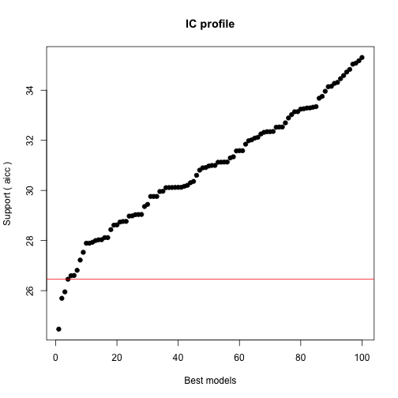
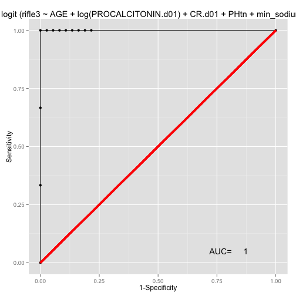
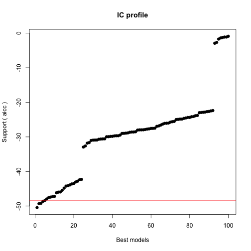

## Exploratory Survival Graphs from d01 Procalcitonin Project and the CHF,ESLD ,GLOBAL, renal failure project

========================================================


```r
anonMASTER <- read.csv("~/Desktop/Procalcitonin Day 01 Priject/anonMASTER.csv")

library(ggplot2)
library(caret)
```

```
## Loading required package: lattice
```

```r
library(dplyr)
```

```
## 
## Attaching package: 'dplyr'
## 
## The following objects are masked from 'package:stats':
## 
##     filter, lag
## 
## The following objects are masked from 'package:base':
## 
##     intersect, setdiff, setequal, union
```

## Exploratory Graphs


```r
data <- anonMASTER
data <- tbl_df(data)
qplot(LACTATE.d01,Survival,data=data, colour=Survival)
anonMASTER <- mutate(anonMASTER, devakirifle2=(d2max_cr/CR.d01)>=2)
data <- anonMASTER
```


```r
qplot(LACTATE.d01,Survival,data=data, colour=ESLD, geom=c("point","smooth"), method=lm)
```


```r
qplot(log(PROCALCITONIN.d01),Survival,data=data,colour=ESLD, geom=c("point","smooth"), method=lm)
```


## ** ESLD AKI  models **

Below we will create a data set esldnowesrd which contains the patients that have a cirrhosis code and do not have a esrd.ckd 5 code.


```r
## define the esld subset and exclude the chronic dialysis patients##
anonmaster4 <- read.csv("~/Desktop/Procalcitonin Day 01 Priject/anonmaster4.csv")
esld <- subset(anonmaster4, ESLD=="ESLD")

esldnonesrd <- subset(esld, ESRD_CKD.5="non ESRD.CKD5")

## glm for predicing the risk of RIFLE stage1  AKI in the encounter in this subset##
g <- glm(devaki~WBC.d01 + log(PROCALCITONIN.d01) + CR.d01 +DM2 + Htn + PLATELETS.d01+LACTATE.d01, data=esldnonesrd, family=binomial(link=logit))
```

## Summary of the GLM for developing renal injury of >= RIFLE stage 1 in hospitalised ESLD patients who do not have prexisting stage 5 ESRD.


```r
summary(g)
```

```
## 
## Call:
## glm(formula = devaki ~ WBC.d01 + log(PROCALCITONIN.d01) + CR.d01 + 
##     DM2 + Htn + PLATELETS.d01 + LACTATE.d01, family = binomial(link = logit), 
##     data = esldnonesrd)
## 
## Deviance Residuals: 
##    Min      1Q  Median      3Q     Max  
## -1.217  -0.461  -0.303  -0.175   3.157  
## 
## Coefficients:
##                        Estimate Std. Error z value Pr(>|z|)  
## (Intercept)            -0.01684    1.96581   -0.01    0.993  
## WBC.d01                -0.01034    0.07423   -0.14    0.889  
## log(PROCALCITONIN.d01)  0.62057    0.37404    1.66    0.097 .
## CR.d01                  0.03011    0.29135    0.10    0.918  
## DM2no DM2              -1.90340    1.32789   -1.43    0.152  
## Htnno htn              -1.83503    1.28125   -1.43    0.152  
## PLATELETS.d01          -0.00512    0.00682   -0.75    0.453  
## LACTATE.d01             0.15554    0.15074    1.03    0.302  
## ---
## Signif. codes:  0 '***' 0.001 '**' 0.01 '*' 0.05 '.' 0.1 ' ' 1
## 
## (Dispersion parameter for binomial family taken to be 1)
## 
##     Null deviance: 37.907  on 54  degrees of freedom
## Residual deviance: 30.211  on 47  degrees of freedom
##   (13 observations deleted due to missingness)
## AIC: 46.21
## 
## Number of Fisher Scoring iterations: 6
```


```r
## define the esld subset and exclude the chronic dialysis patients##
anonmaster4 <- read.csv("~/Desktop/Procalcitonin Day 01 Priject/anonmaster4.csv")
esld <- subset(anonmaster4, ESLD=="ESLD")

esldnonesrd <- subset(esld, ESRD_CKD.5="non ESRD.CKD5")
## glm for predicing the risk of starting rrt in the encounter in this subset##
rrtbin <- glm(rrtbin ~ WBC.d01 + log(PROCALCITONIN.d01) + CR.d01 +DM2 + Htn + PLATELETS.d01 +LACTATE.d01, data=esldnonesrd, family=binomial(link=logit))

rifle1 <- glm(devaki ~ WBC.d01 + log(PROCALCITONIN.d01) + CR.d01 +DM2 + Htn + PLATELETS.d01 +LACTATE.d01, data=esldnonesrd, family=binomial(link=logit))
```


** Not enough data to look at patients in the rifle2 and rifle 3 categories in ESLD patients. Algorithms dont converge for rifle 2 and rifle 3 patients. The RRT data is shown below.**


```r
rifle2 <- glm(devakirifle2 ~ WBC.d01 + log(PROCALCITONIN.d01) + CR.d01 +DM2 + Htn + PLATELETS.d01 +LACTATE.d01 +AGE, data=esldnonesrd, family=binomial(link=logit))
```

```
## Warning: glm.fit: algorithm did not converge
## Warning: glm.fit: fitted probabilities numerically 0 or 1 occurred
```

```r
rifle3  <- glm(devakirifle3 ~ WBC.d01 + log(PROCALCITONIN.d01) + CR.d01 +DM2 + Htn + PLATELETS.d01 +LACTATE.d01 +AGE, data=esldnonesrd, family=binomial(link=logit))
```

```
## Warning: glm.fit: algorithm did not converge
## Warning: glm.fit: fitted probabilities numerically 0 or 1 occurred
```

```r
## GLM for the intiation of RRT in ESLD patients in hospitalised patients. (Not with preexisting ESRD)
summary(rrtbin)
```

```
## 
## Call:
## glm(formula = rrtbin ~ WBC.d01 + log(PROCALCITONIN.d01) + CR.d01 + 
##     DM2 + Htn + PLATELETS.d01 + LACTATE.d01, family = binomial(link = logit), 
##     data = esldnonesrd)
## 
## Deviance Residuals: 
##    Min      1Q  Median      3Q     Max  
## -1.694  -0.557  -0.244   0.483   2.386  
## 
## Coefficients:
##                        Estimate Std. Error z value Pr(>|z|)   
## (Intercept)            -5.56520    2.15312   -2.58   0.0097 **
## WBC.d01                 0.16787    0.07291    2.30   0.0213 * 
## log(PROCALCITONIN.d01)  0.46430    0.28357    1.64   0.1016   
## CR.d01                  1.42445    0.43306    3.29   0.0010 **
## DM2no DM2              -0.55779    0.93853   -0.59   0.5523   
## Htnno htn              -0.12755    0.97284   -0.13   0.8957   
## PLATELETS.d01          -0.00417    0.00383   -1.09   0.2763   
## LACTATE.d01             0.07702    0.14385    0.54   0.5923   
## ---
## Signif. codes:  0 '***' 0.001 '**' 0.01 '*' 0.05 '.' 0.1 ' ' 1
## 
## (Dispersion parameter for binomial family taken to be 1)
## 
##     Null deviance: 72.103  on 54  degrees of freedom
## Residual deviance: 40.918  on 47  degrees of freedom
##   (13 observations deleted due to missingness)
## AIC: 56.92
## 
## Number of Fisher Scoring iterations: 6
```


## CHF and RRT models


```r
anonmaster4 <- read.csv("~/Desktop/Procalcitonin Day 01 Priject/anonmaster4.csv")
data <- anonmaster4

chf <- subset(data, CHF=="CHF")
chfnoesrd<- subset(chf, ESRD_CKD5=="non ESRD.CKD5" )


glm.chf.rrt <- glm(rrtbin~log(PROCALCITONIN.d01)+ WBC.d01 +CR.d01 + ALB.d01+DM2 +min_sodium+AGE+Htn+PHtn,data=chfnoesrd, family=binomial)
summary(glm.chf.rrt)
```

```
## 
## Call:
## glm(formula = rrtbin ~ log(PROCALCITONIN.d01) + WBC.d01 + CR.d01 + 
##     ALB.d01 + DM2 + min_sodium + AGE + Htn + PHtn, family = binomial, 
##     data = chfnoesrd)
## 
## Deviance Residuals: 
##    Min      1Q  Median      3Q     Max  
## -1.193  -0.347  -0.208  -0.132   2.640  
## 
## Coefficients:
##                        Estimate Std. Error z value Pr(>|z|)  
## (Intercept)             7.38851   11.29898    0.65    0.513  
## log(PROCALCITONIN.d01)  0.49210    0.22388    2.20    0.028 *
## WBC.d01                -0.02114    0.04776   -0.44    0.658  
## CR.d01                  0.44947    0.22016    2.04    0.041 *
## ALB.d01                 0.06286    0.62419    0.10    0.920  
## DM2no DM2              -0.13255    0.78225   -0.17    0.865  
## min_sodium             -0.08090    0.08729   -0.93    0.354  
## AGE                    -0.01144    0.02326   -0.49    0.623  
## Htnno htn              -0.00316    0.80338    0.00    0.997  
## PHtnPHtn                1.71050    0.88157    1.94    0.052 .
## ---
## Signif. codes:  0 '***' 0.001 '**' 0.01 '*' 0.05 '.' 0.1 ' ' 1
## 
## (Dispersion parameter for binomial family taken to be 1)
## 
##     Null deviance: 68.336  on 151  degrees of freedom
## Residual deviance: 53.232  on 142  degrees of freedom
##   (55 observations deleted due to missingness)
## AIC: 73.23
## 
## Number of Fisher Scoring iterations: 7
```

```r
glm.chf.rrt.lact <- glm(rrtbin~log(PROCALCITONIN.d01)+LACTATE.d01+ WBC.d01 +CR.d01 + PHtn + ALB.d01+DM2 +min_sodium +AGE + min_hb+Htn,data=chfnoesrd, family=binomial)
summary(glm.chf.rrt.lact)
```

```
## 
## Call:
## glm(formula = rrtbin ~ log(PROCALCITONIN.d01) + LACTATE.d01 + 
##     WBC.d01 + CR.d01 + PHtn + ALB.d01 + DM2 + min_sodium + AGE + 
##     min_hb + Htn, family = binomial, data = chfnoesrd)
## 
## Deviance Residuals: 
##    Min      1Q  Median      3Q     Max  
## -1.363  -0.360  -0.207  -0.106   2.452  
## 
## Coefficients:
##                        Estimate Std. Error z value Pr(>|z|)  
## (Intercept)              5.2107    13.6340    0.38    0.702  
## log(PROCALCITONIN.d01)   0.4984     0.2954    1.69    0.092 .
## LACTATE.d01              0.1259     0.1399    0.90    0.368  
## WBC.d01                 -0.0344     0.0660   -0.52    0.602  
## CR.d01                   0.4392     0.2161    2.03    0.042 *
## PHtnPHtn                 1.7955     1.1051    1.62    0.104  
## ALB.d01                 -0.4277     0.7502   -0.57    0.569  
## DM2no DM2               -0.4374     0.9930   -0.44    0.660  
## min_sodium              -0.0691     0.1085   -0.64    0.524  
## AGE                     -0.0288     0.0283   -1.01    0.310  
## min_hb                   0.2664     0.2150    1.24    0.215  
## Htnno htn                0.5502     0.9246    0.60    0.552  
## ---
## Signif. codes:  0 '***' 0.001 '**' 0.01 '*' 0.05 '.' 0.1 ' ' 1
## 
## (Dispersion parameter for binomial family taken to be 1)
## 
##     Null deviance: 55.417  on 97  degrees of freedom
## Residual deviance: 39.823  on 86  degrees of freedom
##   (109 observations deleted due to missingness)
## AIC: 63.82
## 
## Number of Fisher Scoring iterations: 7
```

```r
glm.chf.rrt.lact2 <- glm(rrtbin~LACTATE.d01+CR.d01,data=chfnoesrd, family=binomial)
summary(glm.chf.rrt.lact2)
```

```
## 
## Call:
## glm(formula = rrtbin ~ LACTATE.d01 + CR.d01, family = binomial, 
##     data = chfnoesrd)
## 
## Deviance Residuals: 
##    Min      1Q  Median      3Q     Max  
## -1.077  -0.389  -0.322  -0.272   2.626  
## 
## Coefficients:
##             Estimate Std. Error z value Pr(>|z|)    
## (Intercept)  -4.2523     0.8172   -5.20    2e-07 ***
## LACTATE.d01   0.1674     0.0982    1.70    0.088 .  
## CR.d01        0.6987     0.3240    2.16    0.031 *  
## ---
## Signif. codes:  0 '***' 0.001 '**' 0.01 '*' 0.05 '.' 0.1 ' ' 1
## 
## (Dispersion parameter for binomial family taken to be 1)
## 
##     Null deviance: 74.286  on 123  degrees of freedom
## Residual deviance: 62.028  on 121  degrees of freedom
##   (83 observations deleted due to missingness)
## AIC: 68.03
## 
## Number of Fisher Scoring iterations: 6
```

```r
glm.chf.rrt.lact3 <- glm(rrtbin~log(PROCALCITONIN.d01)+CR.d01,data=chfnoesrd, family=binomial)
summary(glm.chf.rrt.lact3)
```

```
## 
## Call:
## glm(formula = rrtbin ~ log(PROCALCITONIN.d01) + CR.d01, family = binomial, 
##     data = chfnoesrd)
## 
## Deviance Residuals: 
##    Min      1Q  Median      3Q     Max  
## -0.913  -0.346  -0.234  -0.175   2.835  
## 
## Coefficients:
##                        Estimate Std. Error z value Pr(>|z|)    
## (Intercept)              -4.221      0.714   -5.91  3.4e-09 ***
## log(PROCALCITONIN.d01)    0.359      0.150    2.38    0.017 *  
## CR.d01                    0.685      0.299    2.29    0.022 *  
## ---
## Signif. codes:  0 '***' 0.001 '**' 0.01 '*' 0.05 '.' 0.1 ' ' 1
## 
## (Dispersion parameter for binomial family taken to be 1)
## 
##     Null deviance: 91.518  on 205  degrees of freedom
## Residual deviance: 74.787  on 203  degrees of freedom
##   (1 observation deleted due to missingness)
## AIC: 80.79
## 
## Number of Fisher Scoring iterations: 6
```

```r
qplot( log(PROCALCITONIN.d01),CR.d01-d2max_cr,data=chfnoesrd, colour=rrtbin)
```

```
## Warning: Removed 1 rows containing missing values (geom_point).
```

 

## CHF AKI RIFLE Stage I models


```r
glm.chf.aki <- glm(devaki~log(PROCALCITONIN.d01)+WBC.d01+DM2+CR.d01+gender+ALB.d01+ESLD+PHtn+Htn,data=chfnoesrd, family=binomial(link=logit))
summary(glm.chf.aki)
```

```
## 
## Call:
## glm(formula = devaki ~ log(PROCALCITONIN.d01) + WBC.d01 + DM2 + 
##     CR.d01 + gender + ALB.d01 + ESLD + PHtn + Htn, family = binomial(link = logit), 
##     data = chfnoesrd)
## 
## Deviance Residuals: 
##    Min      1Q  Median      3Q     Max  
## -0.973  -0.416  -0.324  -0.222   2.628  
## 
## Coefficients:
##                        Estimate Std. Error z value Pr(>|z|)  
## (Intercept)             -2.8696     2.3735   -1.21    0.227  
## log(PROCALCITONIN.d01)   0.3525     0.1566    2.25    0.024 *
## WBC.d01                 -0.0588     0.0473   -1.24    0.214  
## DM2no DM2               -0.4732     0.6253   -0.76    0.449  
## CR.d01                  -0.3810     0.4716   -0.81    0.419  
## genderM                 -0.2416     0.6751   -0.36    0.720  
## ALB.d01                  0.6485     0.5113    1.27    0.205  
## ESLDnon ESLD            -0.1257     1.1322   -0.11    0.912  
## PHtnPHtn                -0.0123     0.7962   -0.02    0.988  
## Htnno htn               -0.1574     0.6281   -0.25    0.802  
## ---
## Signif. codes:  0 '***' 0.001 '**' 0.01 '*' 0.05 '.' 0.1 ' ' 1
## 
## (Dispersion parameter for binomial family taken to be 1)
## 
##     Null deviance: 91.822  on 169  degrees of freedom
## Residual deviance: 82.634  on 160  degrees of freedom
##   (37 observations deleted due to missingness)
## AIC: 102.6
## 
## Number of Fisher Scoring iterations: 6
```

```r
glm.chf.aki.lact <- glm(devaki~log(PROCALCITONIN.d01)+LACTATE.d01+WBC.d01+DM2+PHtn+min_sodium+CR.d01+gender+ALB.d01,data=chfnoesrd, family=binomial(link=logit))

summary(glm.chf.aki.lact)
```

```
## 
## Call:
## glm(formula = devaki ~ log(PROCALCITONIN.d01) + LACTATE.d01 + 
##     WBC.d01 + DM2 + PHtn + min_sodium + CR.d01 + gender + ALB.d01, 
##     family = binomial(link = logit), data = chfnoesrd)
## 
## Deviance Residuals: 
##    Min      1Q  Median      3Q     Max  
## -1.280  -0.399  -0.201  -0.117   2.779  
## 
## Coefficients:
##                        Estimate Std. Error z value Pr(>|z|)  
## (Intercept)              8.3201    13.3358    0.62    0.533  
## log(PROCALCITONIN.d01)   0.5900     0.2810    2.10    0.036 *
## LACTATE.d01             -0.0939     0.1854   -0.51    0.613  
## WBC.d01                 -0.0371     0.0643   -0.58    0.564  
## DM2no DM2               -1.0748     1.0157   -1.06    0.290  
## PHtnPHtn                 0.8141     1.3454    0.61    0.545  
## min_sodium              -0.0899     0.1038   -0.87    0.387  
## CR.d01                  -1.1553     0.8197   -1.41    0.159  
## genderM                  0.2784     1.0809    0.26    0.797  
## ALB.d01                  0.9259     0.8083    1.15    0.252  
## ---
## Signif. codes:  0 '***' 0.001 '**' 0.01 '*' 0.05 '.' 0.1 ' ' 1
## 
## (Dispersion parameter for binomial family taken to be 1)
## 
##     Null deviance: 55.417  on 97  degrees of freedom
## Residual deviance: 41.894  on 88  degrees of freedom
##   (109 observations deleted due to missingness)
## AIC: 61.89
## 
## Number of Fisher Scoring iterations: 7
```

## Stage 1 RIFLE AKI in CHF All Subset Regression

*We will generate all subset regression with the LEAPS package for looking at risk factors for developing AKI in patient with a history of CHF in the dataset. We are using the devaki variable as an outcome (1.5X rise in Cr, over admission day Creatinine)((d2max_cr/cr.d01 > 1.5)*


```r
library(MASS)
library(leaps)
attach(chfnoesrd)
```

```
## The following objects are masked _by_ .GlobalEnv:
## 
##     rifle3, rrtbin
```

```r
leaps <- regsubsets(devaki~log(PROCALCITONIN.d01)+LACTATE.d01+WBC.d01+DM2+CR.d01+gender+ALB.d01+ESLD+PHtn+Htn,data=chfnoesrd, nbest=10)

plot(leaps)
```

 

## Stage 1 RIFLE AKI in CHF Odds ratio table

*We will generate an odds ratio table for looking at risk factors for developing AKI in patient with a history of CHF in the dataset. We are using the devaki variable which essentially corresponds to a rifle stage 1 definition of renal failure (d2max_cr/cr.d01 > 1.5)*


```r
aki <- glm(formula = devaki ~ log(PROCALCITONIN.d01) + LACTATE.d01 +
WBC.d01 + DM2 + CR.d01 + gender + ALB.d01 + ESLD + PHtn,
family = binomial(link = logit), data = chfnoesrd)
int <- exp(confint(aki))
```

```
## Waiting for profiling to be done...
```

```
## Warning: glm.fit: fitted probabilities numerically 0 or 1 occurred
## Warning: glm.fit: fitted probabilities numerically 0 or 1 occurred
```

```r
odds <- exp(coef(aki))
akioddstable <- cbind(odds,int)
akioddstable
```

```
##                          odds    2.5 %  97.5 %
## (Intercept)            0.6846 0.001213 264.647
## log(PROCALCITONIN.d01) 2.0033 1.268276   3.617
## LACTATE.d01            0.9544 0.638179   1.265
## WBC.d01                0.9252 0.807300   1.027
## DM2no DM2              0.2911 0.038014   1.643
## CR.d01                 0.4175 0.092484   1.153
## genderM                0.8931 0.129960   6.709
## ALB.d01                1.3277 0.405007   5.002
## ESLDnon ESLD           0.4399 0.044187  10.652
## PHtnPHtn               2.1494 0.157377  26.938
```


## CHF AKI RIFLE Stage 2 (d2maxcr/Cr.d01 >2)

*Here we subset the anonMASTER file and define the outcome of RIFLE 2 renal injury. We subset the data for CHF patients and generate and odds ratio table.*


```r
anonMASTER <- mutate(anonMASTER, devakirifle2=(d2max_cr/CR.d01)>=2)
data <- anonMASTER
chf <- subset(data, CHF=="CHF")
chfnoesrd<- subset(chf, ESRD_CKD5=="non ESRD.CKD5" )
glm.chf.aki.rifle2 <- glm(devakirifle2~log(PROCALCITONIN.d01)+LACTATE.d01+ WBC.d01+DM2+CR.d01+gender+ALB.d01+ELSD+AGE+PHtn+Htn,data=chfnoesrd, family=binomial(link=logit))
```

```
## Error: object 'ELSD' not found
```

```r
summary(glm.chf.aki.rifle2)
```

```
## Error: object 'glm.chf.aki.rifle2' not found
```

```r
glmrifle2 <- glm.chf.aki.rifle2 
```

```
## Error: object 'glm.chf.aki.rifle2' not found
```

```r
int <- exp(confint(glm.chf.aki.rifle2))
```

```
## Error: object 'glm.chf.aki.rifle2' not found
```

```r
odds <- exp(coef(glm.chf.aki.rifle2))
```

```
## Error: object 'glm.chf.aki.rifle2' not found
```

```r
akioddstable <- cbind(odds,int)
akioddstable
```

```
##                          odds    2.5 %  97.5 %
## (Intercept)            0.6846 0.001213 264.647
## log(PROCALCITONIN.d01) 2.0033 1.268276   3.617
## LACTATE.d01            0.9544 0.638179   1.265
## WBC.d01                0.9252 0.807300   1.027
## DM2no DM2              0.2911 0.038014   1.643
## CR.d01                 0.4175 0.092484   1.153
## genderM                0.8931 0.129960   6.709
## ALB.d01                1.3277 0.405007   5.002
## ESLDnon ESLD           0.4399 0.044187  10.652
## PHtnPHtn               2.1494 0.157377  26.938
```

*All subsets regression fo RIFLE2 renal failure in CHF*


```r
library(MASS)
library(leaps)
attach(chfnoesrd)
```

```
## The following objects are masked _by_ .GlobalEnv:
## 
##     aki, rrtbin
## The following objects are masked from chfnoesrd (position 3):
## 
##     aki, ALB.d01, CatheterCPT, CHEMORAD, CHF, CR.d01, CRP.d01,
##     d2max_cr, devaki, devakirifle2, DM2, ESLD, ESRD_CKD5, event,
##     fractioncrchange, gender, HIV, Htn, IMMUNE, LACTATE.d01,
##     LOS.y, LVAD, max_cr, maxcr, mean_cr, min_cr, min_hb,
##     min_sodium, newage, PHtn, PLATELETS.d01, PLevel,
##     PROCALCITONIN.d01, ratiocr, rationcr, rrtbin, RRTCPT,
##     Survival, Transplant.x, Transplant.y, two_week, VentCPT,
##     WBC.d01, X, X.1, X30d
```

```r
leaps <- regsubsets(devakirifle2~log(PROCALCITONIN.d01)+LACTATE.d01+WBC.d01+DM2+CR.d01+gender+ALB.d01+ESLD+PHtn+Htn,data=chfnoesrd, nbest=10)

plot(leaps)
```

 

## CHF and RIFLE 3 AKI Models

*We are generating glm models on the outcome of RIFLE 3 Renal failure which includes a Creatinine rise of >3X and or RRT.*


```r
library(dplyr)
anonMASTER3 <- mutate(anonMASTER, devakirifle3=(d2max_cr/CR.d01)>=3)
anonmaster3 <- mutate(anonMASTER3,rifle4 = (CR.d01 >=4 & ((d2max_cr-CR.d01)>=0.5)))
anonmaster4 <- mutate(anonmaster3, rifle3 = (devakirifle3=="TRUE" | rrtbin =="TRUE" | rifle4 == "TRUE"))


data <- anonmaster4

chf <- subset(data, CHF=="CHF")

chfnoesrd<- subset(chf, ESRD_CKD5=="non ESRD.CKD5" )
## glm for rifle3
chfrifle3 <- glm(rifle3~log(PROCALCITONIN.d01)+LACTATE.d01+ WBC.d01+DM2+CR.d01+gender+ALB.d01+PHtn+Htn+AGE+min_sodium+min_hb,data=chfnoesrd, family=binomial(link=logit))

summary(chfrifle3)
```

```
## 
## Call:
## glm(formula = rifle3 ~ log(PROCALCITONIN.d01) + LACTATE.d01 + 
##     WBC.d01 + DM2 + CR.d01 + gender + ALB.d01 + PHtn + Htn + 
##     AGE + min_sodium + min_hb, family = binomial(link = logit), 
##     data = chfnoesrd)
## 
## Deviance Residuals: 
##     Min       1Q   Median       3Q      Max  
## -1.6303  -0.4136  -0.2070  -0.0616   2.5345  
## 
## Coefficients:
##                        Estimate Std. Error z value Pr(>|z|)  
## (Intercept)             15.5616    12.8928    1.21    0.227  
## log(PROCALCITONIN.d01)   0.7174     0.2961    2.42    0.015 *
## LACTATE.d01              0.0596     0.1215    0.49    0.624  
## WBC.d01                 -0.0263     0.0507   -0.52    0.603  
## DM2no DM2                0.2967     0.8841    0.34    0.737  
## CR.d01                   0.7798     0.3937    1.98    0.048 *
## genderM                  1.2935     1.1555    1.12    0.263  
## ALB.d01                  0.1962     0.7720    0.25    0.799  
## PHtnPHtn                 2.4523     1.2919    1.90    0.058 .
## Htnno htn               -1.3225     0.9541   -1.39    0.166  
## AGE                     -0.0189     0.0241   -0.78    0.434  
## min_sodium              -0.1589     0.1028   -1.55    0.122  
## min_hb                   0.0995     0.1773    0.56    0.575  
## ---
## Signif. codes:  0 '***' 0.001 '**' 0.01 '*' 0.05 '.' 0.1 ' ' 1
## 
## (Dispersion parameter for binomial family taken to be 1)
## 
##     Null deviance: 72.868  on 97  degrees of freedom
## Residual deviance: 46.260  on 85  degrees of freedom
##   (109 observations deleted due to missingness)
## AIC: 72.26
## 
## Number of Fisher Scoring iterations: 7
```

```r
##odds ratio table
int <- exp(confint(chfrifle3))
```

```
## Waiting for profiling to be done...
```

```r
odds <- exp(coef(chfrifle3))
akioddstable <- cbind(odds,int)
akioddstable
```

```
##                             odds     2.5 %    97.5 %
## (Intercept)            5.732e+06 0.0002436 3.568e+18
## log(PROCALCITONIN.d01) 2.049e+00 1.2106347 3.961e+00
## LACTATE.d01            1.061e+00 0.8226065 1.348e+00
## WBC.d01                9.740e-01 0.8660107 1.061e+00
## DM2no DM2              1.345e+00 0.2237074 7.997e+00
## CR.d01                 2.181e+00 1.2870441 5.321e+00
## genderM                3.645e+00 0.4259920 4.453e+01
## ALB.d01                1.217e+00 0.2722270 6.148e+00
## PHtnPHtn               1.162e+01 1.0192807 1.885e+02
## Htnno htn              2.665e-01 0.0333966 1.561e+00
## AGE                    9.813e-01 0.9340495 1.029e+00
## min_sodium             8.531e-01 0.6811371 1.019e+00
## min_hb                 1.105e+00 0.7801172 1.602e+00
```


```r
library(glmulti)

chfrifle3 <- glm(rifle3~log(PROCALCITONIN.d01)+LACTATE.d01+ WBC.d01+DM2+CR.d01+gender+ALB.d01+Htn+min_sodium+min_hb+AGE,data=chfnoesrd, family=binomial(link=logit), na.action=na.exclude)

multi.chf.model <- glmulti(chfrifle3, # use the model with built as a starting point
                      level = 1,  #  just look at main effects
                      crit="aicc") # use AICc because it works better than AIC for small sample sizes)
```

```
## Initialization...
## TASK: Exhaustive screening of candidate set.
## Fitting...
## 
## After 50 models:
## Best model: rifle3~1+log(PROCALCITONIN.d01)+CR.d01+min_sodium
## Crit= 24.4634293420555
## Mean crit= 57.2004072912646
```

 

```
## 
## After 100 models:
## Best model: rifle3~1+log(PROCALCITONIN.d01)+CR.d01+min_sodium
## Crit= 24.4634293420555
## Mean crit= 53.5872902402722
```

 

```
## 
## After 150 models:
## Best model: rifle3~1+log(PROCALCITONIN.d01)+CR.d01+min_sodium
## Crit= 24.4634293420555
## Mean crit= 46.0746342885933
```

 

```
## 
## After 200 models:
## Best model: rifle3~1+log(PROCALCITONIN.d01)+CR.d01+min_sodium
## Crit= 24.4634293420555
## Mean crit= 41.7770613455725
```

 

```
## 
## After 250 models:
## Best model: rifle3~1+log(PROCALCITONIN.d01)+CR.d01+min_sodium
## Crit= 24.4634293420555
## Mean crit= 38.8626514453523
```

 

```
## 
## After 300 models:
## Best model: rifle3~1+log(PROCALCITONIN.d01)+CR.d01+min_sodium
## Crit= 24.4634293420555
## Mean crit= 37.0102603486173
```

 

```
## 
## After 350 models:
## Best model: rifle3~1+log(PROCALCITONIN.d01)+CR.d01+min_sodium
## Crit= 24.4634293420555
## Mean crit= 34.6123116115685
```

 

```
## 
## After 400 models:
## Best model: rifle3~1+log(PROCALCITONIN.d01)+CR.d01+min_sodium
## Crit= 24.4634293420555
## Mean crit= 32.87921495582
```

 

```
## 
## After 450 models:
## Best model: rifle3~1+log(PROCALCITONIN.d01)+CR.d01+min_sodium
## Crit= 24.4634293420555
## Mean crit= 31.8877047454736
```

 

```
## 
## After 500 models:
## Best model: rifle3~1+log(PROCALCITONIN.d01)+CR.d01+min_sodium
## Crit= 24.4634293420555
## Mean crit= 31.1937396778474
```

 

```
## 
## After 550 models:
## Best model: rifle3~1+log(PROCALCITONIN.d01)+CR.d01+min_sodium
## Crit= 24.4634293420555
## Mean crit= 30.8765081821073
```

 

```
## 
## After 600 models:
## Best model: rifle3~1+log(PROCALCITONIN.d01)+CR.d01+min_sodium
## Crit= 24.4634293420555
## Mean crit= 30.4869518169527
```

 

```
## 
## After 650 models:
## Best model: rifle3~1+log(PROCALCITONIN.d01)+CR.d01+min_sodium
## Crit= 24.4634293420555
## Mean crit= 30.2407870998398
```

 

```
## 
## After 700 models:
## Best model: rifle3~1+log(PROCALCITONIN.d01)+CR.d01+min_sodium
## Crit= 24.4634293420555
## Mean crit= 30.1658700428566
```

 

```
## 
## After 750 models:
## Best model: rifle3~1+log(PROCALCITONIN.d01)+CR.d01+min_sodium
## Crit= 24.4634293420555
## Mean crit= 29.9505534885163
```

 

```
## 
## After 800 models:
## Best model: rifle3~1+log(PROCALCITONIN.d01)+CR.d01+min_sodium
## Crit= 24.4634293420555
## Mean crit= 29.8892704631747
```

 

```
## 
## After 850 models:
## Best model: rifle3~1+log(PROCALCITONIN.d01)+CR.d01+min_sodium
## Crit= 24.4634293420555
## Mean crit= 29.8283238375579
```

 

```
## 
## After 900 models:
## Best model: rifle3~1+log(PROCALCITONIN.d01)+CR.d01+min_sodium
## Crit= 24.4634293420555
## Mean crit= 29.7948807281551
```

 

```
## 
## After 950 models:
## Best model: rifle3~1+log(PROCALCITONIN.d01)+CR.d01+min_sodium
## Crit= 24.4634293420555
## Mean crit= 29.7813204415808
```

 

```
## 
## After 1000 models:
## Best model: rifle3~1+log(PROCALCITONIN.d01)+CR.d01+min_sodium
## Crit= 24.4634293420555
## Mean crit= 29.7496512580229
```

```
## 
## After 1050 models:
## Best model: rifle3~1+log(PROCALCITONIN.d01)+CR.d01+min_sodium
## Crit= 24.4634293420555
## Mean crit= 29.7496512580229
```

 

```
## 
## After 1100 models:
## Best model: rifle3~1+log(PROCALCITONIN.d01)+CR.d01+min_sodium
## Crit= 24.4634293420555
## Mean crit= 29.7187210059059
```

 

```
## 
## After 1150 models:
## Best model: rifle3~1+log(PROCALCITONIN.d01)+CR.d01+min_sodium
## Crit= 24.4634293420555
## Mean crit= 29.3458031015874
```

 

```
## 
## After 1200 models:
## Best model: rifle3~1+log(PROCALCITONIN.d01)+CR.d01+min_sodium
## Crit= 24.4634293420555
## Mean crit= 29.1826113136241
```

 

```
## 
## After 1250 models:
## Best model: rifle3~1+log(PROCALCITONIN.d01)+CR.d01+min_sodium
## Crit= 24.4634293420555
## Mean crit= 29.0786763215888
```

 

```
## 
## After 1300 models:
## Best model: rifle3~1+log(PROCALCITONIN.d01)+CR.d01+min_sodium
## Crit= 24.4634293420555
## Mean crit= 28.9808464272458
```

 

```
## 
## After 1350 models:
## Best model: rifle3~1+log(PROCALCITONIN.d01)+CR.d01+min_sodium
## Crit= 24.4634293420555
## Mean crit= 28.9401781976114
```

 

```
## 
## After 1400 models:
## Best model: rifle3~1+log(PROCALCITONIN.d01)+CR.d01+min_sodium
## Crit= 24.4634293420555
## Mean crit= 28.8332381885315
```

 

```
## 
## After 1450 models:
## Best model: rifle3~1+log(PROCALCITONIN.d01)+CR.d01+min_sodium
## Crit= 24.4634293420555
## Mean crit= 28.8160199085611
```

 

```
## 
## After 1500 models:
## Best model: rifle3~1+log(PROCALCITONIN.d01)+CR.d01+min_sodium
## Crit= 24.4634293420555
## Mean crit= 28.7931708171062
```

 

```
## 
## After 1550 models:
## Best model: rifle3~1+log(PROCALCITONIN.d01)+CR.d01+min_sodium
## Crit= 24.4634293420555
## Mean crit= 28.7843327063746
```

```
## 
## After 1600 models:
## Best model: rifle3~1+log(PROCALCITONIN.d01)+CR.d01+min_sodium
## Crit= 24.4634293420555
## Mean crit= 28.7843327063746
```

 

```
## 
## After 1650 models:
## Best model: rifle3~1+log(PROCALCITONIN.d01)+CR.d01+min_sodium
## Crit= 24.4634293420555
## Mean crit= 28.7112985714282
```

 

```
## 
## After 1700 models:
## Best model: rifle3~1+log(PROCALCITONIN.d01)+CR.d01+min_sodium
## Crit= 24.4634293420555
## Mean crit= 28.6892791964364
```

```
## 
## After 1750 models:
## Best model: rifle3~1+log(PROCALCITONIN.d01)+CR.d01+min_sodium
## Crit= 24.4634293420555
## Mean crit= 28.6892791964364
```

 

```
## 
## After 1800 models:
## Best model: rifle3~1+log(PROCALCITONIN.d01)+CR.d01+min_sodium
## Crit= 24.4634293420555
## Mean crit= 28.6653536046241
```

```
## 
## After 1850 models:
## Best model: rifle3~1+log(PROCALCITONIN.d01)+CR.d01+min_sodium
## Crit= 24.4634293420555
## Mean crit= 28.6653536046241
```

 

```
## 
## After 1900 models:
## Best model: rifle3~1+log(PROCALCITONIN.d01)+CR.d01+min_sodium
## Crit= 24.4634293420555
## Mean crit= 28.6536517311137
```

```
## 
## After 1950 models:
## Best model: rifle3~1+log(PROCALCITONIN.d01)+CR.d01+min_sodium
## Crit= 24.4634293420555
## Mean crit= 28.6536517311137
```

 

```
## 
## After 2000 models:
## Best model: rifle3~1+log(PROCALCITONIN.d01)+CR.d01+min_sodium
## Crit= 24.4634293420555
## Mean crit= 28.6536517311137
```

```
## 
## After 2050 models:
## Best model: rifle3~1+log(PROCALCITONIN.d01)+CR.d01+min_sodium
## Crit= 24.4634293420555
## Mean crit= 28.6536517311137
```

```
## 
## After 2100 models:
## Best model: rifle3~1+log(PROCALCITONIN.d01)+CR.d01+min_sodium
## Crit= 24.4634293420555
## Mean crit= 28.6536517311137
```

```
## Completed.
```

```r
summary(multi.chf.model)
```

```
## $name
## [1] "glmulti.analysis"
## 
## $method
## [1] "h"
## 
## $fitting
## [1] "glm"
## 
## $crit
## [1] "aicc"
## 
## $level
## [1] 1
## 
## $marginality
## [1] FALSE
## 
## $confsetsize
## [1] 100
## 
## $bestic
## [1] 24.46
## 
## $icvalues
##   [1] 24.46 24.72 25.70 25.95 26.25 26.27 26.46 26.53 26.60 26.61 26.81
##  [12] 26.87 26.88 26.88 26.88 27.22 27.48 27.49 27.53 27.75 27.86 27.88
##  [23] 27.89 27.89 27.93 28.00 28.03 28.03 28.09 28.12 28.12 28.33 28.41
##  [34] 28.42 28.44 28.44 28.49 28.49 28.50 28.58 28.61 28.62 28.67 28.69
##  [45] 28.70 28.74 28.74 28.76 28.76 28.88 28.98 28.99 29.03 29.04 29.04
##  [56] 29.04 29.05 29.05 29.06 29.06 29.06 29.07 29.10 29.33 29.36 29.44
##  [67] 29.51 29.51 29.58 29.58 29.65 29.65 29.69 29.72 29.75 29.75 29.76
##  [78] 29.76 29.76 29.94 29.96 29.97 30.00 30.00 30.01 30.03 30.04 30.05
##  [89] 30.05 30.11 30.11 30.11 30.12 30.12 30.12 30.12 30.13 30.17 30.21
## [100] 30.22
## 
## $bestmodel
## [1] "rifle3 ~ 1 + log(PROCALCITONIN.d01) + CR.d01 + min_sodium"
## 
## $modelweights
##   [1] 0.063102 0.055383 0.034088 0.029985 0.025815 0.025569 0.023310
##   [8] 0.022474 0.021731 0.021623 0.019500 0.018963 0.018884 0.018881
##  [15] 0.018835 0.015902 0.013970 0.013876 0.013612 0.012217 0.011553
##  [22] 0.011440 0.011356 0.011356 0.011141 0.010773 0.010606 0.010590
##  [29] 0.010285 0.010156 0.010156 0.009114 0.008753 0.008749 0.008654
##  [36] 0.008646 0.008431 0.008410 0.008388 0.008044 0.007918 0.007881
##  [43] 0.007706 0.007615 0.007600 0.007441 0.007440 0.007355 0.007345
##  [50] 0.006944 0.006612 0.006578 0.006429 0.006407 0.006397 0.006394
##  [57] 0.006372 0.006360 0.006352 0.006328 0.006323 0.006311 0.006226
##  [64] 0.005534 0.005460 0.005231 0.005059 0.005054 0.004897 0.004890
##  [71] 0.004725 0.004722 0.004635 0.004550 0.004497 0.004485 0.004466
##  [78] 0.004465 0.004464 0.004082 0.004044 0.004026 0.003969 0.003959
##  [85] 0.003946 0.003909 0.003892 0.003858 0.003855 0.003754 0.003753
##  [92] 0.003748 0.003739 0.003735 0.003725 0.003722 0.003720 0.003646
##  [99] 0.003575 0.003555
## 
## $includeobjects
## [1] TRUE
```

This is the best model
"rifle3 ~ 1 + log(PROCALCITONIN.d01) + CR.d01 + min_sodium"

Lets run it

```r
library(pROC)
bestchf <- glm(rifle3 ~ 1 + log(PROCALCITONIN.d01) + CR.d01 + min_sodium, data=chfnoesrd,na.action=na.exclude)
m.roc <- roc(chfnoesrd$rifle3, predict(bestchf, backtransform = TRUE))
plot(m.roc)
```

 

```
## 
## Call:
## roc.default(response = chfnoesrd$rifle3, predictor = predict(bestchf,     backtransform = TRUE))
## 
## Data: predict(bestchf, backtransform = TRUE) in 161 controls (chfnoesrd$rifle3 FALSE) < 15 cases (chfnoesrd$rifle3 TRUE).
## Area under the curve: 0.828
```


```r
library(ROCR)
modelpred <- predict(bestchf)
reality <- chfnoesrd$rifle3
pred <- prediction(modelpred$x,reality)
plot(pred)
ed <- as.data.frame(modelpred)

reality <- as.logical(reality)
pred <- prediction(ed,reality)

plot(pred)
```


```

```

*This is an all subsets regression of RIFLE 3 renal failure in CHF patients*


```r
library(MASS)
library(leaps)
attach(chfnoesrd)
```

```
## The following objects are masked _by_ .GlobalEnv:
## 
##     aki, rifle3, rrtbin
## The following objects are masked from chfnoesrd (position 3):
## 
##     AGE, aki, ALB.d01, CatheterCPT, CHEMORAD, CHF, CR.d01,
##     CRP.d01, d2max_cr, devaki, devakirifle2, devakirifle3, DM2,
##     ESLD, ESRD_CKD5, event, fractioncrchange, gender, HIV, Htn,
##     IMMUNE, LACTATE.d01, LOS.y, LVAD, max_cr, maxcr, mean_cr,
##     min_cr, min_hb, min_sodium, newage, PHtn, PLATELETS.d01,
##     PLevel, PROCALCITONIN.d01, ratiocr, rationcr, rifle3, rifle4,
##     rrtbin, RRTCPT, Survival, Transplant.x, Transplant.y,
##     two_week, VentCPT, WBC.d01, X, X.1, X30d
```

```r
leaps <- regsubsets(rifle3~log(PROCALCITONIN.d01)+LACTATE.d01+ WBC.d01+DM2+CR.d01+gender+ALB.d01+AGE+PHtn+Htn,data=chfnoesrd, family=binomial(link=logit), nbest=10)
```

```
## Error: invalid type (list) for variable '(family)'
```

```r
plot(leaps)
```

 

## Global RIFLE 3 Renal Failure


```r
globalnoesrd<- subset(anonmaster4, ESRD_CKD5=="non ESRD.CKD5" )
## the rifle 3 outcome is a composite outcome of patients that had an aki of Cr > 3x and/or initiation or RRT
globalrifle3 <- glm(rifle3~log(PROCALCITONIN.d01)+LACTATE.d01+ WBC.d01+DM2+CR.d01+gender+ALB.d01+AGE+PHtn+Htn,data=globalnoesrd, family=binomial(link=logit))
summary(globalrifle3)
```

```
## 
## Call:
## glm(formula = rifle3 ~ log(PROCALCITONIN.d01) + LACTATE.d01 + 
##     WBC.d01 + DM2 + CR.d01 + gender + ALB.d01 + AGE + PHtn + 
##     Htn, family = binomial(link = logit), data = globalnoesrd)
## 
## Deviance Residuals: 
##    Min      1Q  Median      3Q     Max  
## -1.455  -0.411  -0.290  -0.196   2.599  
## 
## Coefficients:
##                        Estimate Std. Error z value Pr(>|z|)    
## (Intercept)             -0.3960     1.4944   -0.26    0.791    
## log(PROCALCITONIN.d01)   0.1266     0.1065    1.19    0.235    
## LACTATE.d01              0.1392     0.0650    2.14    0.032 *  
## WBC.d01                 -0.0239     0.0244   -0.98    0.327    
## DM2no DM2               -0.7245     0.4449   -1.63    0.103    
## CR.d01                   0.5679     0.1397    4.06  4.8e-05 ***
## genderM                  0.0270     0.4378    0.06    0.951    
## ALB.d01                 -0.6146     0.3027   -2.03    0.042 *  
## AGE                     -0.0167     0.0135   -1.23    0.217    
## PHtnPHtn                 0.6524     0.5764    1.13    0.258    
## Htnno htn                0.0594     0.4301    0.14    0.890    
## ---
## Signif. codes:  0 '***' 0.001 '**' 0.01 '*' 0.05 '.' 0.1 ' ' 1
## 
## (Dispersion parameter for binomial family taken to be 1)
## 
##     Null deviance: 220.59  on 359  degrees of freedom
## Residual deviance: 172.72  on 349  degrees of freedom
##   (243 observations deleted due to missingness)
## AIC: 194.7
## 
## Number of Fisher Scoring iterations: 6
```

## Global RIFLE 2 Renal Failure


```r
leaps <- regsubsets(devakirifle2~log(PROCALCITONIN.d01)+LACTATE.d01+WBC.d01+DM2+CR.d01+gender+ALB.d01+PHtn+Htn+AGE,data=anonmaster4, nbest=10)
plot(leaps,scale="r2")
```

 

## Ventilator data 
GLM regression for the Vent CPT code, which includes lactate on d01


```r
glm.chf.vent.lact <- glm(VentCPT~log(PROCALCITONIN.d01)+LACTATE.d01+WBC.d01+DM2+CR.d01+gender+ALB.d01+ESLD+PHtn,data=chfnoesrd, family=binomial(link=logit))
summary(glm.chf.vent.lact)
```

```
## 
## Call:
## glm(formula = VentCPT ~ log(PROCALCITONIN.d01) + LACTATE.d01 + 
##     WBC.d01 + DM2 + CR.d01 + gender + ALB.d01 + ESLD + PHtn, 
##     family = binomial(link = logit), data = chfnoesrd)
## 
## Deviance Residuals: 
##    Min      1Q  Median      3Q     Max  
## -2.073  -0.933   0.258   0.905   1.884  
## 
## Coefficients:
##                        Estimate Std. Error z value Pr(>|z|)  
## (Intercept)              0.2959     1.6011    0.18    0.853  
## log(PROCALCITONIN.d01)   0.0896     0.1265    0.71    0.479  
## LACTATE.d01              0.2800     0.1331    2.10    0.035 *
## WBC.d01                  0.0764     0.0322    2.37    0.018 *
## DM2no DM2               -0.5747     0.4595   -1.25    0.211  
## CR.d01                  -0.1262     0.1821   -0.69    0.489  
## genderM                  0.8781     0.5202    1.69    0.091 .
## ALB.d01                 -0.5150     0.3603   -1.43    0.153  
## ESLDnon ESLD            -0.6793     0.8423   -0.81    0.420  
## PHtnPHtn                 0.7182     0.6199    1.16    0.247  
## ---
## Signif. codes:  0 '***' 0.001 '**' 0.01 '*' 0.05 '.' 0.1 ' ' 1
## 
## (Dispersion parameter for binomial family taken to be 1)
## 
##     Null deviance: 152.16  on 109  degrees of freedom
## Residual deviance: 124.03  on 100  degrees of freedom
##   (97 observations deleted due to missingness)
## AIC: 144
## 
## Number of Fisher Scoring iterations: 5
```


```r
glm.chf.aki <- glm(devaki~log(PROCALCITONIN.d01)+WBC.d01+DM2+CR.d01+gender+ALB.d01+ESLD+PHtn+Htn,data=chfnoesrd, family=binomial(link=logit))
summary(glm.chf.aki)
```

```
## 
## Call:
## glm(formula = devaki ~ log(PROCALCITONIN.d01) + WBC.d01 + DM2 + 
##     CR.d01 + gender + ALB.d01 + ESLD + PHtn + Htn, family = binomial(link = logit), 
##     data = chfnoesrd)
## 
## Deviance Residuals: 
##    Min      1Q  Median      3Q     Max  
## -0.973  -0.416  -0.324  -0.222   2.628  
## 
## Coefficients:
##                        Estimate Std. Error z value Pr(>|z|)  
## (Intercept)             -2.8696     2.3735   -1.21    0.227  
## log(PROCALCITONIN.d01)   0.3525     0.1566    2.25    0.024 *
## WBC.d01                 -0.0588     0.0473   -1.24    0.214  
## DM2no DM2               -0.4732     0.6253   -0.76    0.449  
## CR.d01                  -0.3810     0.4716   -0.81    0.419  
## genderM                 -0.2416     0.6751   -0.36    0.720  
## ALB.d01                  0.6485     0.5113    1.27    0.205  
## ESLDnon ESLD            -0.1257     1.1322   -0.11    0.912  
## PHtnPHtn                -0.0123     0.7962   -0.02    0.988  
## Htnno htn               -0.1574     0.6281   -0.25    0.802  
## ---
## Signif. codes:  0 '***' 0.001 '**' 0.01 '*' 0.05 '.' 0.1 ' ' 1
## 
## (Dispersion parameter for binomial family taken to be 1)
## 
##     Null deviance: 91.822  on 169  degrees of freedom
## Residual deviance: 82.634  on 160  degrees of freedom
##   (37 observations deleted due to missingness)
## AIC: 102.6
## 
## Number of Fisher Scoring iterations: 6
```

```r
glm.chf.aki.lact <- glm(devaki~log(PROCALCITONIN.d01)+LACTATE.d01+WBC.d01+DM2+CR.d01+gender+ALB.d01+ESLD+PHtn,data=chfnoesrd, family=binomial(link=logit))

summary(glm.chf.aki.lact)
```

```
## 
## Call:
## glm(formula = devaki ~ log(PROCALCITONIN.d01) + LACTATE.d01 + 
##     WBC.d01 + DM2 + CR.d01 + gender + ALB.d01 + ESLD + PHtn, 
##     family = binomial(link = logit), data = chfnoesrd)
## 
## Deviance Residuals: 
##    Min      1Q  Median      3Q     Max  
## -1.307  -0.378  -0.227  -0.124   2.559  
## 
## Coefficients:
##                        Estimate Std. Error z value Pr(>|z|)   
## (Intercept)             -0.3789     3.0774   -0.12   0.9020   
## log(PROCALCITONIN.d01)   0.6948     0.2607    2.67   0.0077 **
## LACTATE.d01             -0.0467     0.1624   -0.29   0.7739   
## WBC.d01                 -0.0777     0.0619   -1.26   0.2093   
## DM2no DM2               -1.2340     0.9300   -1.33   0.1845   
## CR.d01                  -0.8734     0.6732   -1.30   0.1945   
## genderM                 -0.1131     0.9794   -0.12   0.9081   
## ALB.d01                  0.2834     0.6262    0.45   0.6508   
## ESLDnon ESLD            -0.8211     1.2793   -0.64   0.5210   
## PHtnPHtn                 0.7652     1.2724    0.60   0.5476   
## ---
## Signif. codes:  0 '***' 0.001 '**' 0.01 '*' 0.05 '.' 0.1 ' ' 1
## 
## (Dispersion parameter for binomial family taken to be 1)
## 
##     Null deviance: 62.301  on 109  degrees of freedom
## Residual deviance: 48.070  on 100  degrees of freedom
##   (97 observations deleted due to missingness)
## AIC: 68.07
## 
## Number of Fisher Scoring iterations: 7
```

## Multimodel Inference for RIFLE3 GLOBAL


```r
library(glmulti)

globalrifle3 <- glm(rifle3~log(PROCALCITONIN.d01)+LACTATE.d01+ WBC.d01+DM2+CR.d01+gender+ALB.d01+Htn+min_sodium+min_hb,data=globalnoesrd, family=binomial(link=logit), na.action=na.exclude)

multi.global.model <- glmulti(globalrifle3, # use the model with built as a starting point
                      level = 1,  #  just look at main effects
                      crit="aicc") # use AICc because it works better than AIC for small sample sizes)
```

```
## Initialization...
## TASK: Exhaustive screening of candidate set.
## Fitting...
## 
## After 50 models:
## Best model: rifle3~1+log(PROCALCITONIN.d01)+CR.d01
## Crit= -50.4408468451466
## Mean crit= 47.6780654335328
```

 

```
## 
## After 100 models:
## Best model: rifle3~1+log(PROCALCITONIN.d01)+CR.d01
## Crit= -50.4408468451466
## Mean crit= 46.5324126751457
```

 

```
## 
## After 150 models:
## Best model: rifle3~1+log(PROCALCITONIN.d01)+CR.d01
## Crit= -50.4408468451466
## Mean crit= 21.7654011759348
```

 

```
## 
## After 200 models:
## Best model: rifle3~1+log(PROCALCITONIN.d01)+CR.d01
## Crit= -50.4408468451466
## Mean crit= 9.58688908830177
```

 

```
## 
## After 250 models:
## Best model: rifle3~1+log(PROCALCITONIN.d01)+CR.d01
## Crit= -50.4408468451466
## Mean crit= -0.584737340275822
```

 

```
## 
## After 300 models:
## Best model: rifle3~1+log(PROCALCITONIN.d01)+CR.d01
## Crit= -50.4408468451466
## Mean crit= -6.223274211677
```

 

```
## 
## After 350 models:
## Best model: rifle3~1+log(PROCALCITONIN.d01)+CR.d01
## Crit= -50.4408468451466
## Mean crit= -10.7636856336644
```

 

```
## 
## After 400 models:
## Best model: rifle3~1+log(PROCALCITONIN.d01)+CR.d01
## Crit= -50.4408468451466
## Mean crit= -13.4615723326365
```

 

```
## 
## After 450 models:
## Best model: rifle3~1+log(PROCALCITONIN.d01)+CR.d01
## Crit= -50.4408468451466
## Mean crit= -17.3938394613862
```

 

```
## 
## After 500 models:
## Best model: rifle3~1+log(PROCALCITONIN.d01)+CR.d01
## Crit= -50.4408468451466
## Mean crit= -19.0604107859564
```

 

```
## 
## After 550 models:
## Best model: rifle3~1+log(PROCALCITONIN.d01)+CR.d01
## Crit= -50.4408468451466
## Mean crit= -22.3836823341274
```

 

```
## 
## After 600 models:
## Best model: rifle3~1+log(PROCALCITONIN.d01)+CR.d01
## Crit= -50.4408468451466
## Mean crit= -23.6632738784784
```

 

```
## 
## After 650 models:
## Best model: rifle3~1+log(PROCALCITONIN.d01)+CR.d01
## Crit= -50.4408468451466
## Mean crit= -25.777889673411
```

 

```
## 
## After 700 models:
## Best model: rifle3~1+log(PROCALCITONIN.d01)+CR.d01
## Crit= -50.4408468451466
## Mean crit= -27.5903471506938
```

 

```
## 
## After 750 models:
## Best model: rifle3~1+log(PROCALCITONIN.d01)+CR.d01
## Crit= -50.4408468451466
## Mean crit= -29.7283463626212
```

 

```
## 
## After 800 models:
## Best model: rifle3~1+log(PROCALCITONIN.d01)+CR.d01
## Crit= -50.4408468451466
## Mean crit= -30.7941374505779
```

 

```
## 
## After 850 models:
## Best model: rifle3~1+log(PROCALCITONIN.d01)+CR.d01
## Crit= -50.4408468451466
## Mean crit= -32.6344754077767
```

```
## 
## After 900 models:
## Best model: rifle3~1+log(PROCALCITONIN.d01)+CR.d01
## Crit= -50.4408468451466
## Mean crit= -32.6344754077767
```

 

```
## 
## After 950 models:
## Best model: rifle3~1+log(PROCALCITONIN.d01)+CR.d01
## Crit= -50.4408468451466
## Mean crit= -33.4709266483716
```

 

```
## 
## After 1000 models:
## Best model: rifle3~1+log(PROCALCITONIN.d01)+CR.d01
## Crit= -50.4408468451466
## Mean crit= -33.6107512713632
```

 

```
## 
## After 1050 models:
## Best model: rifle3~1+log(PROCALCITONIN.d01)+CR.d01
## Crit= -50.4408468451466
## Mean crit= -33.6550212984362
```

 

```
## Completed.
```

```r
summary(multi.global.model)
```

```
## $name
## [1] "glmulti.analysis"
## 
## $method
## [1] "h"
## 
## $fitting
## [1] "glm"
## 
## $crit
## [1] "aicc"
## 
## $level
## [1] 1
## 
## $marginality
## [1] FALSE
## 
## $confsetsize
## [1] 100
## 
## $bestic
## [1] -50.44
## 
## $icvalues
##   [1] -50.44 -49.30 -49.22 -48.67 -48.41 -47.95 -47.56 -47.40 -47.28 -47.21
##  [11] -46.63 -46.17 -45.97 -45.93 -45.54 -45.46 -45.39 -44.81 -44.22 -44.19
##  [21] -44.13 -43.90 -43.61 -43.48 -43.05 -42.81 -42.39 -42.29 -42.10 -41.63
##  [31] -41.05 -40.47 -32.94 -32.62 -31.81 -31.64 -31.02 -30.94 -30.92 -30.91
##  [41] -30.68 -30.63 -30.59 -30.56 -29.95 -29.94 -29.85 -29.83 -29.72 -29.67
##  [51] -29.66 -29.48 -28.99 -28.98 -28.97 -28.92 -28.92 -28.85 -28.66 -28.63
##  [61] -28.60 -28.59 -28.59 -28.51 -28.04 -27.97 -27.96 -27.96 -27.94 -27.85
##  [71] -27.75 -27.73 -27.67 -27.54 -27.53 -27.48 -26.95 -26.95 -26.91 -26.85
##  [81] -26.83 -26.61 -26.60 -26.54 -26.53 -26.32 -26.09 -26.05 -26.01 -25.96
##  [91] -25.94 -25.74 -25.74 -25.60 -25.52 -25.52 -24.98 -24.93 -24.88 -24.86
## 
## $bestmodel
## [1] "rifle3 ~ 1 + log(PROCALCITONIN.d01) + CR.d01"
## 
## $modelweights
##   [1] 1.931e-01 1.093e-01 1.049e-01 7.952e-02 6.988e-02 5.573e-02 4.578e-02
##   [8] 4.232e-02 3.968e-02 3.834e-02 2.869e-02 2.279e-02 2.064e-02 2.021e-02
##  [15] 1.663e-02 1.601e-02 1.547e-02 1.156e-02 8.595e-03 8.466e-03 8.226e-03
##  [22] 7.334e-03 6.337e-03 5.959e-03 4.787e-03 4.253e-03 3.445e-03 3.282e-03
##  [29] 2.983e-03 2.363e-03 1.766e-03 1.323e-03 3.056e-05 2.610e-05 1.737e-05
##  [36] 1.594e-05 1.170e-05 1.125e-05 1.114e-05 1.107e-05 9.878e-06 9.640e-06
##  [43] 9.449e-06 9.299e-06 6.864e-06 6.817e-06 6.533e-06 6.467e-06 6.107e-06
##  [50] 5.953e-06 5.948e-06 5.412e-06 4.246e-06 4.229e-06 4.199e-06 4.098e-06
##  [57] 4.091e-06 3.961e-06 3.602e-06 3.553e-06 3.486e-06 3.483e-06 3.479e-06
##  [64] 3.333e-06 2.642e-06 2.546e-06 2.539e-06 2.533e-06 2.514e-06 2.400e-06
##  [71] 2.285e-06 2.256e-06 2.195e-06 2.059e-06 2.045e-06 1.997e-06 1.533e-06
##  [78] 1.529e-06 1.498e-06 1.458e-06 1.438e-06 1.292e-06 1.283e-06 1.247e-06
##  [85] 1.239e-06 1.115e-06 9.949e-07 9.782e-07 9.555e-07 9.331e-07 9.235e-07
##  [92] 8.354e-07 8.340e-07 7.796e-07 7.486e-07 7.480e-07 5.725e-07 5.574e-07
##  [99] 5.431e-07 5.386e-07
## 
## $includeobjects
## [1] TRUE
```
Look at the top 10 models, ranked by AICc

```r
weightable(multi.global.model)
```

```
##                                                                                           model
## 1                                                  rifle3 ~ 1 + log(PROCALCITONIN.d01) + CR.d01
## 2                                            rifle3 ~ 1 + DM2 + log(PROCALCITONIN.d01) + CR.d01
## 3                                                                           rifle3 ~ 1 + CR.d01
## 4                                         rifle3 ~ 1 + gender + log(PROCALCITONIN.d01) + CR.d01
## 5                                            rifle3 ~ 1 + Htn + log(PROCALCITONIN.d01) + CR.d01
## 6                                                                     rifle3 ~ 1 + DM2 + CR.d01
## 7                                   rifle3 ~ 1 + DM2 + gender + log(PROCALCITONIN.d01) + CR.d01
## 8                                                                  rifle3 ~ 1 + gender + CR.d01
## 9                                      rifle3 ~ 1 + DM2 + Htn + log(PROCALCITONIN.d01) + CR.d01
## 10                                                                    rifle3 ~ 1 + Htn + CR.d01
## 11                                  rifle3 ~ 1 + gender + Htn + log(PROCALCITONIN.d01) + CR.d01
## 12                                                           rifle3 ~ 1 + DM2 + gender + CR.d01
## 13                                                              rifle3 ~ 1 + DM2 + Htn + CR.d01
## 14                                       rifle3 ~ 1 + log(PROCALCITONIN.d01) + WBC.d01 + CR.d01
## 15                            rifle3 ~ 1 + DM2 + gender + Htn + log(PROCALCITONIN.d01) + CR.d01
## 16                                                                rifle3 ~ 1 + WBC.d01 + CR.d01
## 17                                                           rifle3 ~ 1 + gender + Htn + CR.d01
## 18                                 rifle3 ~ 1 + DM2 + log(PROCALCITONIN.d01) + WBC.d01 + CR.d01
## 19                                                          rifle3 ~ 1 + DM2 + WBC.d01 + CR.d01
## 20                                                     rifle3 ~ 1 + DM2 + gender + Htn + CR.d01
## 21                              rifle3 ~ 1 + gender + log(PROCALCITONIN.d01) + WBC.d01 + CR.d01
## 22                                 rifle3 ~ 1 + Htn + log(PROCALCITONIN.d01) + WBC.d01 + CR.d01
## 23                                                       rifle3 ~ 1 + gender + WBC.d01 + CR.d01
## 24                                                          rifle3 ~ 1 + Htn + WBC.d01 + CR.d01
## 25                        rifle3 ~ 1 + DM2 + gender + log(PROCALCITONIN.d01) + WBC.d01 + CR.d01
## 26                           rifle3 ~ 1 + DM2 + Htn + log(PROCALCITONIN.d01) + WBC.d01 + CR.d01
## 27                                                 rifle3 ~ 1 + DM2 + gender + WBC.d01 + CR.d01
## 28                                                    rifle3 ~ 1 + DM2 + Htn + WBC.d01 + CR.d01
## 29                        rifle3 ~ 1 + gender + Htn + log(PROCALCITONIN.d01) + WBC.d01 + CR.d01
## 30                                                 rifle3 ~ 1 + gender + Htn + WBC.d01 + CR.d01
## 31                  rifle3 ~ 1 + DM2 + gender + Htn + log(PROCALCITONIN.d01) + WBC.d01 + CR.d01
## 32                                           rifle3 ~ 1 + DM2 + gender + Htn + WBC.d01 + CR.d01
## 33                              rifle3 ~ 1 + DM2 + log(PROCALCITONIN.d01) + CR.d01 + min_sodium
## 34                                                       rifle3 ~ 1 + DM2 + CR.d01 + min_sodium
## 35                                    rifle3 ~ 1 + log(PROCALCITONIN.d01) + CR.d01 + min_sodium
## 36                                                             rifle3 ~ 1 + CR.d01 + min_sodium
## 37                     rifle3 ~ 1 + DM2 + gender + log(PROCALCITONIN.d01) + CR.d01 + min_sodium
## 38                     rifle3 ~ 1 + DM2 + log(PROCALCITONIN.d01) + CR.d01 + min_sodium + min_hb
## 39                        rifle3 ~ 1 + DM2 + Htn + log(PROCALCITONIN.d01) + CR.d01 + min_sodium
## 40                                             rifle3 ~ 1 + DM2 + WBC.d01 + CR.d01 + min_sodium
## 41                                              rifle3 ~ 1 + DM2 + gender + CR.d01 + min_sodium
## 42                                              rifle3 ~ 1 + DM2 + CR.d01 + min_sodium + min_hb
## 43                                                 rifle3 ~ 1 + DM2 + Htn + CR.d01 + min_sodium
## 44                    rifle3 ~ 1 + DM2 + log(PROCALCITONIN.d01) + WBC.d01 + CR.d01 + min_sodium
## 45                                                   rifle3 ~ 1 + WBC.d01 + CR.d01 + min_sodium
## 46                              rifle3 ~ 1 + Htn + log(PROCALCITONIN.d01) + CR.d01 + min_sodium
## 47                           rifle3 ~ 1 + gender + log(PROCALCITONIN.d01) + CR.d01 + min_sodium
## 48                           rifle3 ~ 1 + log(PROCALCITONIN.d01) + CR.d01 + min_sodium + min_hb
## 49                                                       rifle3 ~ 1 + Htn + CR.d01 + min_sodium
## 50                                                    rifle3 ~ 1 + CR.d01 + min_sodium + min_hb
## 51                                                    rifle3 ~ 1 + gender + CR.d01 + min_sodium
## 52                          rifle3 ~ 1 + log(PROCALCITONIN.d01) + WBC.d01 + CR.d01 + min_sodium
## 53            rifle3 ~ 1 + DM2 + gender + log(PROCALCITONIN.d01) + CR.d01 + min_sodium + min_hb
## 54               rifle3 ~ 1 + DM2 + gender + Htn + log(PROCALCITONIN.d01) + CR.d01 + min_sodium
## 55                                    rifle3 ~ 1 + DM2 + WBC.d01 + CR.d01 + min_sodium + min_hb
## 56               rifle3 ~ 1 + DM2 + Htn + log(PROCALCITONIN.d01) + CR.d01 + min_sodium + min_hb
## 57                                    rifle3 ~ 1 + DM2 + gender + WBC.d01 + CR.d01 + min_sodium
## 58                                       rifle3 ~ 1 + DM2 + Htn + WBC.d01 + CR.d01 + min_sodium
## 59                                     rifle3 ~ 1 + DM2 + gender + CR.d01 + min_sodium + min_hb
## 60                                        rifle3 ~ 1 + DM2 + gender + Htn + CR.d01 + min_sodium
## 61           rifle3 ~ 1 + DM2 + log(PROCALCITONIN.d01) + WBC.d01 + CR.d01 + min_sodium + min_hb
## 62                                        rifle3 ~ 1 + DM2 + Htn + CR.d01 + min_sodium + min_hb
## 63           rifle3 ~ 1 + DM2 + gender + log(PROCALCITONIN.d01) + WBC.d01 + CR.d01 + min_sodium
## 64              rifle3 ~ 1 + DM2 + Htn + log(PROCALCITONIN.d01) + WBC.d01 + CR.d01 + min_sodium
## 65                                          rifle3 ~ 1 + WBC.d01 + CR.d01 + min_sodium + min_hb
## 66                     rifle3 ~ 1 + Htn + log(PROCALCITONIN.d01) + CR.d01 + min_sodium + min_hb
## 67                                             rifle3 ~ 1 + Htn + WBC.d01 + CR.d01 + min_sodium
## 68                     rifle3 ~ 1 + gender + Htn + log(PROCALCITONIN.d01) + CR.d01 + min_sodium
## 69                                          rifle3 ~ 1 + gender + WBC.d01 + CR.d01 + min_sodium
## 70                  rifle3 ~ 1 + gender + log(PROCALCITONIN.d01) + CR.d01 + min_sodium + min_hb
## 71                                              rifle3 ~ 1 + Htn + CR.d01 + min_sodium + min_hb
## 72                                              rifle3 ~ 1 + gender + Htn + CR.d01 + min_sodium
## 73                                           rifle3 ~ 1 + gender + CR.d01 + min_sodium + min_hb
## 74                 rifle3 ~ 1 + log(PROCALCITONIN.d01) + WBC.d01 + CR.d01 + min_sodium + min_hb
## 75                    rifle3 ~ 1 + Htn + log(PROCALCITONIN.d01) + WBC.d01 + CR.d01 + min_sodium
## 76                 rifle3 ~ 1 + gender + log(PROCALCITONIN.d01) + WBC.d01 + CR.d01 + min_sodium
## 77      rifle3 ~ 1 + DM2 + gender + Htn + log(PROCALCITONIN.d01) + CR.d01 + min_sodium + min_hb
## 78                           rifle3 ~ 1 + DM2 + gender + WBC.d01 + CR.d01 + min_sodium + min_hb
## 79                              rifle3 ~ 1 + DM2 + Htn + WBC.d01 + CR.d01 + min_sodium + min_hb
## 80                              rifle3 ~ 1 + DM2 + gender + Htn + WBC.d01 + CR.d01 + min_sodium
## 81                                  rifle3 ~ 1 + DM2 + log(PROCALCITONIN.d01) + CR.d01 + min_hb
## 82                               rifle3 ~ 1 + DM2 + gender + Htn + CR.d01 + min_sodium + min_hb
## 83  rifle3 ~ 1 + DM2 + gender + log(PROCALCITONIN.d01) + WBC.d01 + CR.d01 + min_sodium + min_hb
## 84     rifle3 ~ 1 + DM2 + Htn + log(PROCALCITONIN.d01) + WBC.d01 + CR.d01 + min_sodium + min_hb
## 85     rifle3 ~ 1 + DM2 + gender + Htn + log(PROCALCITONIN.d01) + WBC.d01 + CR.d01 + min_sodium
## 86                                        rifle3 ~ 1 + log(PROCALCITONIN.d01) + CR.d01 + min_hb
## 87                                                           rifle3 ~ 1 + DM2 + CR.d01 + min_hb
## 88                                    rifle3 ~ 1 + Htn + WBC.d01 + CR.d01 + min_sodium + min_hb
## 89                                 rifle3 ~ 1 + gender + WBC.d01 + CR.d01 + min_sodium + min_hb
## 90            rifle3 ~ 1 + gender + Htn + log(PROCALCITONIN.d01) + CR.d01 + min_sodium + min_hb
## 91                                    rifle3 ~ 1 + gender + Htn + WBC.d01 + CR.d01 + min_sodium
## 92                                                                 rifle3 ~ 1 + CR.d01 + min_hb
## 93                                     rifle3 ~ 1 + gender + Htn + CR.d01 + min_sodium + min_hb
## 94           rifle3 ~ 1 + Htn + log(PROCALCITONIN.d01) + WBC.d01 + CR.d01 + min_sodium + min_hb
## 95        rifle3 ~ 1 + gender + log(PROCALCITONIN.d01) + WBC.d01 + CR.d01 + min_sodium + min_hb
## 96           rifle3 ~ 1 + gender + Htn + log(PROCALCITONIN.d01) + WBC.d01 + CR.d01 + min_sodium
## 97                                                 rifle3 ~ 1 + DM2 + WBC.d01 + CR.d01 + min_hb
## 98                         rifle3 ~ 1 + DM2 + gender + log(PROCALCITONIN.d01) + CR.d01 + min_hb
## 99                     rifle3 ~ 1 + DM2 + gender + Htn + WBC.d01 + CR.d01 + min_sodium + min_hb
## 100                           rifle3 ~ 1 + DM2 + Htn + log(PROCALCITONIN.d01) + CR.d01 + min_hb
##       aicc   weights
## 1   -50.44 1.931e-01
## 2   -49.30 1.093e-01
## 3   -49.22 1.049e-01
## 4   -48.67 7.952e-02
## 5   -48.41 6.988e-02
## 6   -47.95 5.573e-02
## 7   -47.56 4.578e-02
## 8   -47.40 4.232e-02
## 9   -47.28 3.968e-02
## 10  -47.21 3.834e-02
## 11  -46.63 2.869e-02
## 12  -46.17 2.279e-02
## 13  -45.97 2.064e-02
## 14  -45.93 2.021e-02
## 15  -45.54 1.663e-02
## 16  -45.46 1.601e-02
## 17  -45.39 1.547e-02
## 18  -44.81 1.156e-02
## 19  -44.22 8.595e-03
## 20  -44.19 8.466e-03
## 21  -44.13 8.226e-03
## 22  -43.90 7.334e-03
## 23  -43.61 6.337e-03
## 24  -43.48 5.959e-03
## 25  -43.05 4.787e-03
## 26  -42.81 4.253e-03
## 27  -42.39 3.445e-03
## 28  -42.29 3.282e-03
## 29  -42.10 2.983e-03
## 30  -41.63 2.363e-03
## 31  -41.05 1.766e-03
## 32  -40.47 1.323e-03
## 33  -32.94 3.056e-05
## 34  -32.62 2.610e-05
## 35  -31.81 1.737e-05
## 36  -31.64 1.594e-05
## 37  -31.02 1.170e-05
## 38  -30.94 1.125e-05
## 39  -30.92 1.114e-05
## 40  -30.91 1.107e-05
## 41  -30.68 9.878e-06
## 42  -30.63 9.640e-06
## 43  -30.59 9.449e-06
## 44  -30.56 9.299e-06
## 45  -29.95 6.864e-06
## 46  -29.94 6.817e-06
## 47  -29.85 6.533e-06
## 48  -29.83 6.467e-06
## 49  -29.72 6.107e-06
## 50  -29.67 5.953e-06
## 51  -29.66 5.948e-06
## 52  -29.48 5.412e-06
## 53  -28.99 4.246e-06
## 54  -28.98 4.229e-06
## 55  -28.97 4.199e-06
## 56  -28.92 4.098e-06
## 57  -28.92 4.091e-06
## 58  -28.85 3.961e-06
## 59  -28.66 3.602e-06
## 60  -28.63 3.553e-06
## 61  -28.60 3.486e-06
## 62  -28.59 3.483e-06
## 63  -28.59 3.479e-06
## 64  -28.51 3.333e-06
## 65  -28.04 2.642e-06
## 66  -27.97 2.546e-06
## 67  -27.96 2.539e-06
## 68  -27.96 2.533e-06
## 69  -27.94 2.514e-06
## 70  -27.85 2.400e-06
## 71  -27.75 2.285e-06
## 72  -27.73 2.256e-06
## 73  -27.67 2.195e-06
## 74  -27.54 2.059e-06
## 75  -27.53 2.045e-06
## 76  -27.48 1.997e-06
## 77  -26.95 1.533e-06
## 78  -26.95 1.529e-06
## 79  -26.91 1.498e-06
## 80  -26.85 1.458e-06
## 81  -26.83 1.438e-06
## 82  -26.61 1.292e-06
## 83  -26.60 1.283e-06
## 84  -26.54 1.247e-06
## 85  -26.53 1.239e-06
## 86  -26.32 1.115e-06
## 87  -26.09 9.949e-07
## 88  -26.05 9.782e-07
## 89  -26.01 9.555e-07
## 90  -25.96 9.331e-07
## 91  -25.94 9.235e-07
## 92  -25.74 8.354e-07
## 93  -25.74 8.340e-07
## 94  -25.60 7.796e-07
## 95  -25.52 7.486e-07
## 96  -25.52 7.480e-07
## 97  -24.98 5.725e-07
## 98  -24.93 5.574e-07
## 99  -24.88 5.431e-07
## 100 -24.86 5.386e-07
```

Use the top 5 models


```r
library(MuMIn)
library(dplyr)

globalnoesrd2 <- filter(globalnoesrd, CR.d01!=NA)
f<- glm(rifle3 ~ 1 + log(PROCALCITONIN.d01) + CR.d01,data=globalnoesrd, na.action=na.exclude)
```

average the models together

```r
f.ave <- model.avg(f, f2, f3, f4, f5,na.action=na.exclude)
summary(f.ave)
```


```r
library(pROC)
```

Make your reciever-operater curve

```r
m.roc <- roc(globalnoesrd$rifle3, predict(f, backtransform = TRUE))
plot(m.roc)
```

 

```
## 
## Call:
## roc.default(response = globalnoesrd$rifle3, predictor = predict(f,     backtransform = TRUE))
## 
## Data: predict(f, backtransform = TRUE) in 561 controls (globalnoesrd$rifle3 FALSE) < 39 cases (globalnoesrd$rifle3 TRUE).
## Area under the curve: 0.749
```


```r
 inTrain <- createDataPartition(y = chfnoesrd$rifle3,
p = .75, list = FALSE)
```
