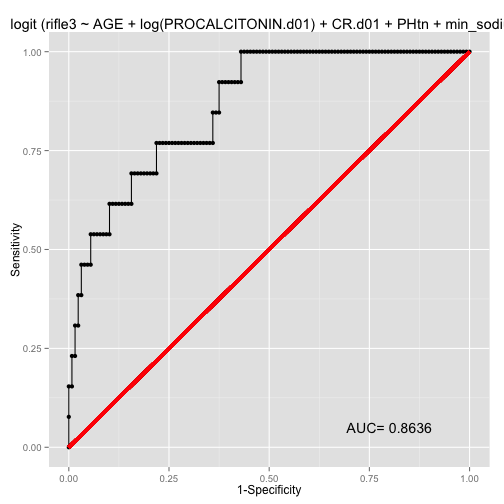
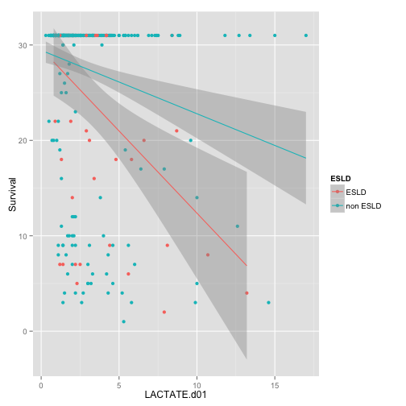
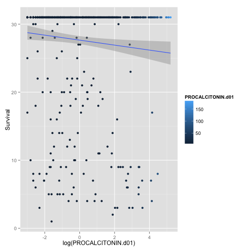
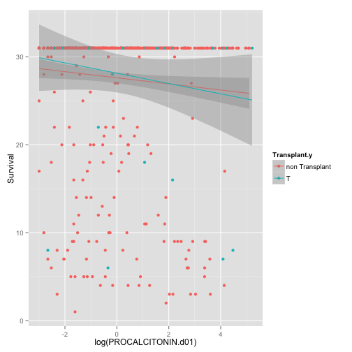
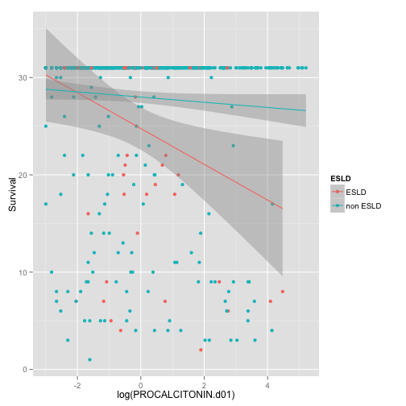
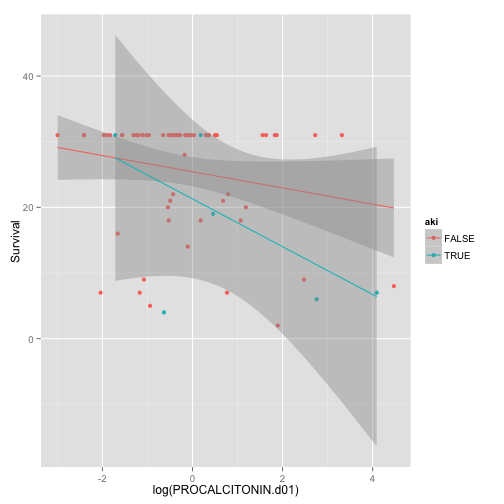
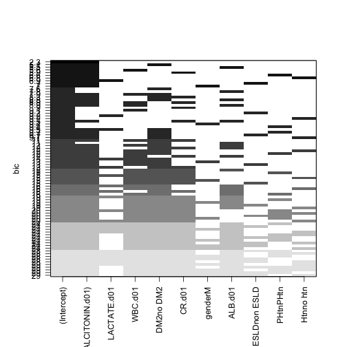

## Survival Analysis from d01 Procalcitonin Project

========================================================


```r
opts_chunk$set(warning=FALSE, fig.width=6, fig.height=6)
anonMASTER <- read.csv("~/Desktop/Procalcitonin Day 01 Priject/anonMASTER.csv")
View(anonMASTER)
library(ggplot2)
library(caret)
library(dplyr)
```

## Exploratory Graphs


```r
data <- anonMASTER
data <- tbl_df(data)
qplot(LACTATE.d01,Survival,data=data, colour=Survival)
```

 

```r
anonMASTER <- mutate(anonMASTER, devakirifle2=(d2max_cr/CR.d01)>=2)
data <- anonMASTER
```


```r
qplot(LACTATE.d01,Survival,data=data, colour=Survival, geom=c("point","smooth"), method=lm)
```

 


```r
qplot(LACTATE.d01,Survival,data=data, colour=Transplant.y, geom=c("point","smooth"), method=lm)
```

 

```r
qplot(LACTATE.d01,Survival,data=data, colour=ESLD, geom=c("point","smooth"), method=lm)
```

 


```r
qplot(log(PROCALCITONIN.d01),Survival,data=data,colour=PROCALCITONIN.d01, geom=c("point","smooth"), method=lm)
```

 


```r
qplot(log(PROCALCITONIN.d01),Survival,data=data,colour=Transplant.y, geom=c("point","smooth"), method=lm)
```

 


```r
qplot(log(PROCALCITONIN.d01),Survival,data=data,colour=ESLD, geom=c("point","smooth"), method=lm)
```

 


```r
qplot(log(LACTATE.d01),Survival,data=data,colour=aki, geom=c("point","smooth"), method=lm)
```

 

```r
qplot(log(PROCALCITONIN.d01),Survival,data=data,colour=aki, geom=c("point","smooth"), method=lm)
```

 


```r
qplot(log(LACTATE.d01),Survival,data=data,colour=ESLD, geom=c("point","smooth"), method=lm)
```

 
## ** ESLD AKI  models **

Below we will create a data set esldnowesrd which contains the patients that have a cirrhosis code and do not have a esrd.ckd 5 code.


```r
## define the esld subset and exclude the chronic dialysis patients##
esld <- subset(data, ESLD=="ESLD")

esldnonesrd <- subset(esld, ESRD_CKD.5="non ESRD.CKD5")
## glm for predicing the risk of starting rrt in the encounter in this subset##
g <- glm(rrtbin~WBC.d01 + log(PROCALCITONIN.d01) + CR.d01 +DM2 + Htn + PLATELETS.d01, data=esldnonesrd, family=binomial(link=logit))

summary(g)
```

```
## 
## Call:
## glm(formula = rrtbin ~ WBC.d01 + log(PROCALCITONIN.d01) + CR.d01 + 
##     DM2 + Htn + PLATELETS.d01, family = binomial(link = logit), 
##     data = esldnonesrd)
## 
## Deviance Residuals: 
##    Min      1Q  Median      3Q     Max  
## -1.718  -0.479  -0.197   0.264   2.352  
## 
## Coefficients:
##                        Estimate Std. Error z value Pr(>|z|)    
## (Intercept)            -5.54996    1.85852   -2.99  0.00282 ** 
## WBC.d01                 0.18368    0.06560    2.80  0.00511 ** 
## log(PROCALCITONIN.d01)  0.53847    0.25756    2.09  0.03656 *  
## CR.d01                  1.46222    0.41349    3.54  0.00041 ***
## DM2no DM2              -0.46167    0.87908   -0.53  0.59946    
## Htnno htn              -0.10604    0.94002   -0.11  0.91019    
## PLATELETS.d01          -0.00491    0.00366   -1.34  0.17956    
## ---
## Signif. codes:  0 '***' 0.001 '**' 0.01 '*' 0.05 '.' 0.1 ' ' 1
## 
## (Dispersion parameter for binomial family taken to be 1)
## 
##     Null deviance: 85.612  on 67  degrees of freedom
## Residual deviance: 44.814  on 61  degrees of freedom
## AIC: 58.81
## 
## Number of Fisher Scoring iterations: 6
```

```r
qplot(log(PROCALCITONIN.d01),Survival,data=esldnonesrd,colour=aki, geom=c("point","smooth"), method=lm)
```

 

## CHF and RRT models


```r
chf <- subset(data, CHF=="CHF")
chfnoesrd<- subset(chf, ESRD_CKD5=="non ESRD.CKD5" )


glm.chf.rrt <- glm(rrtbin~log(PROCALCITONIN.d01)+ WBC.d01 +CR.d01 + PHtn + ALB.d01+DM2 +min_sodium + min_hb+Htn,data=chfnoesrd, family=binomial)
summary(glm.chf.rrt)
```

```
## 
## Call:
## glm(formula = rrtbin ~ log(PROCALCITONIN.d01) + WBC.d01 + CR.d01 + 
##     PHtn + ALB.d01 + DM2 + min_sodium + min_hb + Htn, family = binomial, 
##     data = chfnoesrd)
## 
## Deviance Residuals: 
##    Min      1Q  Median      3Q     Max  
## -1.163  -0.343  -0.203  -0.125   2.595  
## 
## Coefficients:
##                        Estimate Std. Error z value Pr(>|z|)  
## (Intercept)              7.9346    11.4446    0.69    0.488  
## log(PROCALCITONIN.d01)   0.4965     0.2279    2.18    0.029 *
## WBC.d01                 -0.0277     0.0522   -0.53    0.595  
## CR.d01                   0.4566     0.2222    2.05    0.040 *
## PHtnPHtn                 1.7160     0.8899    1.93    0.054 .
## ALB.d01                 -0.1718     0.7060   -0.24    0.808  
## DM2no DM2               -0.0934     0.7676   -0.12    0.903  
## min_sodium              -0.0940     0.0868   -1.08    0.279  
## min_hb                   0.1192     0.1703    0.70    0.484  
## Htnno htn               -0.0159     0.8000   -0.02    0.984  
## ---
## Signif. codes:  0 '***' 0.001 '**' 0.01 '*' 0.05 '.' 0.1 ' ' 1
## 
## (Dispersion parameter for binomial family taken to be 1)
## 
##     Null deviance: 68.336  on 151  degrees of freedom
## Residual deviance: 52.984  on 142  degrees of freedom
##   (55 observations deleted due to missingness)
## AIC: 72.98
## 
## Number of Fisher Scoring iterations: 7
```

```r
glm.chf.rrt.lact <- glm(rrtbin~log(PROCALCITONIN.d01)+LACTATE.d01+ WBC.d01 +CR.d01 + PHtn + ALB.d01+DM2 +min_sodium + min_hb+Htn,data=chfnoesrd, family=binomial)
summary(glm.chf.rrt.lact)
```

```
## 
## Call:
## glm(formula = rrtbin ~ log(PROCALCITONIN.d01) + LACTATE.d01 + 
##     WBC.d01 + CR.d01 + PHtn + ALB.d01 + DM2 + min_sodium + min_hb + 
##     Htn, family = binomial, data = chfnoesrd)
## 
## Deviance Residuals: 
##    Min      1Q  Median      3Q     Max  
## -1.132  -0.396  -0.211  -0.116   2.420  
## 
## Coefficients:
##                        Estimate Std. Error z value Pr(>|z|)  
## (Intercept)              5.9622    14.1334    0.42     0.67  
## log(PROCALCITONIN.d01)   0.4462     0.2860    1.56     0.12  
## LACTATE.d01              0.1629     0.1360    1.20     0.23  
## WBC.d01                 -0.0385     0.0677   -0.57     0.57  
## CR.d01                   0.4426     0.2262    1.96     0.05 .
## PHtnPHtn                 1.5663     1.0678    1.47     0.14  
## ALB.d01                 -0.3980     0.7477   -0.53     0.59  
## DM2no DM2               -0.3081     0.9478   -0.33     0.75  
## min_sodium              -0.0866     0.1113   -0.78     0.44  
## min_hb                   0.2403     0.2103    1.14     0.25  
## Htnno htn                0.4355     0.9061    0.48     0.63  
## ---
## Signif. codes:  0 '***' 0.001 '**' 0.01 '*' 0.05 '.' 0.1 ' ' 1
## 
## (Dispersion parameter for binomial family taken to be 1)
## 
##     Null deviance: 55.417  on 97  degrees of freedom
## Residual deviance: 40.849  on 87  degrees of freedom
##   (109 observations deleted due to missingness)
## AIC: 62.85
## 
## Number of Fisher Scoring iterations: 7
```

```r
glm.chf.rrt.lact2 <- glm(rrtbin~+LACTATE.d01+ WBC.d01 +CR.d01 + PHtn + ALB.d01+DM2 +min_sodium + min_hb+Htn,data=chfnoesrd, family=binomial)
summary(glm.chf.rrt.lact2)
```

```
## 
## Call:
## glm(formula = rrtbin ~ +LACTATE.d01 + WBC.d01 + CR.d01 + PHtn + 
##     ALB.d01 + DM2 + min_sodium + min_hb + Htn, family = binomial, 
##     data = chfnoesrd)
## 
## Deviance Residuals: 
##    Min      1Q  Median      3Q     Max  
## -0.955  -0.375  -0.255  -0.180   2.558  
## 
## Coefficients:
##             Estimate Std. Error z value Pr(>|z|)  
## (Intercept)   1.0060    13.1246    0.08    0.939  
## LACTATE.d01   0.2262     0.1295    1.75    0.081 .
## WBC.d01      -0.0230     0.0620   -0.37    0.711  
## CR.d01        0.4800     0.2518    1.91    0.057 .
## PHtnPHtn      0.7901     0.8685    0.91    0.363  
## ALB.d01      -0.6161     0.7584   -0.81    0.417  
## DM2no DM2    -0.3610     0.9260   -0.39    0.697  
## min_sodium   -0.0443     0.0990   -0.45    0.655  
## min_hb        0.2485     0.2105    1.18    0.238  
## Htnno htn     0.5920     0.8791    0.67    0.501  
## ---
## Signif. codes:  0 '***' 0.001 '**' 0.01 '*' 0.05 '.' 0.1 ' ' 1
## 
## (Dispersion parameter for binomial family taken to be 1)
## 
##     Null deviance: 55.417  on 97  degrees of freedom
## Residual deviance: 43.691  on 88  degrees of freedom
##   (109 observations deleted due to missingness)
## AIC: 63.69
## 
## Number of Fisher Scoring iterations: 6
```

```r
qplot( log(PROCALCITONIN.d01),CR.d01-d2max_cr,data=chfnoesrd, colour=rrtbin)
```

 

## CHF AKI RIFLE Stage I models


```r
glm.chf.aki <- glm(devaki~log(PROCALCITONIN.d01)+WBC.d01+DM2+CR.d01+gender+ALB.d01+ESLD+PHtn+Htn,data=chfnoesrd, family=binomial(link=logit))
summary(glm.chf.aki)
```

```
## 
## Call:
## glm(formula = devaki ~ log(PROCALCITONIN.d01) + WBC.d01 + DM2 + 
##     CR.d01 + gender + ALB.d01 + ESLD + PHtn + Htn, family = binomial(link = logit), 
##     data = chfnoesrd)
## 
## Deviance Residuals: 
##    Min      1Q  Median      3Q     Max  
## -0.973  -0.416  -0.324  -0.222   2.628  
## 
## Coefficients:
##                        Estimate Std. Error z value Pr(>|z|)  
## (Intercept)             -2.8696     2.3735   -1.21    0.227  
## log(PROCALCITONIN.d01)   0.3525     0.1566    2.25    0.024 *
## WBC.d01                 -0.0588     0.0473   -1.24    0.214  
## DM2no DM2               -0.4732     0.6253   -0.76    0.449  
## CR.d01                  -0.3810     0.4716   -0.81    0.419  
## genderM                 -0.2416     0.6751   -0.36    0.720  
## ALB.d01                  0.6485     0.5113    1.27    0.205  
## ESLDnon ESLD            -0.1257     1.1322   -0.11    0.912  
## PHtnPHtn                -0.0123     0.7962   -0.02    0.988  
## Htnno htn               -0.1574     0.6281   -0.25    0.802  
## ---
## Signif. codes:  0 '***' 0.001 '**' 0.01 '*' 0.05 '.' 0.1 ' ' 1
## 
## (Dispersion parameter for binomial family taken to be 1)
## 
##     Null deviance: 91.822  on 169  degrees of freedom
## Residual deviance: 82.634  on 160  degrees of freedom
##   (37 observations deleted due to missingness)
## AIC: 102.6
## 
## Number of Fisher Scoring iterations: 6
```

```r
glm.chf.aki.lact <- glm(devaki~log(PROCALCITONIN.d01)+LACTATE.d01+WBC.d01+DM2+CR.d01+gender+ALB.d01+ESLD+PHtn,data=chfnoesrd, family=binomial(link=logit))

summary(glm.chf.aki.lact)
```

```
## 
## Call:
## glm(formula = devaki ~ log(PROCALCITONIN.d01) + LACTATE.d01 + 
##     WBC.d01 + DM2 + CR.d01 + gender + ALB.d01 + ESLD + PHtn, 
##     family = binomial(link = logit), data = chfnoesrd)
## 
## Deviance Residuals: 
##    Min      1Q  Median      3Q     Max  
## -1.307  -0.378  -0.227  -0.124   2.559  
## 
## Coefficients:
##                        Estimate Std. Error z value Pr(>|z|)   
## (Intercept)             -0.3789     3.0774   -0.12   0.9020   
## log(PROCALCITONIN.d01)   0.6948     0.2607    2.67   0.0077 **
## LACTATE.d01             -0.0467     0.1624   -0.29   0.7739   
## WBC.d01                 -0.0777     0.0619   -1.26   0.2093   
## DM2no DM2               -1.2340     0.9300   -1.33   0.1845   
## CR.d01                  -0.8734     0.6732   -1.30   0.1945   
## genderM                 -0.1131     0.9794   -0.12   0.9081   
## ALB.d01                  0.2834     0.6262    0.45   0.6508   
## ESLDnon ESLD            -0.8211     1.2793   -0.64   0.5210   
## PHtnPHtn                 0.7652     1.2724    0.60   0.5476   
## ---
## Signif. codes:  0 '***' 0.001 '**' 0.01 '*' 0.05 '.' 0.1 ' ' 1
## 
## (Dispersion parameter for binomial family taken to be 1)
## 
##     Null deviance: 62.301  on 109  degrees of freedom
## Residual deviance: 48.070  on 100  degrees of freedom
##   (97 observations deleted due to missingness)
## AIC: 68.07
## 
## Number of Fisher Scoring iterations: 7
```

## Stage 1 RIFLE AKI in CHF All Subset Regression

We will generate all subset regression with the LEAPS package for looking at risk factors for developing AKI in patient with a history of CHF in the dataset. We are using the devaki variable as an outcome (1.5X rise in Cr, over admission day Creatinine)((d2max_cr/cr.d01 > 1.5)


```r
library(MASS)
library(leaps)
attach(chfnoesrd)
leaps <- regsubsets(devaki~log(PROCALCITONIN.d01)+LACTATE.d01+WBC.d01+DM2+CR.d01+gender+ALB.d01+ESLD+PHtn+Htn,data=chfnoesrd, nbest=10)

plot(leaps)
```

 

## Stage 1 RIFLE AKI in CHF Odds ratio table

We will generate an odds ratio table for looking at risk factors for developing AKI in patient with a history of CHF in the dataset. We are using the devaki variable which essentially corresponds to a rifle stage 1 definition of renal failure (d2max_cr/cr.d01 > 1.5)


```r
aki <- glm(formula = devaki ~ log(PROCALCITONIN.d01) + LACTATE.d01 +
WBC.d01 + DM2 + CR.d01 + gender + ALB.d01 + ESLD + PHtn,
family = binomial(link = logit), data = chfnoesrd)
int <- exp(confint(aki))
```

```
## Waiting for profiling to be done...
```

```r
odds <- exp(coef(aki))
akioddstable <- cbind(odds,int)
akioddstable
```

```
##                          odds    2.5 %  97.5 %
## (Intercept)            0.6846 0.001213 264.647
## log(PROCALCITONIN.d01) 2.0033 1.268276   3.617
## LACTATE.d01            0.9544 0.638179   1.265
## WBC.d01                0.9252 0.807300   1.027
## DM2no DM2              0.2911 0.038014   1.643
## CR.d01                 0.4175 0.092484   1.153
## genderM                0.8931 0.129960   6.709
## ALB.d01                1.3277 0.405007   5.002
## ESLDnon ESLD           0.4399 0.044187  10.652
## PHtnPHtn               2.1494 0.157377  26.938
```


## CHF AKI RIFLE Stage 2 (d2maxcr/Cr.d01 >2)

Here we subset the anonMASTER file and define the outcome of RIFLE 2 renal injury. We subset the data for CHF patients and generate and odds ratio table.


```r
anonMASTER <- mutate(anonMASTER, devakirifle2=(d2max_cr/CR.d01)>=2)
data <- anonMASTER
chf <- subset(data, CHF=="CHF")
chfnoesrd<- subset(chf, ESRD_CKD5=="non ESRD.CKD5" )
glm.chf.aki.rifle2 <- glm(devakirifle2~log(PROCALCITONIN.d01)+LACTATE.d01+ WBC.d01+DM2+CR.d01+gender+ALB.d01+ESLD+PHtn+Htn,data=chfnoesrd, family=binomial(link=logit))
summary(glm.chf.aki.rifle2)
```

```
## 
## Call:
## glm(formula = devakirifle2 ~ log(PROCALCITONIN.d01) + LACTATE.d01 + 
##     WBC.d01 + DM2 + CR.d01 + gender + ALB.d01 + ESLD + PHtn + 
##     Htn, family = binomial(link = logit), data = chfnoesrd)
## 
## Deviance Residuals: 
##     Min       1Q   Median       3Q      Max  
## -1.3291  -0.2503  -0.1036  -0.0309   2.4720  
## 
## Coefficients:
##                         Estimate Std. Error z value Pr(>|z|)  
## (Intercept)            -1.51e+01   3.17e+03    0.00    0.996  
## log(PROCALCITONIN.d01)  7.88e-01   3.57e-01    2.21    0.027 *
## LACTATE.d01            -3.75e-01   3.62e-01   -1.04    0.299  
## WBC.d01                -7.44e-03   6.86e-02   -0.11    0.914  
## DM2no DM2              -2.31e+00   1.36e+00   -1.70    0.090 .
## CR.d01                 -2.35e+00   1.40e+00   -1.68    0.092 .
## genderM                 1.48e+00   1.70e+00    0.87    0.382  
## ALB.d01                -7.14e-02   9.07e-01   -0.08    0.937  
## ESLDnon ESLD            1.58e+01   3.17e+03    0.00    0.996  
## PHtnPHtn                6.28e-01   1.77e+00    0.35    0.723  
## Htnno htn              -9.96e-01   1.15e+00   -0.87    0.386  
## ---
## Signif. codes:  0 '***' 0.001 '**' 0.01 '*' 0.05 '.' 0.1 ' ' 1
## 
## (Dispersion parameter for binomial family taken to be 1)
## 
##     Null deviance: 46.571  on 109  degrees of freedom
## Residual deviance: 30.074  on  99  degrees of freedom
##   (97 observations deleted due to missingness)
## AIC: 52.07
## 
## Number of Fisher Scoring iterations: 18
```

```r
glmrifle2 <- glm.chf.aki.rifle2 

int <- exp(confint(glm.chf.aki.rifle2))
```

```
## Waiting for profiling to be done...
```

```r
odds <- exp(coef(glm.chf.aki.rifle2))
akioddstable <- cbind(odds,int)
akioddstable
```

```
##                             odds      2.5 %     97.5 %
## (Intercept)            2.703e-07         NA 4.829e+129
## log(PROCALCITONIN.d01) 2.198e+00  1.195e+00  5.109e+00
## LACTATE.d01            6.871e-01  2.782e-01  1.180e+00
## WBC.d01                9.926e-01  8.472e-01  1.120e+00
## DM2no DM2              9.937e-02  3.463e-03  1.073e+00
## CR.d01                 9.545e-02  3.071e-03  7.734e-01
## genderM                4.408e+00  2.292e-01  2.557e+02
## ALB.d01                9.311e-01  1.318e-01  5.588e+00
## ESLDnon ESLD           7.286e+06 4.079e-130         NA
## PHtnPHtn               1.875e+00  4.221e-02  6.776e+01
## Htnno htn              3.694e-01  2.912e-02  3.203e+00
```

All subsets regression fo RIFLE2 renal failure in CHF


```r
library(MASS)
library(leaps)
attach(chfnoesrd)
```

```
## The following object is masked _by_ .GlobalEnv:
## 
##     aki
## The following objects are masked from chfnoesrd (position 3):
## 
##     aki, ALB.d01, CatheterCPT, CHEMORAD, CHF, CR.d01, CRP.d01,
##     d2max_cr, devaki, devakirifle2, DM2, ESLD, ESRD_CKD5, event,
##     fractioncrchange, gender, HIV, Htn, IMMUNE, LACTATE.d01,
##     LOS.y, LVAD, max_cr, maxcr, mean_cr, min_cr, min_hb,
##     min_sodium, newage, PHtn, PLATELETS.d01, PLevel,
##     PROCALCITONIN.d01, ratiocr, rationcr, rrtbin, RRTCPT,
##     Survival, Transplant.x, Transplant.y, two_week, VentCPT,
##     WBC.d01, X, X.1, X30d
```

```r
leaps <- regsubsets(devakirifle2~log(PROCALCITONIN.d01)+LACTATE.d01+WBC.d01+DM2+CR.d01+gender+ALB.d01+ESLD+PHtn+Htn,data=chfnoesrd, nbest=10)

plot(leaps)
```

 

We are generating glm models on the outcome of RIFLE 3 Renal failure which includes a Creatinine rise of >3X and or RRT.


```r
anonMASTER3 <- mutate(anonMASTER, devakirifle3=(d2max_cr/CR.d01)>=3)
anonmaster4 <- mutate(anonMASTER3, rifle3 = (devakirifle3=="TRUE" | rrtbin =="TRUE"))

data <- anonmaster4

chf <- subset(data, CHF=="CHF")

chfnoesrd<- subset(chf, ESRD_CKD5=="non ESRD.CKD5" )
## glm for rifle3
chfrifle3 <- glm(rifle3~log(PROCALCITONIN.d01)+LACTATE.d01+ WBC.d01+DM2+CR.d01+gender+ALB.d01+ESLD+PHtn+Htn,data=chfnoesrd, family=binomial(link=logit))

summary(chfrifle3)
```

```
## 
## Call:
## glm(formula = rifle3 ~ log(PROCALCITONIN.d01) + LACTATE.d01 + 
##     WBC.d01 + DM2 + CR.d01 + gender + ALB.d01 + ESLD + PHtn + 
##     Htn, family = binomial(link = logit), data = chfnoesrd)
## 
## Deviance Residuals: 
##    Min      1Q  Median      3Q     Max  
## -1.163  -0.454  -0.264  -0.154   2.934  
## 
## Coefficients:
##                        Estimate Std. Error z value Pr(>|z|)   
## (Intercept)             -2.9755     2.9986   -0.99    0.321   
## log(PROCALCITONIN.d01)   0.5287     0.2333    2.27    0.023 * 
## LACTATE.d01              0.0451     0.1359    0.33    0.740   
## WBC.d01                 -0.0399     0.0534   -0.75    0.455   
## DM2no DM2                0.1424     0.7733    0.18    0.854   
## CR.d01                   0.6018     0.3652    1.65    0.099 . 
## genderM                  0.8695     0.9869    0.88    0.378   
## ALB.d01                  0.3768     0.6727    0.56    0.575   
## ESLDnon ESLD            -2.8961     1.0314   -2.81    0.005 **
## PHtnPHtn                 1.2274     1.0826    1.13    0.257   
## Htnno htn               -0.1182     0.7693   -0.15    0.878   
## ---
## Signif. codes:  0 '***' 0.001 '**' 0.01 '*' 0.05 '.' 0.1 ' ' 1
## 
## (Dispersion parameter for binomial family taken to be 1)
## 
##     Null deviance: 79.923  on 109  degrees of freedom
## Residual deviance: 55.558  on  99  degrees of freedom
##   (97 observations deleted due to missingness)
## AIC: 77.56
## 
## Number of Fisher Scoring iterations: 6
```

```r
##odds ratio table
int <- exp(confint(chfrifle3))
```

```
## Waiting for profiling to be done...
```

```r
odds <- exp(coef(chfrifle3))
akioddstable <- cbind(odds,int)
akioddstable
```

```
##                           odds     2.5 %  97.5 %
## (Intercept)            0.05102 9.575e-05 16.1762
## log(PROCALCITONIN.d01) 1.69677 1.104e+00  2.8158
## LACTATE.d01            1.04612 7.828e-01  1.3554
## WBC.d01                0.96086 8.552e-01  1.0544
## DM2no DM2              1.15303 2.485e-01  5.5152
## CR.d01                 1.82543 1.122e+00  4.1288
## genderM                2.38571 3.792e-01 19.7880
## ALB.d01                1.45756 3.930e-01  5.8759
## ESLDnon ESLD           0.05524 6.299e-03  0.4135
## PHtnPHtn               3.41230 3.817e-01 30.7918
## Htnno htn              0.88854 1.899e-01  4.1518
```
This is an all subsets regression of RIFLE 3 renal failure in CHF patients


```r
library(MASS)
library(leaps)
attach(chfnoesrd)
```

```
## The following object is masked _by_ .GlobalEnv:
## 
##     aki
## The following objects are masked from chfnoesrd (position 3):
## 
##     aki, ALB.d01, CatheterCPT, CHEMORAD, CHF, CR.d01, CRP.d01,
##     d2max_cr, devaki, devakirifle2, DM2, ESLD, ESRD_CKD5, event,
##     fractioncrchange, gender, HIV, Htn, IMMUNE, LACTATE.d01,
##     LOS.y, LVAD, max_cr, maxcr, mean_cr, min_cr, min_hb,
##     min_sodium, newage, PHtn, PLATELETS.d01, PLevel,
##     PROCALCITONIN.d01, ratiocr, rationcr, rrtbin, RRTCPT,
##     Survival, Transplant.x, Transplant.y, two_week, VentCPT,
##     WBC.d01, X, X.1, X30d
## The following objects are masked from chfnoesrd (position 4):
## 
##     aki, ALB.d01, CatheterCPT, CHEMORAD, CHF, CR.d01, CRP.d01,
##     d2max_cr, devaki, devakirifle2, DM2, ESLD, ESRD_CKD5, event,
##     fractioncrchange, gender, HIV, Htn, IMMUNE, LACTATE.d01,
##     LOS.y, LVAD, max_cr, maxcr, mean_cr, min_cr, min_hb,
##     min_sodium, newage, PHtn, PLATELETS.d01, PLevel,
##     PROCALCITONIN.d01, ratiocr, rationcr, rrtbin, RRTCPT,
##     Survival, Transplant.x, Transplant.y, two_week, VentCPT,
##     WBC.d01, X, X.1, X30d
```

```r
leaps <- regsubsets(rifle3~log(PROCALCITONIN.d01)+LACTATE.d01+ WBC.d01+DM2+CR.d01+gender+ALB.d01+ESLD+PHtn+Htn,data=chfnoesrd, family=binomial(link=logit), nbest=10)
```

```
## Error: invalid type (list) for variable '(family)'
```

```r
plot(leaps)
```

 


## Ventilator data 
GLM regression for the Vent CPT code, which includes lactate on d01


```r
glm.chf.vent.lact <- glm(VentCPT~log(PROCALCITONIN.d01)+LACTATE.d01+WBC.d01+DM2+CR.d01+gender+ALB.d01+ESLD+PHtn,data=chfnoesrd, family=binomial(link=logit))
summary(glm.chf.vent.lact)
```

```
## 
## Call:
## glm(formula = VentCPT ~ log(PROCALCITONIN.d01) + LACTATE.d01 + 
##     WBC.d01 + DM2 + CR.d01 + gender + ALB.d01 + ESLD + PHtn, 
##     family = binomial(link = logit), data = chfnoesrd)
## 
## Deviance Residuals: 
##    Min      1Q  Median      3Q     Max  
## -2.073  -0.933   0.258   0.905   1.884  
## 
## Coefficients:
##                        Estimate Std. Error z value Pr(>|z|)  
## (Intercept)              0.2959     1.6011    0.18    0.853  
## log(PROCALCITONIN.d01)   0.0896     0.1265    0.71    0.479  
## LACTATE.d01              0.2800     0.1331    2.10    0.035 *
## WBC.d01                  0.0764     0.0322    2.37    0.018 *
## DM2no DM2               -0.5747     0.4595   -1.25    0.211  
## CR.d01                  -0.1262     0.1821   -0.69    0.489  
## genderM                  0.8781     0.5202    1.69    0.091 .
## ALB.d01                 -0.5150     0.3603   -1.43    0.153  
## ESLDnon ESLD            -0.6793     0.8423   -0.81    0.420  
## PHtnPHtn                 0.7182     0.6199    1.16    0.247  
## ---
## Signif. codes:  0 '***' 0.001 '**' 0.01 '*' 0.05 '.' 0.1 ' ' 1
## 
## (Dispersion parameter for binomial family taken to be 1)
## 
##     Null deviance: 152.16  on 109  degrees of freedom
## Residual deviance: 124.03  on 100  degrees of freedom
##   (97 observations deleted due to missingness)
## AIC: 144
## 
## Number of Fisher Scoring iterations: 5
```


```

