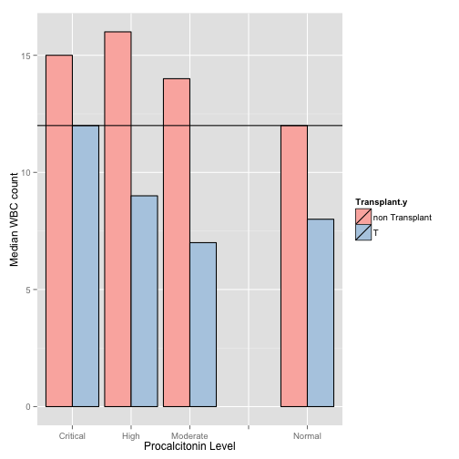
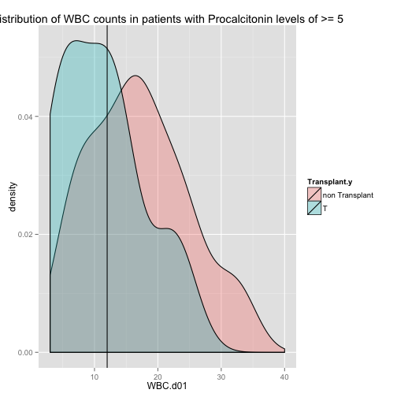

Transplant patients do not mount a brisk leukocytotic reponse.

========================================================


We subsettted patients that had a WBC count of atleast 3


```
## 
## Attaching package: 'dplyr'
## 
## The following objects are masked from 'package:stats':
## 
##     filter, lag
## 
## The following objects are masked from 'package:base':
## 
##     intersect, setdiff, setequal, union
## 
## -------------------------------------------------------------------------
## You have loaded plyr after dplyr - this is likely to cause problems.
## If you need functions from both plyr and dplyr, please load plyr first, then dplyr:
## library(plyr); library(dplyr)
## -------------------------------------------------------------------------
## 
## Attaching package: 'plyr'
## 
## The following objects are masked from 'package:dplyr':
## 
##     arrange, desc, failwith, id, mutate, summarise, summarize
```

 


The horizontal black line represents a WBC count of 12,000


The same analysis by medians

 

Histogram of WBC distributions in patients with a Procal of >2 and >5


```
## Warning: Removed 17 rows containing non-finite values (stat_density).
## Warning: Removed 1 rows containing non-finite values (stat_density).
```

 

```
## Warning: Removed 8 rows containing non-finite values (stat_density).
```

 

```
## Warning: Removed 8 rows containing non-finite values (stat_density).
```

 


```r
library(gridExtra)
```

```
## Loading required package: grid
```

```r
grid.arrange(hist1,hist5,plot1, plot2,ncol=2)
```

 


```r
data4 <- subset(data,WBC.d01>=4)
t <- with(data4, table(hiwbc=WBC.d01>12, hiproc=PROCALCITONIN.d01>=2, Transplant.y))
library(vcd)
structable(t)
```

```
##                      hiproc FALSE TRUE
## hiwbc Transplant.y                    
## FALSE non Transplant          193   50
##       T                        17    9
## TRUE  non Transplant          201  129
##       T                         6    6
```

```r
chisq.test(t)
```

```
## 
## 	Chi-squared test for given probabilities
## 
## data:  t
## X-squared = 662.1, df = 7, p-value < 2.2e-16
```
