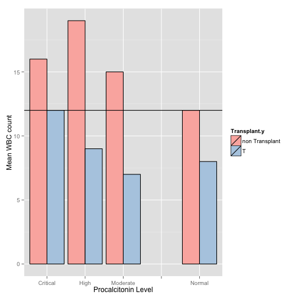
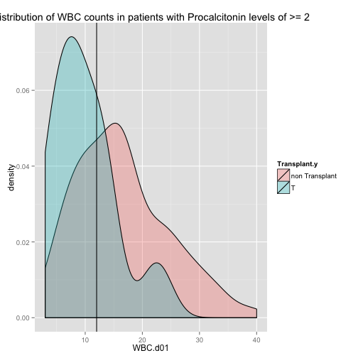
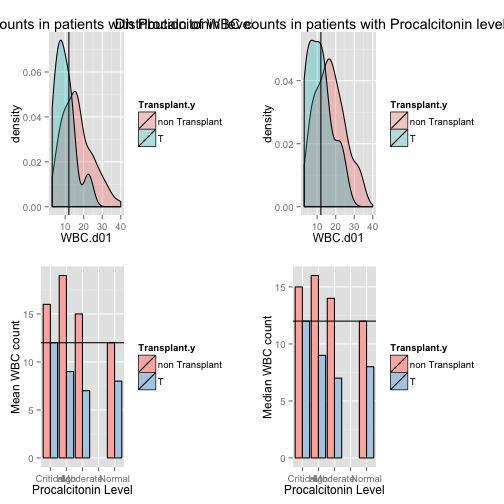

2 week Survival Prediction Project: (Kill the APACHE)
========================================================

Our Aim is to develop a tool that competes with the APACHE score prediction system and allows clinicians to model scenarios that will predict probability of 2 week survival of patients. We are using admission day labs, clinical data about patient health (parts of their medical history) and some CPT codes that allow clinicians to enter or model clinical variable (such as if they are put on a ventilator, if they are started on RRT or if they require a central line). Currently I am trialing the first iteration of this model on CHF patients. But hopefully will expand to a more generalised model.


```r
chf <- read.csv("~/Dropbox/Procalcitonin CHF Project/chf.csv")
glm <- glm(two_week~LACTATE.d01+AGE+PROCALCITONIN.d01+min_sodium+min_hb+gender+devaki+rrtbin+COPD+CR.d01+AFIB+ALB.d01+ESLD+PHtn+Transplant.y+IHD+VentCPT+CatheterCPT, data=chf, family=binomial(link=logit), na.action=na.exclude)
summary(glm)
```

```
## 
## Call:
## glm(formula = two_week ~ LACTATE.d01 + AGE + PROCALCITONIN.d01 + 
##     min_sodium + min_hb + gender + devaki + rrtbin + COPD + CR.d01 + 
##     AFIB + ALB.d01 + ESLD + PHtn + Transplant.y + IHD + VentCPT + 
##     CatheterCPT, family = binomial(link = logit), data = chf, 
##     na.action = na.exclude)
## 
## Deviance Residuals: 
##     Min       1Q   Median       3Q      Max  
## -1.9972  -0.2962  -0.0182  -0.0009   1.9269  
## 
## Coefficients:
##                             Estimate Std. Error z value Pr(>|z|)   
## (Intercept)                 -19.3185    15.8508   -1.22   0.2229   
## LACTATE.d01                   0.8156     0.3270    2.49   0.0126 * 
## AGE                           0.3366     0.1141    2.95   0.0032 **
## PROCALCITONIN.d01            -0.0637     0.0332   -1.92   0.0546 . 
## min_sodium                    0.0624     0.0968    0.65   0.5188   
## min_hb                        0.4634     0.3121    1.48   0.1376   
## genderM                       2.6518     1.5561    1.70   0.0884 . 
## devakiTRUE                    8.1251     3.1328    2.59   0.0095 **
## rrtbinTRUE                   -9.8065     4.7480   -2.07   0.0389 * 
## COPDnon COPD                 -3.1804     1.4987   -2.12   0.0338 * 
## CR.d01                        0.2637     0.4612    0.57   0.5675   
## AFIBno AFIB                  -1.8102     1.4146   -1.28   0.2007   
## ALB.d01                      -3.4737     1.6928   -2.05   0.0402 * 
## ESLDnon ESLD                -13.2254     4.5075   -2.93   0.0033 **
## PHtnPHtn                     -2.7064     1.9869   -1.36   0.1732   
## Transplant.yT                 1.1692     3.7074    0.32   0.7525   
## IHDno IHD                     1.3260     1.1460    1.16   0.2472   
## VentCPTVENTCPT                2.7813     1.3244    2.10   0.0357 * 
## CatheterCPTNO CATHETER CODE  -1.2120     1.1712   -1.03   0.3007   
## ---
## Signif. codes:  0 '***' 0.001 '**' 0.01 '*' 0.05 '.' 0.1 ' ' 1
## 
## (Dispersion parameter for binomial family taken to be 1)
## 
##     Null deviance: 80.383  on 97  degrees of freedom
## Residual deviance: 36.936  on 79  degrees of freedom
##   (109 observations deleted due to missingness)
## AIC: 74.94
## 
## Number of Fisher Scoring iterations: 8
```

```r
library(pROC)
```

```
## Type 'citation("pROC")' for a citation.
## 
## Attaching package: 'pROC'
## 
## The following objects are masked from 'package:stats':
## 
##     cov, smooth, var
```

```r
m.roc <- roc(chf$two_week, predict(glm, backtransform = TRUE))
plot(m.roc)
```

 

```
## 
## Call:
## roc.default(response = chf$two_week, predictor = predict(glm,     backtransform = TRUE))
## 
## Data: predict(glm, backtransform = TRUE) in 84 controls (chf$two_week FALSE) < 14 cases (chf$two_week TRUE).
## Area under the curve: 0.956
```

## Selecting the best model using the glmmulti package

Lets used the glm multi package to select the best model for the two week outome


```r
library(glmulti)


chf.surv <- glmulti(glm, # use the model with built as a starting point
                      level = 1,  #  just look at main effects
                      crit="aicc", method="g") # use AICc because it works better than AIC for small sample sizes)

summary(chf.surv)
```

After 820 generations:
Best model: two_week~1+ESLD+VentCPT+PHtn+IHD+Htn+min_hb+AGE+ALB.d01
Crit= 93.7236292379163
Mean crit= 100.789138411269
Improvements in best and average IC have bebingo en below the specified goals.
Algorithm is declared to have converged.
Completed.


Lets try out our  best model

```r
bestmodels <- glm(two_week~1+ESLD+VentCPT+PHtn+IHD+Htn+min_hb+AGE+ALB.d01 ,data=chf, family=binomial(link=logit), na.action=na.exclude)
library(pROC)
m.roc <- roc(chf$two_week, predict(bestmodels, backtransform = TRUE))
plot(m.roc)
```

 

```
## 
## Call:
## roc.default(response = chf$two_week, predictor = predict(bestmodels,     backtransform = TRUE))
## 
## Data: predict(bestmodels, backtransform = TRUE) in 133 controls (chf$two_week FALSE) < 19 cases (chf$two_week TRUE).
## Area under the curve: 0.824
```
Not really as good as the whole model, I guess the genetic glm multi search didnt improve the model very much. We will chuck it. 

We will take a more reasoned clinical based approach, divide the predictors into 3 categories

Class 1) Admission Day Labs
Class 2) Patient History
Class 3) Procedures/Events in the Hospital


```r
admitlabs <- c("HCO3","PLATELETS.d01","LACTATE.d01","CR.d01","PROCALCITONIN.d01","ALB.d01","min_sodium","min_hb")
history <-c("gender","COPD","AFIB","ESLD","PHtn","AGE","Transplant.y","CHFTYPE","IHD")
interactions <- c("PLATELETS.d01:ESLD")
month.surv <- chf$event
fourteen <- chf$two_week
```

Categories 1 and 2 are immediately available to clinicians on the time of admission; events , procedures status may or may not be available to the clinician. Eg a patient may get admitted to the hospital ICU and then get intubated and get a central line in the on HOD subsequent 2 day. In this case the clinician will not have the VentStatus and the Central line status available at the time of admission but will have it in 2 days. They can thus use the model for restimation of th 2 week mortality category at the time.

Lets try to fit a model based on Predictor Class 1 and 2 only, since this information is immediately available to clinicians at the time of admission.


```r
 glm <- glm(event~ HCO3+ PLATELETS.d01+LACTATE.d01+AGE+PROCALCITONIN.d01+min_sodium+min_hb+gender+COPD+CR.d01+AFIB+ALB.d01+ESLD+PHtn+Transplant.y+IHD+PLATELETS.d01:ESLD, data=chf, family=binomial(link=logit), na.action=na.exclude)
```

```
## Warning: glm.fit: fitted probabilities numerically 0 or 1 occurred
```

```r
library(pROC)
m.roc <- roc(chf$event, predict(glm, backtransform = TRUE))
plot(m.roc)
```

 

```
## 
## Call:
## roc.default(response = chf$event, predictor = predict(glm, backtransform = TRUE))
## 
## Data: predict(glm, backtransform = TRUE) in 78 controls (chf$event FALSE) < 20 cases (chf$event TRUE).
## Area under the curve: 0.835
```

The following is the 2 week survival model based on clinical history and admit labs alone. The AUC on this model is reasonably good at 0.89, hopefully we can add on more terms to refine this model.


```r
glm <- glm(two_week~ HCO3+ PLATELETS.d01+LACTATE.d01+AGE+PROCALCITONIN.d01+min_sodium+min_hb+gender+COPD+CR.d01+AFIB+ALB.d01+ESLD+PHtn+Transplant.y+IHD+PLATELETS.d01:ESLD+CHFTYPE, data=chf, family=binomial(link=logit), na.action=na.exclude)
```

```
## Warning: glm.fit: fitted probabilities numerically 0 or 1 occurred
```

```r
library(pROC)
m.roc <- roc(chf$two_week, predict(glm, backtransform = TRUE))
plot(m.roc)
```

 

```
## 
## Call:
## roc.default(response = chf$two_week, predictor = predict(glm,     backtransform = TRUE))
## 
## Data: predict(glm, backtransform = TRUE) in 84 controls (chf$two_week FALSE) < 14 cases (chf$two_week TRUE).
## Area under the curve: 0.897
```

Now we will add in event information that the physician may not have nessecarily have on admission. Lets suppose that we give wether the patient was Vent during this admission (represented by the VentCPT code). The AUC jumps to 0.9243


```r
glm <- glm(two_week~ HCO3+ PLATELETS.d01+LACTATE.d01+AGE+PROCALCITONIN.d01+min_sodium+min_hb+gender+COPD+CR.d01+AFIB+ALB.d01+ESLD+PHtn+Transplant.y+IHD+PLATELETS.d01:ESLD+CHFTYPE+VentCPT, data=chf, family=binomial(link=logit), na.action=na.exclude)
```

```
## Warning: glm.fit: fitted probabilities numerically 0 or 1 occurred
```

```r
m.roc <- roc(chf$two_week, predict(glm, backtransform = TRUE))
plot(m.roc)
```

 

```
## 
## Call:
## roc.default(response = chf$two_week, predictor = predict(glm,     backtransform = TRUE))
## 
## Data: predict(glm, backtransform = TRUE) in 84 controls (chf$two_week FALSE) < 14 cases (chf$two_week TRUE).
## Area under the curve: 0.924
```

So far we have not incorporated any information on labs and any information to the model about what could have potentially changed beyond day 0-1 except for the VentCPT.
Suppose we know that the patient was started on RRT at some point during the admission.

```r
glm <- glm(two_week~ HCO3+ PLATELETS.d01+LACTATE.d01+AGE+PROCALCITONIN.d01+min_sodium+min_hb+gender+COPD+CR.d01+AFIB+ALB.d01+ESLD+PHtn+Transplant.y+IHD+PLATELETS.d01:ESLD+CHFTYPE+rifle3+VentCPT, data=chf, family=binomial(link=logit), na.action=na.exclude)
```

```
## Warning: glm.fit: fitted probabilities numerically 0 or 1 occurred
```

```r
m.roc <- roc(chf$two_week, predict(glm, backtransform = TRUE))
plot(m.roc)
```

 

```
## 
## Call:
## roc.default(response = chf$two_week, predictor = predict(glm,     backtransform = TRUE))
## 
## Data: predict(glm, backtransform = TRUE) in 84 controls (chf$two_week FALSE) < 14 cases (chf$two_week TRUE).
## Area under the curve: 0.938
```


Here is the data for the 30 day survival AUC in this model.

```r
glm <- glm(event~ HCO3+ PLATELETS.d01+LACTATE.d01+AGE+PROCALCITONIN.d01+min_sodium+min_hb+gender+COPD+CR.d01+AFIB+ALB.d01+ESLD+PHtn+Transplant.y+IHD+PLATELETS.d01:ESLD+CHFTYPE+rifle3+VentCPT, data=chf, family=binomial(link=logit), na.action=na.exclude)
```

```
## Warning: glm.fit: fitted probabilities numerically 0 or 1 occurred
```

```r
m.roc <- roc(chf$event, predict(glm, backtransform = TRUE))
plot(m.roc)
```

 

```
## 
## Call:
## roc.default(response = chf$event, predictor = predict(glm, backtransform = TRUE))
## 
## Data: predict(glm, backtransform = TRUE) in 78 controls (chf$event FALSE) < 20 cases (chf$event TRUE).
## Area under the curve: 0.888
```
